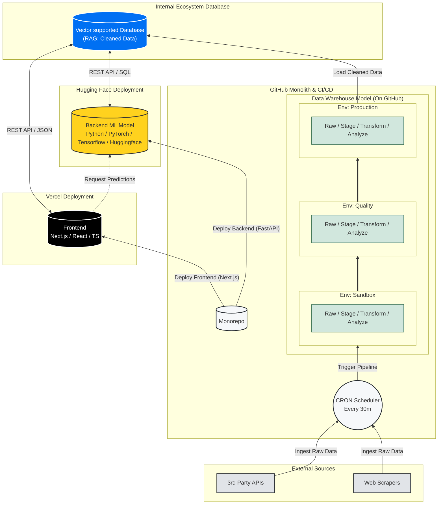

<a id="readme-top"></a>

<div align="center">

  

  <br />

  <a href="https://thomas-to-bcheme-github-io.vercel.app/">
    
  </a>
  <a href="src/docs/Thomas_To_Resume.pdf?raw=true">
    
  </a>
  <a href="https://www.linkedin.com/in/thomas-to-ucdavis/">
    
  </a>

  <br /><br />

  <!-- Tech Stack Badges -->
  
  
  
  
  
  

  <br />

  <!-- CI/CD Badge -->
  <a href="https://github.com/thomas-to/thomas-to-bcheme/actions/workflows/linkedin-scheduler.yml">
    
  </a>

</div>

---

## Features

- **AI Chat Agent** - Live streaming chat powered by Google Gemini with RAG context
- **LinkedIn Integration** - Automated LinkedIn posting via GitHub Actions CRON scheduler
- **Voice Controls** - Speech-to-Text input and Text-to-Speech output for AI chat
- **Project Showcase** - Interactive deep-dives into engineering projects
- **Architecture Visualization** - Mermaid diagrams with animated system flows
- **ROI Calculator** - Interactive calculator demonstrating business value
- **Development Roadmap** - Visual timeline of upcoming features
- **ML Salary Prediction** - Random Forest + TensorFlow models for job market analysis
- **Claude Code Plugins** - Distributable AI workflow automation (tto-init, git-commit, git-push, git-push-agentic, git-README)
- **Dark Mode Support** - Automatic theme switching with system preferences
- **Mobile Responsive** - Optimized UI with collapsible components and touch-friendly navigation
- **System Status Ticker** - Real-time system health monitoring display

<p align="right">(<a href="#readme-top">back to top</a>)</p>

---

## Claude Code Plugin Marketplace

This repository includes a **[Claude Code Plugin Marketplace](my_marketplace/)** with distributable plugins for AI-assisted development workflows.

> **Note:** This marketplace follows the [Claude Code Plugin Marketplaces schema](https://code.claude.com/docs/en/plugin-marketplaces#host-and-distribute-marketplaces). This schema reference is used to agentically generate tools in this marketplace, ensuring compatibility with Claude Code's expected plugin structure.

### Available Plugins

| Plugin | Description | Install |
|--------|-------------|---------|
| **[tto-init](my_marketplace/plugins/tto-init/)** | Initialize CLAUDE.md with programming-agnostic best practices | [Instructions](my_marketplace/README.md#installation) |
| **[git-commit](my_marketplace/plugins/git-commit/)** | Autonomous commit - auto stages all changes and generates commit message | [Instructions](my_marketplace/README.md#installation) |
| **[git-push](my_marketplace/plugins/git-push/)** | Interactive git push with manual commit messages | [Instructions](my_marketplace/README.md#installation) |
| **[git-push-agentic](my_marketplace/plugins/git-push-agentic/)** | Autonomous git workflow - auto stages, commits, and pushes | [Instructions](my_marketplace/README.md#installation) |
| **[git-README](my_marketplace/plugins/git-README/)** | 5-agent README generator with smart merge | [Instructions](my_marketplace/README.md#installation) |

### Quick Install

```bash
# Set plugin name: tto-init, git-commit, git-push, git-push-agentic, or git-README
PLUGIN_NAME="git-push"

# One-liner install
mkdir -p .claude/plugins/${PLUGIN_NAME}/.claude-plugin .claude/plugins/${PLUGIN_NAME}/skills/${PLUGIN_NAME} && \
curl -sL "https://raw.githubusercontent.com/thomas-to/thomas-to-bcheme/main/my_marketplace/plugins/${PLUGIN_NAME}/.claude-plugin/plugin.json" -o ".claude/plugins/${PLUGIN_NAME}/.claude-plugin/plugin.json" && \
curl -sL "https://raw.githubusercontent.com/thomas-to/thomas-to-bcheme/main/my_marketplace/plugins/${PLUGIN_NAME}/skills/${PLUGIN_NAME}/SKILL.md" -o ".claude/plugins/${PLUGIN_NAME}/skills/${PLUGIN_NAME}/SKILL.md"
```

Then use in Claude Code: `/init`, `/git-commit`, `/git-push`, `/git-push-agentic`, or `/git-README`

<p align="right">(<a href="#readme-top">back to top</a>)</p>

---

## Executive Summary

This repository showcases data architecture, design considerations, risk assessment, documentation, and roadmap of features in development. This document outlines the strategic design choices to minimize cost while maximizing the capabilities within this constraint. To design this project for the foreseeable future, its longevity and sustainability must remain free of charge. Therefore, the project design will be small-scale, proof of concept showcasing aptitude for designing, developing, and deploying software.

To demonstrate agentic fullstack software engineering, at least one of the following will be implemented using continuous integration and continuous deployment from GitHub acting as our data warehouse backend, to utilizing Vercel for its intended purpose as a frontend as a service:
* database
* algorithmic model
* agentic model

The purpose of this is to ***show, not tell, my personal [portfolio/resume](src/docs/Thomas_To_Resume.pdf?raw=true)*** and serves as an open source resource to others as a learning resource or to continue building on this framework themselves.

<p align="right">(<a href="#readme-top">back to top</a>)</p>

---

## Prerequisites

Before you begin, ensure you have the following installed:

| Requirement | Version | Purpose |
|-------------|---------|---------|
| **Node.js** | 20+ | JavaScript runtime |
| **npm** | 10+ | Package manager |
| **Python** | 3.8+ | ML backend |
| **Git** | Latest | Version control |

<p align="right">(<a href="#readme-top">back to top</a>)</p>

---

## Installation

### Frontend (Next.js)

```bash
# Clone the repository
git clone https://github.com/thomas-to/thomas-to-bcheme.git
cd thomas-to-bcheme

# Install dependencies
npm install

# Set up environment variables
cp .env .env.local
# Edit .env.local and add your GOOGLE_API_KEY
```

### Backend (Python ML)

```bash
# Navigate to backend directory
cd backend

# Create virtual environment (recommended)
python -m venv venv
source venv/bin/activate  # On Windows: venv\Scripts\activate

# Install dependencies
pip install -r requirements.txt
```

<p align="right">(<a href="#readme-top">back to top</a>)</p>

---

## Usage

### Development Server

```bash
# Start Next.js development server
npm run dev
```

Open [http://localhost:3000](http://localhost:3000) in your browser.

### Production Build

```bash
# Build for production
npm run build

# Start production server
npm start
```

### Run ML Models

```bash
cd backend
python main.py                      # Train with sample data
python main.py --data-path FILE.csv # Train with custom dataset
python main.py --no-plots           # Skip visualization (headless)
```

### Available Scripts

| Command | Description |
|---------|-------------|
| `npm run dev` | Start development server with hot reload |
| `npm run build` | Create production build |
| `npm start` | Start production server |
| `npm run lint` | Run ESLint |
| `npm run linkedin` | LinkedIn CLI for post management |
| `npm run linkedin:list` | List available LinkedIn posts |
| `npm run linkedin:post` | Publish post to LinkedIn |

<p align="right">(<a href="#readme-top">back to top</a>)</p>

---

## Project Structure

```
thomas-to-bcheme/
├── src/
│   ├── app/                    # Next.js App Router
│   │   ├── api/
│   │   │   ├── chat/           # Gemini streaming API endpoint
│   │   │   └── linkedin/       # LinkedIn API endpoints
│   │   │       ├── post/       # POST - publish to LinkedIn
│   │   │       └── content/    # GET - list available posts
│   │   ├── layout.tsx          # Root layout
│   │   └── page.tsx            # Home page
│   ├── components/             # React components (19 total)
│   │   ├── HeroSection.tsx     # Landing hero with badges
│   │   ├── AiGenerator.tsx     # Streaming chat interface
│   │   ├── ProjectDeepDive.tsx # Project showcase cards
│   │   ├── ArchitectureDiagram.tsx # System architecture viz
│   │   ├── ROICalculation.tsx  # Interactive ROI calculator
│   │   ├── Roadmap.tsx         # Development timeline
│   │   ├── VoiceControls.tsx   # STT/TTS interface
│   │   └── ...                 # Badge, BentoGrid, Connect, etc.
│   ├── hooks/                  # Custom React hooks
│   │   ├── useSpeechRecognition.ts
│   │   └── useSpeechSynthesis.ts
│   ├── lib/
│   │   ├── chat-api.ts         # Gemini client utilities
│   │   └── linkedin/           # LinkedIn API client
│   ├── data/
│   │   └── AiSystemInformation.tsx  # RAG context/system prompt
│   └── docs/                   # Resume and documentation
├── backend/                    # Python ML models
│   ├── main.py                 # Entry point
│   ├── ml_model.py             # Random Forest model
│   ├── dl_model.py             # TensorFlow model
│   ├── data_preprocessing.py   # Feature engineering
│   ├── evaluation.py           # Model metrics
│   └── requirements.txt
├── my_marketplace/             # Claude Code plugins
│   ├── plugins/
│   │   ├── tto-init/
│   │   ├── git-commit/
│   │   ├── git-push/
│   │   ├── git-push-agentic/
│   │   └── git-README/
│   └── README.md
├── genAI/                      # AI-generated content
│   └── linkedin-posts/         # Pre-written LinkedIn posts
│       ├── validated/          # Ready to publish
│       └── posted/             # Archived after publishing
├── system_design_docs/         # Architecture documentation (10 docs)
│   ├── architecture.md         # Platform KPIs & constraints
│   ├── api.md                  # Chat API specification
│   ├── database.md             # GitHub-as-warehouse pattern
│   ├── deployment.md           # CI/CD pipeline
│   ├── frontend.md             # React component architecture
│   ├── github-api.md           # GitHub Actions & CRON patterns
│   ├── linkedin-api.md         # LinkedIn OAuth & Share API
│   ├── ml-models.md            # ML/DL implementation details
│   └── roadmap.md              # Feature roadmap
├── .github/workflows/
│   └── linkedin-scheduler.yml  # CRON: Tuesdays 10 AM PST
├── public/                     # Static assets
├── CLAUDE.md                   # AI assistant instructions
├── package.json
├── tsconfig.json
└── README.md
```

<p align="right">(<a href="#readme-top">back to top</a>)</p>

---

## Configuration

### Environment Variables

Create a `.env.local` file in the root directory:

| Variable | Required | Description |
|----------|----------|-------------|
| `GOOGLE_API_KEY` | **Yes** | Google Gemini API key for chat functionality |
| `LINKEDIN_ACCESS_TOKEN` | For LinkedIn | OAuth bearer token (~60 day expiry) |
| `LINKEDIN_PERSON_URN` | For LinkedIn | Format: `urn:li:person:{sub}` from OAuth id_token |
| `LINKEDIN_CLIENT_ID` | For token refresh | LinkedIn OAuth app Client ID |
| `LINKEDIN_CLIENT_SECRET` | For token refresh | LinkedIn OAuth app Client Secret |
| `LINKEDIN_DRY_RUN` | No | Set `true` to test posting without publishing |
| `AWS_ACCESS_KEY_ID` | No | AWS credentials for DynamoDB/S3 |
| `AWS_SECRET_ACCESS_KEY` | No | AWS credentials for DynamoDB/S3 |
| `VERCEL_API_KEY` | No | Vercel API for deployment automation |

> **Note:** See [system_design_docs/linkedin-api.md](system_design_docs/linkedin-api.md) for detailed LinkedIn OAuth setup.

### TypeScript Path Aliases

The project uses `@/*` to map to `./src/*`:

```typescript
import { Component } from "@/components/Component";
```

<p align="right">(<a href="#readme-top">back to top</a>)</p>

---

## API Reference

### Chat API

| Endpoint | Method | Description |
|----------|--------|-------------|
| `/api/chat` | POST | Streaming chat with Gemini AI + RAG context |

**Request:**
```json
{
  "messages": [
    { "role": "user", "content": "Tell me about Thomas" }
  ]
}
```

**Response:** Server-Sent Events (SSE) streaming text with correlation ID header.

For detailed documentation, see: [system_design_docs/api.md](system_design_docs/api.md)

### LinkedIn API

| Endpoint | Method | Description |
|----------|--------|-------------|
| `/api/linkedin/content` | GET | List available pre-written posts |
| `/api/linkedin/post` | POST | Publish content to LinkedIn |

**POST Request:**
```json
{
  "source": "file",
  "filename": "2026-02-17-topic-name",
  "visibility": "PUBLIC"
}
```

**Response (201):**
```json
{
  "success": true,
  "postId": "urn:li:share:...",
  "correlationId": "uuid"
}
```

For detailed documentation, see: [system_design_docs/linkedin-api.md](system_design_docs/linkedin-api.md)

<p align="right">(<a href="#readme-top">back to top</a>)</p>

---

## About Me

I am a **(Founding) Engineer** with a formal background in [Biochemical Engineering](https://catalog.ucdavis.edu/departments-programs-degrees/chemical-engineering/biochemical-engineering-bs/#requirementstext), and [research](https://mcnair.ucdavis.edu/sites/g/files/dgvnsk476/files/inline-files/Design%20to%20Data%20for%20mutants%20of%20%CE%B2-glucosidase%20B%20from%20Paenibacillus%20polymyxa%20L171G%2C%20L171V%20and%20L171W.pdf), applying fullstack software engineering in various fields and usecases on a strong mathematical and emperical foundation to design end-to-end architectures that bridge physical reality with cloud infrastructure. 

My experience spans the entire data lifecycle—from capturing empirical data on the manufacturing floor to digitizing it via enterprise ETL/ELT pipelines and digitulizing it through Agentic Machine Learning and automated applications for digital transformation. By architecting data models and pipelines that accurately reflect real-world processes, I deliver tangible value, driving efficiency, revenue generation, and optimization through scalable, reality-grounded software solutions.

> **We've seen how even simplistic algorithms can automate manual workflows. Now with Agentic methods, I combine classical fullstack methods with agentic AI/ML solutions to drive reality into the future.**

As of Dec 2025, I have taken on reaching out to protein academics to support GenAI of novel designs leveraging my formal background. Working in industry with tech during the day and protein design by night.

---

## Summary of System Architecture: ETL & Data Flow

This diagram illustrates the automated pipeline moving data from external sources into Github "database folder" for accumulated (semantic) pre-processing of raw data from sandbox, test, to product with raw, staging, transform, and analyze layers before moving enviornments to Server-side database, Vercel Edge Config for low-latency frontend access.

### System Design Conclusions
* 30 minute CRON frequency [See KPIs](system_design_docs/architecture.md#system-design-key-performance-indicators-kpi)
* 1 server-side (vercel) integrated database [See Vercel Limits](system_design_docs/architecture.md#vercel-free-hobby-limitation-specifications)

For detailed technical specifications, refer to the following documentation:
- [Architecture](system_design_docs/architecture.md)
- [Database](system_design_docs/database.md)
- [API](system_design_docs/api.md)
- [LinkedIn API](system_design_docs/linkedin-api.md)
- [GitHub Actions](system_design_docs/github-api.md)
- [Deployment](system_design_docs/deployment.md)
- [Roadmap](system_design_docs/roadmap.md)


### 🏗️ Built Using

| **Core Infrastructure** | **Frontend** | **Data & Backend** | **AI & Integrations** |
| :--- | :--- | :--- | :--- |
| **Git & GitHub** (Version Control + "Database") | **React 19.2.3** (UI Library) | **Vercel Blob** (Object Storage) | **Gemini API** (GenAI Logic) |
| **Vercel** (Edge Hosting & Deployment) | **TypeScript 5** (Type Safety) | **AWS DynamoDB** (NoSQL / Roadmap) | **Hugging Face** (Model Inference) |
| **GitHub Actions** (CI/CD & CRON Workers) | **Next.js 16.1.1** (App Router) | **Node.js** (ETL Scripting) | **scikit-learn** (ML Models) |
| **Markdown** (Documentation as Code) | **Tailwind CSS v4** (Styling) | **Python 3** (ML Backend) | **TensorFlow** (Deep Learning) |
| | **Framer Motion** (Animations) | **OpenSSH** (Secure Auth) | **RESTful API** (public-apis) |

<p align="right">(<a href="#readme-top">back to top</a>)</p>

---

## Testing

> **Note:** A formal test framework is not yet configured. Current quality assurance includes:

| Tool | Command | Description |
|------|---------|-------------|
| ESLint | `npm run lint` | Static code analysis |
| TypeScript | `npm run build` | Type checking (strict mode) |

<p align="right">(<a href="#readme-top">back to top</a>)</p>

---

## Contributing

Contributions are welcome! Please follow these steps:

1. Fork the repository
2. Create a feature branch (`git checkout -b feature/amazing-feature`)
3. Commit your changes following conventional commit format
4. Push to your branch (`git push origin feature/amazing-feature`)
5. Open a Pull Request

For Claude Code Plugins, see the [Plugin Marketplace Contributing Guide](my_marketplace/README.md).

<p align="right">(<a href="#readme-top">back to top</a>)</p>

---

## License

MIT License - This project is provided as an open source learning resource.

<p align="right">(<a href="#readme-top">back to top</a>)</p>

---