# Thomas To Portfolio

> A fullstack engineering portfolio with an embedded AI chat agent, demonstrating "Show, Don't Tell" through live, interactive technology.

[](https://thomas-to-bcheme-github-io.vercel.app/)
[](src/docs/Thomas_To_Resume.pdf?raw=true)
[](https://www.linkedin.com/in/thomas-to-ucdavis/)

[](https://www.typescriptlang.org/)
[](https://nextjs.org/)
[](https://react.dev/)
[](https://tailwindcss.com/)
[](https://python.org/)

---

## System Architecture

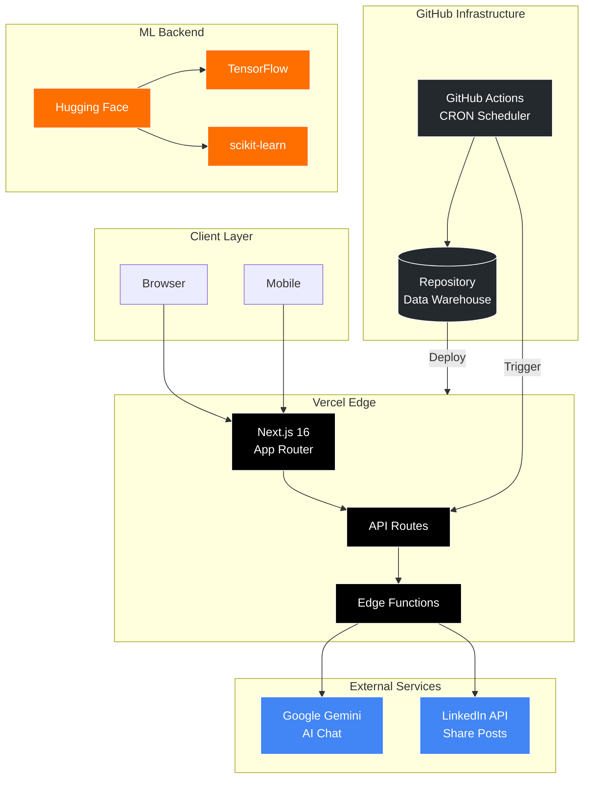

---

## Features

| Feature | Description |
|---------|-------------|
| **AI Chat Agent** | Live streaming chat powered by Google Gemini with RAG context |
| **LinkedIn Automation** | Scheduled posting via GitHub Actions with content management |
| **Voice Controls** | Speech-to-Text input and Text-to-Speech output |
| **Project Showcase** | Interactive deep-dives with architecture visualizations |
| **ROI Calculator** | Interactive calculator demonstrating business value |
| **ML Salary Prediction** | Random Forest + TensorFlow models for job market analysis |
| **Claude Code Plugins** | 15 specialized agent plugins for AI-assisted workflows |
| **Dark Mode** | Automatic theme switching with system preferences |

---

## Tech Stack

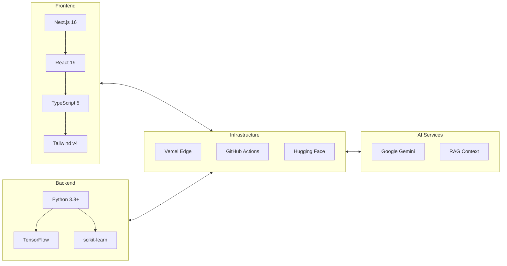

| Category | Technologies |
|----------|-------------|
| **Frontend** | Next.js 16, React 19, TypeScript 5, Tailwind CSS v4, Framer Motion |
| **AI/ML** | Google Gemini API, TensorFlow, scikit-learn, NumPy, Pandas |
| **Backend** | Python 3.8+, Node.js |
| **Infrastructure** | Vercel (Edge Functions), GitHub Actions (CI/CD), AWS SDK |
| **Data** | AWS DynamoDB, S3, Vercel Edge Config, Vercel Blob |
| **Quality** | ESLint 9, TypeScript strict mode, Zod validation |

---

## Quick Start

```bash
# Clone and install
git clone https://github.com/thomas-to-bcheme/thomas-to-bcheme.git
cd thomas-to-bcheme
npm install

# Configure environment
cp .env .env.local
# Add GOOGLE_API_KEY to .env.local

# Run development server
npm run dev
```

Open [http://localhost:3000](http://localhost:3000)

### ML Backend (Optional)

```bash
cd backend
pip install -r requirements.txt
python main.py
```

---

## Project Structure

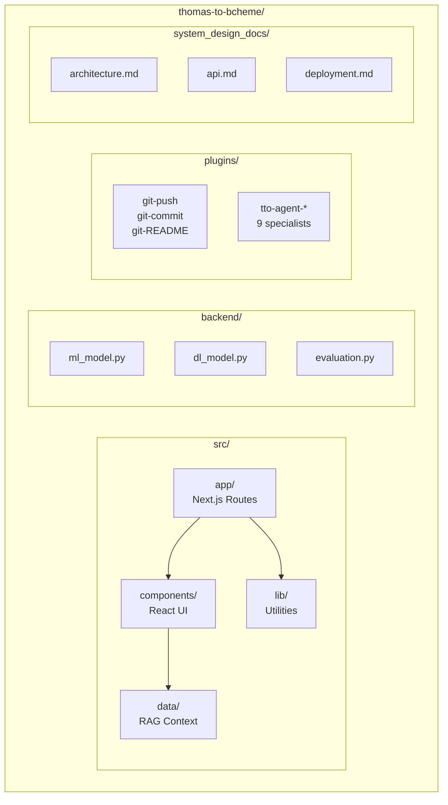

<details>
<summary>Full Directory Tree</summary>

```
thomas-to-bcheme/
├── src/
│   ├── app/                      # Next.js App Router
│   │   ├── api/
│   │   │   ├── chat/route.ts     # Gemini streaming endpoint
│   │   │   └── linkedin/         # LinkedIn API endpoints
│   │   ├── layout.tsx
│   │   └── page.tsx
│   ├── components/               # React components (18 total)
│   ├── data/
│   │   └── AiSystemInformation.tsx  # RAG context
│   ├── lib/                      # Utilities
│   └── hooks/                    # Custom React hooks
├── backend/                      # Python ML models
│   ├── main.py
│   ├── ml_model.py               # Random Forest
│   ├── dl_model.py               # TensorFlow
│   └── requirements.txt
├── plugins/                      # Claude Code agents (15 total)
│   ├── git-push/
│   ├── git-commit/
│   ├── git-README/
│   ├── tto-agent-orchestrator/
│   └── ...
├── system_design_docs/           # Architecture documentation
├── genAI/linkedin-posts/         # Content management
├── .github/workflows/
└── CLAUDE.md
```

</details>

---

## API Reference

### Chat API

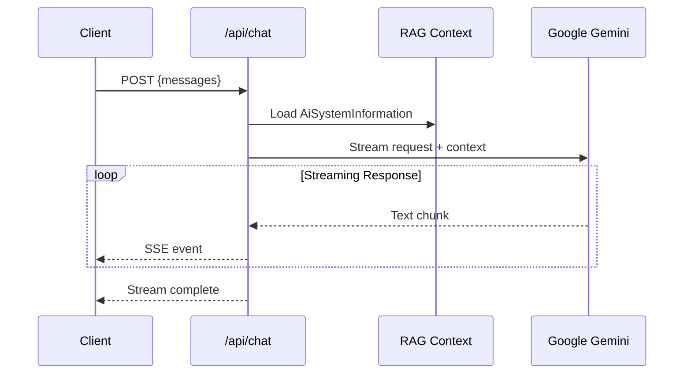

**POST** `/api/chat`

```json
{
  "messages": [
    { "role": "user", "content": "Tell me about Thomas" }
  ]
}
```

**Response:** SSE stream with `X-Correlation-ID` header

### LinkedIn CLI

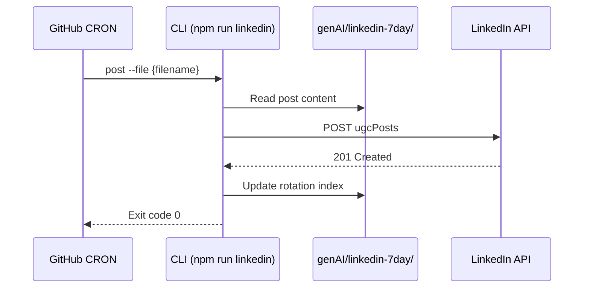

| Command | Description |
|---------|-------------|
| `npm run linkedin list` | List available posts |
| `npm run linkedin post -- --file <name>` | Publish to LinkedIn |
| `npm run linkedin post -- --dry-run` | Test without posting |

---

## Configuration

| Variable | Required | Description |
|----------|----------|-------------|
| `GOOGLE_API_KEY` | Yes | Google Gemini API key |
| `LINKEDIN_ACCESS_TOKEN` | No | OAuth bearer token |
| `LINKEDIN_PERSON_URN` | No | `urn:li:person:{id}` |
| `LINKEDIN_DRY_RUN` | No | Test without posting |
| `AWS_ACCESS_KEY_ID` | No | AWS credentials |
| `AWS_SECRET_ACCESS_KEY` | No | AWS credentials |

See [system_design_docs/linkedin-api.md](system_design_docs/linkedin-api.md) for OAuth setup.

---

## Claude Code Plugins

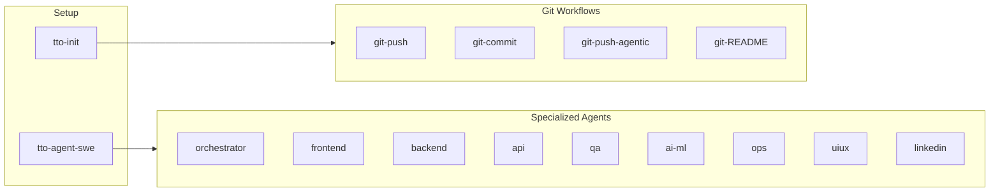

| Plugin | Description | Command |
|--------|-------------|---------|
| **tto-init** | Initialize CLAUDE.md | `/init` |
| **git-commit** | Auto-generate commit | `/git-commit` |
| **git-push** | Interactive push | `/git-push` |
| **git-push-agentic** | Autonomous workflow | `/git-push-agentic` |
| **git-README** | 5-agent README generator | `/git-README` |

### Quick Install

```bash
PLUGIN_NAME="git-push"
mkdir -p .claude/plugins/${PLUGIN_NAME}/.claude-plugin .claude/plugins/${PLUGIN_NAME}/skills/${PLUGIN_NAME} && \
curl -sL "https://raw.githubusercontent.com/thomas-to/thomas-to-bcheme/main/plugins/${PLUGIN_NAME}/.claude-plugin/plugin.json" -o ".claude/plugins/${PLUGIN_NAME}/.claude-plugin/plugin.json" && \
curl -sL "https://raw.githubusercontent.com/thomas-to/thomas-to-bcheme/main/plugins/${PLUGIN_NAME}/skills/${PLUGIN_NAME}/SKILL.md" -o ".claude/plugins/${PLUGIN_NAME}/skills/${PLUGIN_NAME}/SKILL.md"
```

---

## CI/CD Pipeline

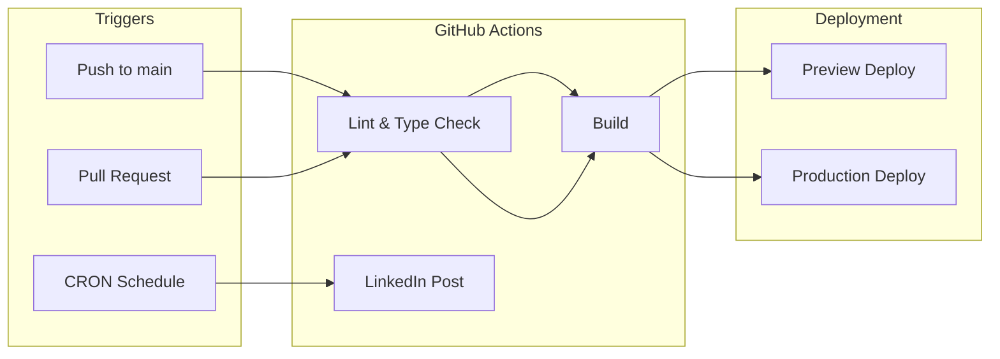

| Workflow | Schedule | Description |
|----------|----------|-------------|
| `linkedin-scheduler.yml` | Tuesdays 10:07 AM PST | Automated LinkedIn posting |

---

## Documentation

| Document | Description |
|----------|-------------|
| [Architecture](system_design_docs/architecture.md) | Platform KPIs, zero-cost infrastructure |
| [API Design](system_design_docs/api.md) | Chat API streaming, RAG context |
| [LinkedIn API](system_design_docs/linkedin-api.md) | OAuth 2.0 setup, posting workflow |
| [Database](system_design_docs/database.md) | GitHub-as-warehouse pattern |
| [Deployment](system_design_docs/deployment.md) | CI/CD pipeline, Vercel config |
| [Frontend](system_design_docs/frontend.md) | Component architecture |
| [ML Models](system_design_docs/ml-models.md) | Random Forest + TensorFlow |
| [Roadmap](system_design_docs/roadmap.md) | Feature timeline |

---

## Roadmap

Three tracks of planned work extending this portfolio into production ML deployment, content automation, and developer tooling.

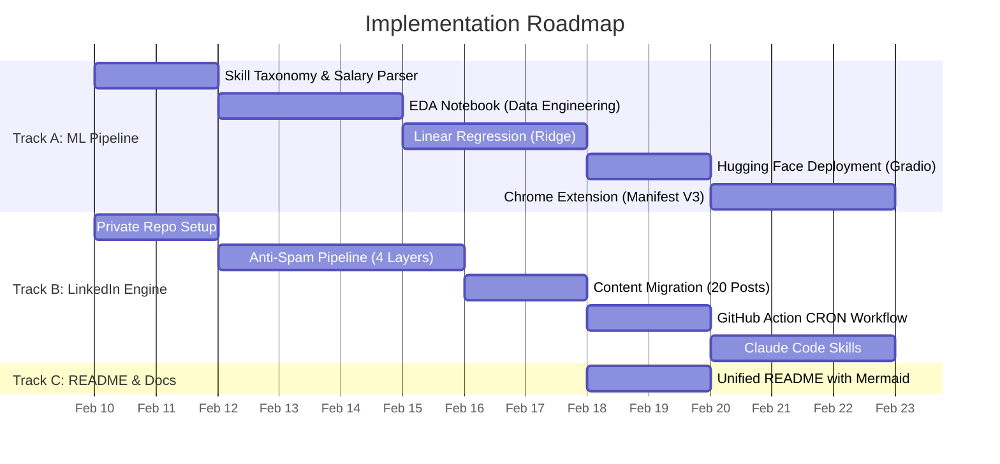

### Track A: Data Engineering Salary Prediction

EDA and ML pipeline for predicting data engineering salaries, identifying the AI skills premium.

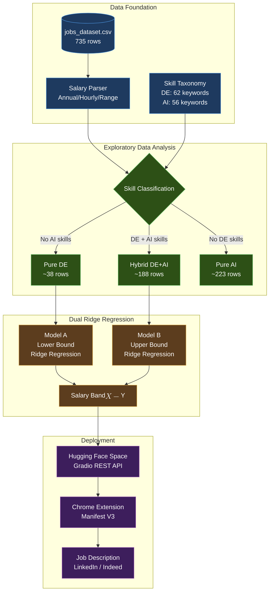

**Why Linear Regression?** The existing Random Forest and TensorFlow models predict general salary. Linear regression serves a different purpose here: **interpretability**. Ridge coefficients directly answer "which skills command a premium?" and two separate models (Pure DE vs Hybrid DE+AI) create a meaningful salary band. With only ~38 Pure DE rows, Ridge regularization prevents overfitting where tree-based methods would.

<details>
<summary>A1. Skill Taxonomy & Salary Parser</summary>

**Files:** `backend/config/skill_taxonomy.py`, `backend/de_salary/salary_parser.py`

- DE keywords (62): ETL, Spark, Airflow, Kafka, Snowflake, dbt, data warehouse, data lake, etc.
- AI keywords (56): machine learning, TensorFlow, PyTorch, NLP, LLM, computer vision, etc.
- `classify_role()` segments each job as "Pure DE", "Hybrid DE+AI", "Pure AI", or "General"
- `compute_de_score()` / `compute_ai_score()` return continuous 0.0-1.0 scores
- Salary parser handles all observed formats: annual range/single, hourly range/single

</details>

<details>
<summary>A2. EDA Jupyter Notebook</summary>

**File:** `backend/notebooks/01_eda_data_engineering.ipynb`

1. Data loading + quality assessment
2. Salary parsing + distribution (histogram + box plot)
3. Role classification using skill taxonomy (segment pie chart)
4. Salary box plot by segment (Pure DE vs Hybrid DE+AI vs Pure AI)
5. Top 20 keyword frequency per segment
6. DE-AI skill co-occurrence heatmap
7. Seniority x segment salary analysis
8. Geographic salary analysis by segment

</details>

<details>
<summary>A3. Ridge Regression Models</summary>

**File:** `backend/de_salary/linear_model.py`

| Model | Training Data | Features | Output |
|-------|--------------|----------|--------|
| Model A (Lower) | Pure DE (~38 rows) | Seniority, DE skill count, cloud/streaming/orchestration/warehouse flags, location tier | DE baseline salary |
| Model B (Upper) | Hybrid DE+AI (~188 rows) | Same + AI skill count, ML framework flag, NLP flag | AI premium salary |

- 5-fold cross-validation (mandatory for small samples)
- Metrics: MAE, RMSE, R2, MAPE via existing `ModelEvaluator`
- Coefficient bar charts + VIF multicollinearity analysis

</details>

<details>
<summary>A4. Hugging Face Deployment</summary>

**File:** `backend/hf_space/app.py` (Gradio)

```
POST /api/predict
Request:  { "data": ["<job_description>", "<position_name>"] }
Response: { "segment", "salary_lower", "salary_upper", "de_skills_found", "ai_skills_found" }
```

- Serialize models with `joblib`
- Gradio auto-exposes REST API
- Free tier, CPU-only

</details>

<details>
<summary>A5. Chrome Extension</summary>

**Directory:** `chrome-extension/` (Manifest V3)

- Content script extracts job descriptions from LinkedIn, Indeed, Greenhouse
- Configurable selector registry per job board (no hardcoding)
- Popup sends extracted text to Hugging Face API
- Displays salary band, segment classification, and matched skills

</details>

### Track B: LinkedIn Content Engine

Private repository (`linkedin-content-engine`) for CI/CD content automation with a 4-layer anti-spam pipeline.

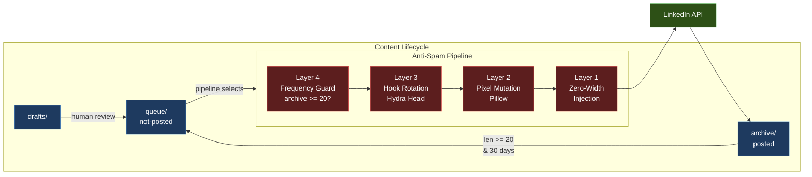

<details>
<summary>B1. Repository Structure</summary>

```
linkedin-content-engine/          (private repo)
├── .github/workflows/
│   ├── linkedin-poster.yml       CRON: 7:30 AM PST, Mon-Thu (4/week)
│   └── content-audit.yml         Weekly Sunday health check
├── content/
│   ├── queue/                    Ready to post
│   ├── archive/                  Published (recycling source)
│   └── drafts/                   WIP (human review)
├── assets/carousels/             Image attachments per post
├── pipeline/
│   ├── run.py                    Orchestrator entry point
│   ├── selector.py               Queue selection + frequency guard
│   ├── assembler.py              Hook rotation (Hydra Head)
│   ├── image_mutator.py          Pixel mutation (Pillow)
│   └── antispam.py               Zero-width injection
├── state/
│   ├── post-history.json         What posted, when, which hook
│   ├── queue-manifest.json       Queue/archive sizes
│   └── hook-tracker.json         Hook rotation tracking
├── context/
│   └── portfolio-rag-snapshot.md  Curated RAG context from portfolio
└── scripts/                      Forked from portfolio
```

</details>

<details>
<summary>B2. Post Frontmatter Schema</summary>

```yaml
---
date: 2026-02-17
topic: Constraint-Driven Architecture
target_audience: CTOs, Engineering Managers
category: system-design

hooks:                                    # Layer 3: Hydra Head
  - "Hook variant 1..."
  - "Hook variant 2..."
  - "Hook variant 3..."

hashtag_sets:                             # Metadata diversification
  - ["#SystemDesign", "#OpenToWork"]
  - ["#MLEngineering", "#BuildInPublic"]

cta_variants:
  - "Happy to connect and chat!"
  - "Would love to hear your approach."

carousel: null                            # Optional image folder
times_posted: 0                           # Pipeline-populated
last_posted: null
hooks_used: []
---
Body content here...
```

</details>

<details>
<summary>B3. Anti-Spam Stack</summary>

| Layer | Threat | Solution | Implementation |
|-------|--------|----------|----------------|
| 1 | Exact String Match | Zero-Width Injection (`\u200B` between words at ~5% density) | `antispam.py` |
| 2 | Image Fingerprinting | Pixel Mutation (bottom-right pixel RGB +1 via Pillow) | `image_mutator.py` |
| 3 | Semantic Detection | Hook Rotation (3+ intros per post, tracked in `hook-tracker.json`) | `assembler.py` |
| 4 | Frequency Penalties | Queue Minimum (hard guard: `archive >= 20`, 30-day memory window) | `selector.py` |

**Safety rule:** Auto-recycle is disabled until 20 posts in archive. Mathematical basis: 4 posts/week x 5 weeks (safe margin) = 20 minimum queue size.

</details>

<details>
<summary>B4. GitHub Action CRON</summary>

- **Schedule:** `30 15 * * 1-4` (7:30 AM PST = 15:30 UTC, Mon-Thu)
- **PDT drift:** During daylight saving, posts go out at 8:30 AM local (acceptable)
- **Steps:** Checkout -> Python setup -> Anti-spam pipeline -> LinkedIn API -> Archive file -> Commit state -> Push
- **Supports:** `workflow_dispatch` with `dry_run` and `specific_post` inputs
- **State commit:** Atomic `git add content/ state/ && git commit && git push`

</details>

### Track C: Claude Code Skills

<details>
<summary>C1. /git-commit-linkedin</summary>

Extends `/git-commit` with LinkedIn post drafting:
1. **Phase 1:** Standard git add + commit
2. **Phase 2:** Analyze diff, generate LinkedIn post draft with 3 hook variants
3. **Phase 3:** Save to `content/drafts/YYYY-MM-DD-topic.md` (human review required)

</details>

<details>
<summary>C2. /git-PRD</summary>

Multi-agent PRD generator:
1. Inventory all agents (glob `.claude/agents/*.md`)
2. Draft system design doc per agent (with Mermaid diagrams)
3. Each agent reviews its own doc as subagent (peer review)
4. Orchestrator performs final PRD quality gate

</details>

<details>
<summary>C3. /git-README Mermaid Enhancement</summary>

Extend existing 5-agent README skill:
- Agent 1: Identify data flows and component relationships for Mermaid diagrams
- Agent 5: Generate Mermaid flowchart/sequence diagrams
- Merge rule: Validate Mermaid syntax, prefer `flowchart LR` for architecture

</details>

---

## Contributing

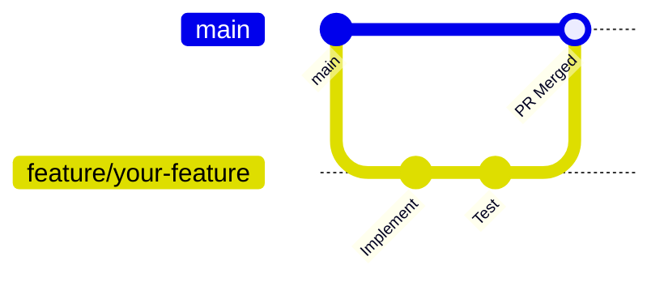

1. Fork the repository
2. Create feature branch: `git checkout -b feature/amazing-feature`
3. Follow coding standards in `CLAUDE.md`
4. Run linting: `npm run lint`
5. Commit changes: `git commit -m 'Add feature'`
6. Push and open PR

---

## License

MIT License - Open source learning resource.

---

## Author

**Thomas To** - Biochemical Engineer turned Fullstack Developer

- [Portfolio](https://thomas-to-bcheme.vercel.app)
- [LinkedIn](https://www.linkedin.com/in/thomas-to-ucdavis/)
- [GitHub](https://github.com/thomas-to-bcheme)
- Email: thomas.to.bcheme@gmail.com
