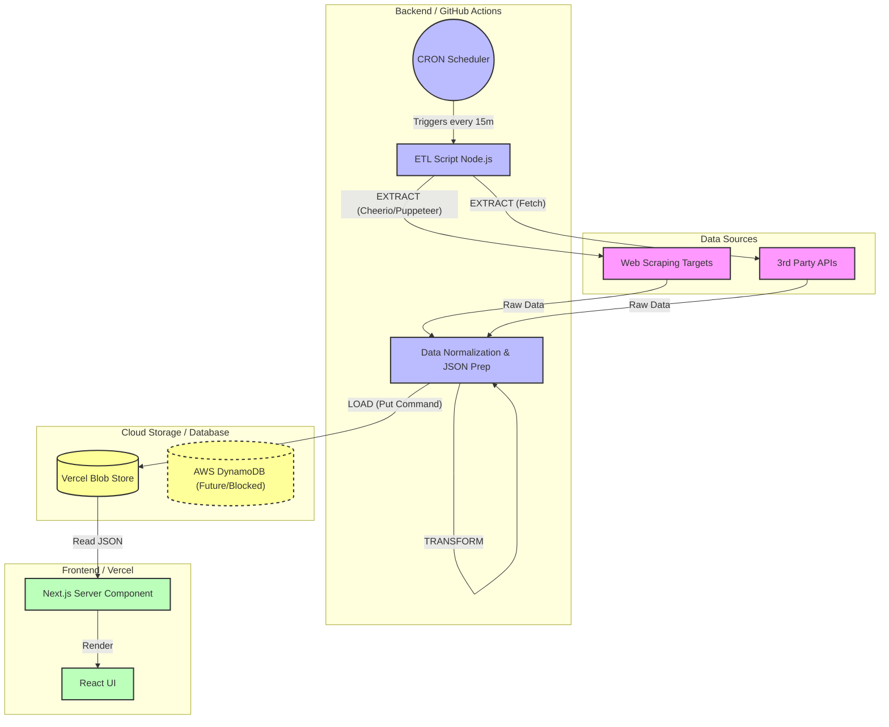

  

   

  
  
  
  

   
   

  

    <b>Bridging "Physical Reality" (Biotech/IoT) with "Cloud Architecture" (AI/Snowflake).</b>
     
    Building secure, ROI-driven (AI/ML) systems that safeguard assets and automate the mundane.
  

---

## 👨‍💻 Executive Summary

This repository serves as a **Proof of Concept (PoC)** for a scalable data ingestion system. The aim is to showcase high level data architecture, bottleneck design considerations (price, security, scope), documentation of roadblocks, and next step roadmaps of features in development. The main purpose of this is to show, not tell, my personal portfolio which serves as an open source resource contribution to others as as learning resource or to continue building on this framework themselves.

This architecture applied professionally can be found **[here](markdown/architecture_professional.md)**

## 🤖 About Me

I am a **Founding Fullstack (AI/ML) Engineer** with a background in **Biochemical Engineering**. This background has allowed me to experience first-hand, on-the-floor and off-the-floor manufacturing experiences to design end-to-end architecture and data models to reflect "physical reality."

I specialize in **Zero-to-One Architecture**: starting from the generation of empirically obtained data, digitized into enterprise systems (ETL/ELT), and utilized for **Agentic Machine Learning**, data analytics, and automated applications.

> **Core Philosophy:** "Even simplistic algorithms can automate manual workflows. Now with Agentic methods, I combine classical fullstack methods with agentic AI/ML solutions to drive reality into the future."

## 🛠 Tech Stack & Core Competencies

I operate across the full stack, from **Operations & IoT** to **Agentic AI**, with experience in developing, training, and deploying my own **Biotech Data Models**.

| **🤖 AI & Agentic Systems** | **📊 Data & Analytics** | **💻 Full Stack & API** | **☁️ Cloud, DevOps & IoT** |
| :--- | :--- | :--- | :--- |
| **LangChain** | **Snowflake** | **Python** | **Google Cloud** |
| **RAG / LLMs** | **dbt** | **TypeScript** | **AWS** |
| **PyTorch** | **PostgreSQL** | **Next.js** | **Docker** |
| **TensorFlow** | **Tableau** | **React.js** | **Kubernetes** |
| **Hugging Face** | **Fivetran** | **FastAPI** | **CI/CD** |

### 🧬 Bio-Computation Tools
* **Molecular Modeling:** pyRosetta, pyMol, Benchling
* **Computer Vision:** ImageJ, Fiji, OpenCV

---

[🏠 Home](/README.md) | [🏗️ Architecture](#Project_Architecture) | [🚀 Deployment](deployment)

---

  
<b>📚 Table of Contents</b>

  <ol>
    <li><a href="#executive-summary">Executive Summary</a></li>
    <li>
      <a href="#architecture">Featured Architecture</a>
      <ul>
        <li><a href="#system-design">System Design Highlights</a></li>
      </ul>
    </li>
    <li><a href="#tech-stack">Tech Stack & Core Competencies</a></li>
    <li><a href="#experience">Experience Highlights</a></li>
    <li><a href="#documentation">Design & Documentation (GxP)</a></li>
    <li><a href="#connect">Connect With Me</a></li>
  </ol>

## 🏗️ Project Architecture: Zero-to-One ETL/ELT Pipeline
To design this project for the foreseeable future, it's longevity and sustainability must remain free of charge. Therefore, the project design will be small-scale, proof of concept showcasing aptitude for designing, developing, and deploying. This document outlines the strategic design choices to minimize cost while maximizing automation frequency. The core philosophy is to offload "Heavy Lifting" (Compute/Duration) to GitHub acting as our data warehouse backend, utilizing Vercel for it's intended purpose as a frontend as a service.

## System Design Key Performance Indicators (KPI):
| Feature | **GitHub Public Repo (Free)** | **Vercel Hobby (Free)** |
| :--- | :--- | :--- |
| **Usage Limit** | **Unlimited Minutes** | **2 Cron Jobs Total** |
| **Reset Logic** | **Fixed Date** (Billing Cycle Start) | **Rolling Window** (24h & 30d) |
| **Max Frequency** | Every 5 minutes | **Once per Day** (24 hours) |
| **Execution Time** | Up to **6 hours** per run | Max **10–60 seconds** |
| **Precision** | Low (delay 5–30 mins) | Low (delay up to 1 hour) |
| **Resource Access** | Full VM (Filesystem, CLI, Docker) | HTTP Endpoint only (Serverless) |
| **Overages** | N/A (Always free for public) | **None** (Hard stop at limit) |

### ⏳ KPI 1: Platform Reset Windows for Time Design Considerations

When architecting your data pipeline, it is critical to understand *how* your limits reset, as this dictates your deployment strategy.

### 1. Vercel: The "Moving Target" (Traffic Strategy)
Vercel does **not** reset on the 1st of the month. It uses a **Rolling Window**.
* **Daily Limits (100 deploys):** Reset exactly **24 hours** after the specific activity occurred. If you deploy 50 times at 2:00 PM today, you don't get those 50 slots back until 2:00 PM tomorrow.
* **Monthly Limits (Bandwidth/Builds):** Usage drops off exactly **30 days** after it was accrued.
* **Design Implication:** You cannot "sprint" at the end of the month. High activity today will "penalize" your quota for exactly 30 days. You must smooth out your deployments to avoid hitting a hard stop.

### 2. GitHub: The "Clean Slate" (Calendar Strategy)
GitHub operates on a **Fixed Billing Date**.
* **Reset Date:** All usage counters (minutes, storage caps) reset to zero on your account's specific monthly billing day (usually the day you created your account).
* **Design Implication:** This is predictable. If you have a heavy data processing job (like a monthly migration), schedule it for the first day of your billing cycle to maximize available resources.

---
### ⏳ KPI 2: Maximizing Automation (CRON) Frequency
Both platforms mutually reset per their respective 30 day window. While the design and delivery of a product may not impact this window, this initial minimal viable product aims to identify the maximum allowable frequency for as "real-time" as the free data pipeline can support. As this project goes on, monitoring feature scalability overtime will support whether or not additional "real-time" data will or will not be supported but lower impact & overhead deliverables can be supported (e.g static pages, no API calls, "hard-coded" to deployment)

### Architecture Comparison: GitHub (CI) vs. Vercel (CD)

| Key Performance Indicator (KPI) | GitHub (Logic Engine) | Vercel (Rendering Engine) |
| :--- | :--- | :--- |
| **1. Costing Structure** | **Unlimited Usage** For public repositories, there are no execution limits. | **Hard Limits** No overage fees. If limits are hit, deployment pauses until the window resets. |
| **2. Deployment Thresholds** | **No Hard Count Limit** Limited only by concurrent job slots. | **Quantity Capped** • **Daily:** 100 deployments (rolling 24h) • **Monthly:** ~3,000 deployments (30-day window) |
| **3. Execution Duration** | **Up to 6 Hours** Ideal for long-running processes. | **10–60 Seconds** Serverless functions time out immediately. |
| **Strategic Role** | **The ETL Layer** Handles web scraping, complex data transformation, and API aggregation. | **The Presentation Layer** Receives final, pre-processed JSON for fast static rendering. |

### The "Cron" Problem
Vercel's Hobby plan limits Cron Jobs to **once per day**. This is insufficient for real-time or hourly data updates.

### The "Vercel-Pinger" Solution (Technical Hack)
To bypass the Vercel scheduling limit, we utilize the **GitHub Action -> Vercel Webhook** pattern:
1.  **Schedule:** Set GitHub Action to run hourly (or desired frequency).
2.  **Execute:** GitHub performs the ETL (Scraping/API Calls).
3.  **Trigger:** GitHub commits the new data file (`data.json`) to the repo.
4.  **Deploy:** The commit automatically triggers a Vercel deployment.

*Result:* We achieve high-frequency updates using GitHub's scheduler, bypassing Vercel's Cron limits entirely.

---

## 4. Final Verdict: Maximum Allowable Frequency

To ensure the system never hits a "Hard Stop," we calculate the safe frequency based on Vercel's daily limit of **100 deployments**.

### The Calculation
* **Limit:** 100 Deployments / 24 Hours.
* **Safety Buffer:** Leave 20% headroom for manual hotfixes/commits (20 deploys).
* **Available Slots:** 80 Deployments / 24 Hours.

### Recommendation
**Safe Maximum Frequency: Hourly (24 Deployments/Day)**

* **Cost:** $0.00 (Free).
* **Capacity Used:** 24% of daily limit.
* **Risk:** Extremely Low. Even if multiple commits occur, the rolling window will easily absorb 24 automated deploys plus manual work.

**Warning:** Do **not** exceed a frequency of **Every 15 Minutes** (96 deploys/day). This creates a "Red Zone" risk where a single manual commit could lock your project for 24 hours.

## [Background](/markdown/architecture.md)

*(This diagram is live-rendered by GitHub using Mermaid.js)*

---

## 🛠 Project Tech Stack

### 🏗️ Built Using
This portfolio is a live "Serverless & Agentic" proof-of-concept built using the following stack:

| **Core Infrastructure** | **Frontend Experience** | **Data & Backend** | **AI & Integrations** |
| :--- | :--- | :--- | :--- |
| **Git & GitHub** (Version Control + "Database") | **React** (UI Library) | **Vercel Blob** (Object Storage) | **Gemini API** (GenAI Logic) |
| **Vercel** (Edge Hosting & Deployment) | **TypeScript** (Type Safety) | **AWS DynamoDB** (NoSQL / Roadmap) | **Hugging Face** (Model Inference) |
| **GitHub Actions** (CI/CD & CRON Workers) | **Next.js** (Server Components) | **Node.js** (ETL Scripting) | **Coinbase API** (Fintech Data) |
| **Markdown** (Documentation as Code) | **Tailwind CSS** (Styling) |  | **REST / GraphQL** (Cross-Platform API) |

---

## 🚀 Experience Highlights

Here is what you will find detailed in my **[Resume](src/docs/Thomas_To_Resume.pdf?raw=true)**:

### **Founding Fullstack Engineer | Canventa Life Sciences**
* **AI/ML Integration:** Architected a revenue optimization system using Snowflake to integrate a predictive machine learning model with a Retrieval Augmented Generative (RAG) AI agent.
    * *Impact:* Reduced stakeholder decision-making from hours to minutes.
* **Knowledge Engineering:** Enriched RAG fine-tuning with Confluence data to enhance GenAI context, improving learning rates by **80%** (Wright’s Law).
* **DevOps:** Deployed an in-house fullstack SaaS on GCP via CI/CD, reducing daily calculation time by **87% (-40 min)**.

### **Founder | Proprietary FinTech**
* **Algorithmic Trading:** Deployed an ETF solution identifying market gaps across brokerages.
* **IoT Architecture:** Hosted secure trading bots on headless Raspberry Pi & AntMiner clusters.

### **Research Engineer | UC Davis**
* **$63.2M Savings:** Optimized biological models using numerical methods (Nandi/McDonald Lab).
* **Computer Vision:** Quantified organoid growth using Python (OpenCV) for automated image analysis (Wan Lab).

---

## 📝 Design & Documentation (GxP)

This repository follows **Good Documentation Practices (GDocP)** to support repeatability and auditability.

* **[View Architecture Deck](src/docs/architecture.pdf)** (PDF) - Deep dive into the ETL pipeline.
* **[Read System Design FAQ](src/docs/design-faq.md)** - Pricing, Security, and Scalability decisions.

### **Project Status (Dec 2025)**

* **Current Phase:** MVP Storage Integration (Vercel Blob).
* **Known Blockers:** AWS DynamoDB documentation inconsistencies (Resolved via Vercel Blob Pivot).

---

## 📫 Connect With Me

I am always open to discussing **Agentic AI**, **Bio-Manufacturing Optimization**, or **Cloud Architecture**.

* **Location:** Oakland, California, USA
* **LinkedIn:** [linkedin.com/in/thomas-to-ucdavis](https://www.linkedin.com/in/thomas-to-ucdavis/)
* **Email:** [thomas.to.bcheme@gmail.com](mailto:thomas.to.bcheme@gmail.com)

(<a href="#readme-top">back to top</a>)
