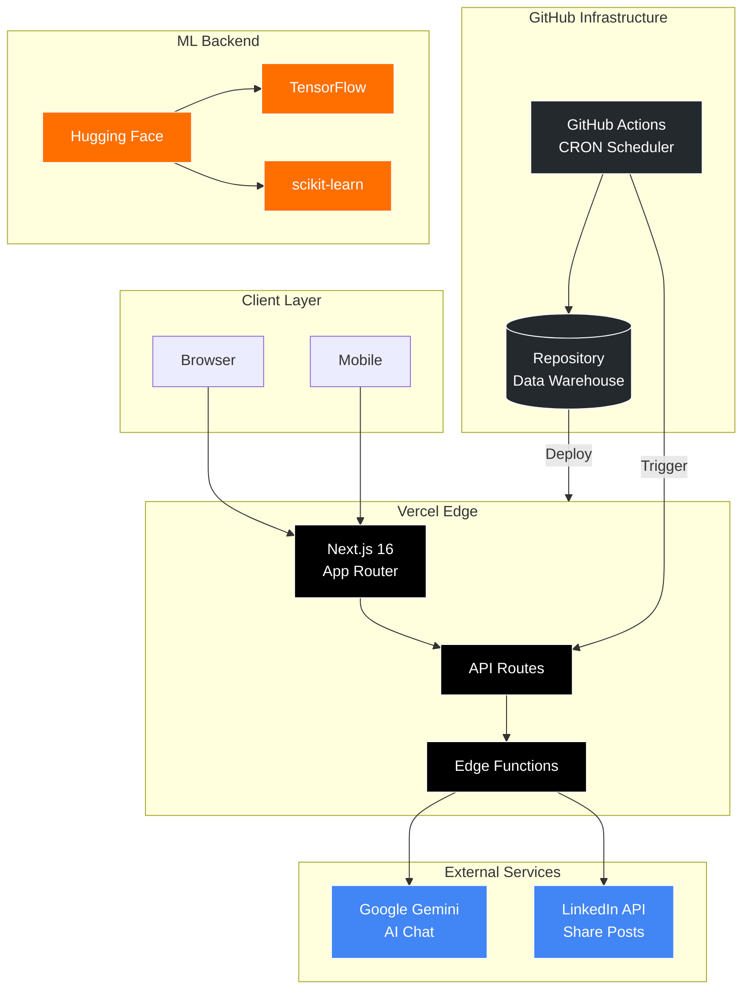
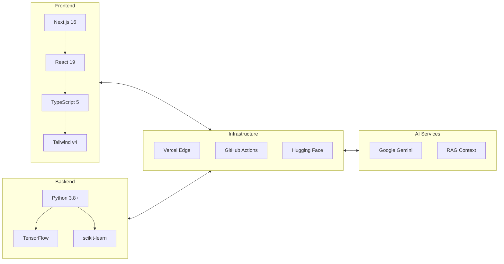
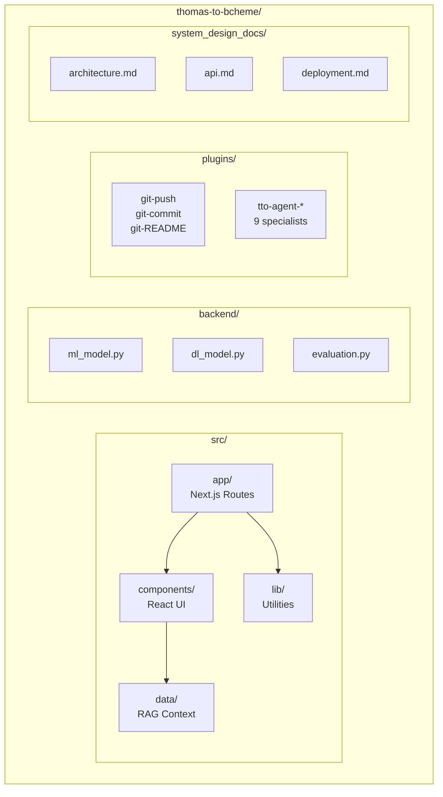
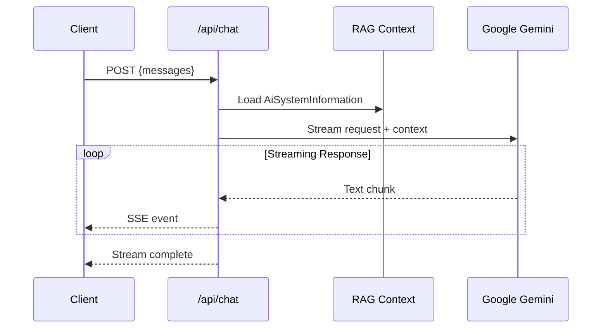
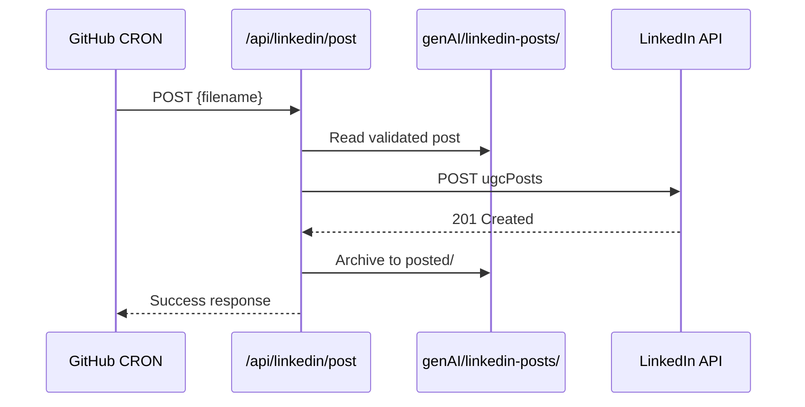
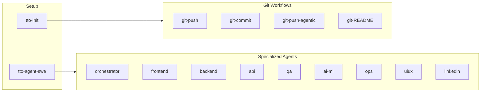
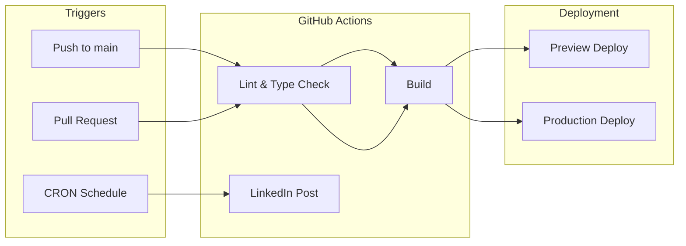
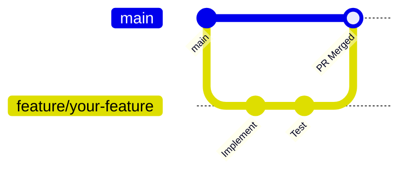

# Thomas To Portfolio

> A fullstack engineering portfolio with an embedded AI chat agent, demonstrating "Show, Don't Tell" through live, interactive technology.

[](https://thomas-to-bcheme-github-io.vercel.app/)
[](src/docs/Thomas_To_Resume.pdf?raw=true)
[](https://www.linkedin.com/in/thomas-to-ucdavis/)

[](https://www.typescriptlang.org/)
[](https://nextjs.org/)
[](https://react.dev/)
[](https://tailwindcss.com/)
[](https://python.org/)
[](https://github.com/thomas-to/thomas-to-bcheme/actions/workflows/linkedin-scheduler.yml)

---

## System Architecture



---

## Features

| Feature | Description |
|---------|-------------|
| **AI Chat Agent** | Live streaming chat powered by Google Gemini with RAG context |
| **LinkedIn Automation** | Scheduled posting via GitHub Actions with content management |
| **Voice Controls** | Speech-to-Text input and Text-to-Speech output |
| **Project Showcase** | Interactive deep-dives with architecture visualizations |
| **ROI Calculator** | Interactive calculator demonstrating business value |
| **ML Salary Prediction** | Random Forest + TensorFlow models for job market analysis |
| **Claude Code Plugins** | 15 specialized agent plugins for AI-assisted workflows |
| **Dark Mode** | Automatic theme switching with system preferences |

---

## Tech Stack



| Category | Technologies |
|----------|-------------|
| **Frontend** | Next.js 16, React 19, TypeScript 5, Tailwind CSS v4, Framer Motion |
| **AI/ML** | Google Gemini API, TensorFlow, scikit-learn, NumPy, Pandas |
| **Backend** | Python 3.8+, Node.js |
| **Infrastructure** | Vercel (Edge Functions), GitHub Actions (CI/CD), AWS SDK |
| **Data** | AWS DynamoDB, S3, Vercel Edge Config, Vercel Blob |
| **Quality** | ESLint 9, TypeScript strict mode, Zod validation |

---

## Quick Start

```bash
# Clone and install
git clone https://github.com/thomas-to-bcheme/thomas-to-bcheme.git
cd thomas-to-bcheme
npm install

# Configure environment
cp .env .env.local
# Add GOOGLE_API_KEY to .env.local

# Run development server
npm run dev
```

Open [http://localhost:3000](http://localhost:3000)

### ML Backend (Optional)

```bash
cd backend
pip install -r requirements.txt
python main.py
```

---

## Project Structure



<details>
<summary>Full Directory Tree</summary>

```
thomas-to-bcheme/
├── src/
│   ├── app/                      # Next.js App Router
│   │   ├── api/
│   │   │   ├── chat/route.ts     # Gemini streaming endpoint
│   │   │   └── linkedin/         # LinkedIn API endpoints
│   │   ├── layout.tsx
│   │   └── page.tsx
│   ├── components/               # React components (18 total)
│   ├── data/
│   │   └── AiSystemInformation.tsx  # RAG context
│   ├── lib/                      # Utilities
│   └── hooks/                    # Custom React hooks
├── backend/                      # Python ML models
│   ├── main.py
│   ├── ml_model.py               # Random Forest
│   ├── dl_model.py               # TensorFlow
│   └── requirements.txt
├── plugins/                      # Claude Code agents (15 total)
│   ├── git-push/
│   ├── git-commit/
│   ├── git-README/
│   ├── tto-agent-orchestrator/
│   └── ...
├── system_design_docs/           # Architecture documentation
├── genAI/linkedin-posts/         # Content management
├── .github/workflows/
└── CLAUDE.md
```

</details>

---

## API Reference

### Chat API



**POST** `/api/chat`

```json
{
  "messages": [
    { "role": "user", "content": "Tell me about Thomas" }
  ]
}
```

**Response:** SSE stream with `X-Correlation-ID` header

### LinkedIn API



| Endpoint | Method | Description |
|----------|--------|-------------|
| `/api/linkedin/content` | GET | List available posts |
| `/api/linkedin/post` | POST | Publish to LinkedIn |

---

## Configuration

| Variable | Required | Description |
|----------|----------|-------------|
| `GOOGLE_API_KEY` | Yes | Google Gemini API key |
| `LINKEDIN_ACCESS_TOKEN` | No | OAuth bearer token |
| `LINKEDIN_PERSON_URN` | No | `urn:li:person:{id}` |
| `LINKEDIN_DRY_RUN` | No | Test without posting |
| `AWS_ACCESS_KEY_ID` | No | AWS credentials |
| `AWS_SECRET_ACCESS_KEY` | No | AWS credentials |

See [system_design_docs/linkedin-api.md](system_design_docs/linkedin-api.md) for OAuth setup.

---

## Claude Code Plugins



| Plugin | Description | Command |
|--------|-------------|---------|
| **tto-init** | Initialize CLAUDE.md | `/init` |
| **git-commit** | Auto-generate commit | `/git-commit` |
| **git-push** | Interactive push | `/git-push` |
| **git-push-agentic** | Autonomous workflow | `/git-push-agentic` |
| **git-README** | 5-agent README generator | `/git-README` |

### Quick Install

```bash
PLUGIN_NAME="git-push"
mkdir -p .claude/plugins/${PLUGIN_NAME}/.claude-plugin .claude/plugins/${PLUGIN_NAME}/skills/${PLUGIN_NAME} && \
curl -sL "https://raw.githubusercontent.com/thomas-to/thomas-to-bcheme/main/plugins/${PLUGIN_NAME}/.claude-plugin/plugin.json" -o ".claude/plugins/${PLUGIN_NAME}/.claude-plugin/plugin.json" && \
curl -sL "https://raw.githubusercontent.com/thomas-to/thomas-to-bcheme/main/plugins/${PLUGIN_NAME}/skills/${PLUGIN_NAME}/SKILL.md" -o ".claude/plugins/${PLUGIN_NAME}/skills/${PLUGIN_NAME}/SKILL.md"
```

---

## CI/CD Pipeline



| Workflow | Schedule | Description |
|----------|----------|-------------|
| `linkedin-scheduler.yml` | Tuesdays 10:07 AM PST | Automated LinkedIn posting |

---

## Documentation

| Document | Description |
|----------|-------------|
| [Architecture](system_design_docs/architecture.md) | Platform KPIs, zero-cost infrastructure |
| [API Design](system_design_docs/api.md) | Chat API streaming, RAG context |
| [LinkedIn API](system_design_docs/linkedin-api.md) | OAuth 2.0 setup, posting workflow |
| [Database](system_design_docs/database.md) | GitHub-as-warehouse pattern |
| [Deployment](system_design_docs/deployment.md) | CI/CD pipeline, Vercel config |
| [Frontend](system_design_docs/frontend.md) | Component architecture |
| [ML Models](system_design_docs/ml-models.md) | Random Forest + TensorFlow |
| [Roadmap](system_design_docs/roadmap.md) | Feature timeline |

---

## Contributing



1. Fork the repository
2. Create feature branch: `git checkout -b feature/amazing-feature`
3. Follow coding standards in `CLAUDE.md`
4. Run linting: `npm run lint`
5. Commit changes: `git commit -m 'Add feature'`
6. Push and open PR

---

## License

MIT License - Open source learning resource.

---

## Author

**Thomas To** - Biochemical Engineer turned Fullstack Developer

- [Portfolio](https://thomas-to-bcheme.vercel.app)
- [LinkedIn](https://www.linkedin.com/in/thomas-to-ucdavis/)
- [GitHub](https://github.com/thomas-to-bcheme)
- Email: thomas.to.bcheme@gmail.com
