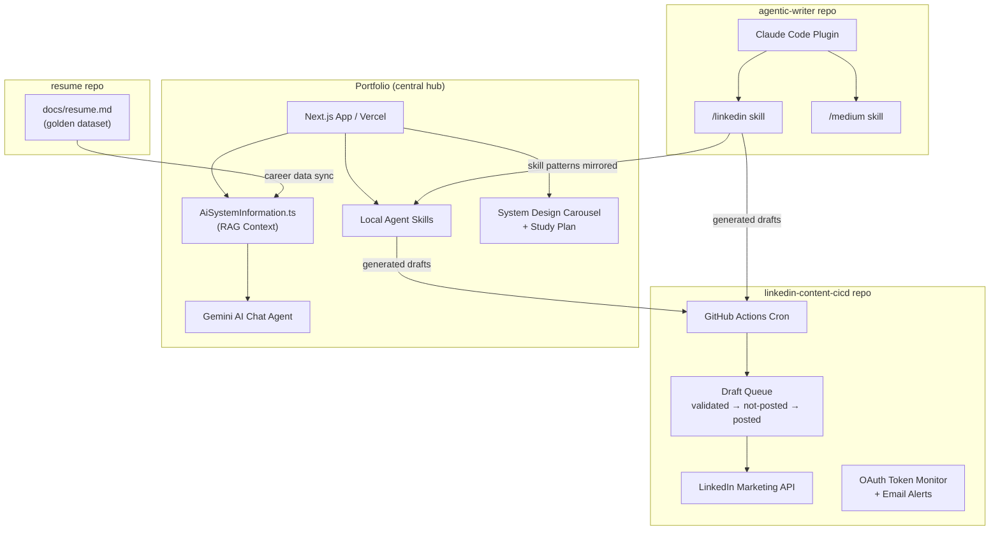
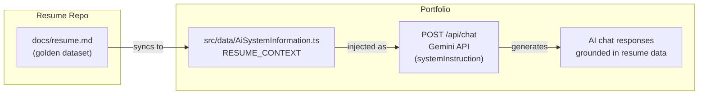
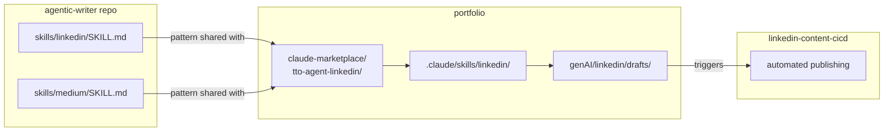
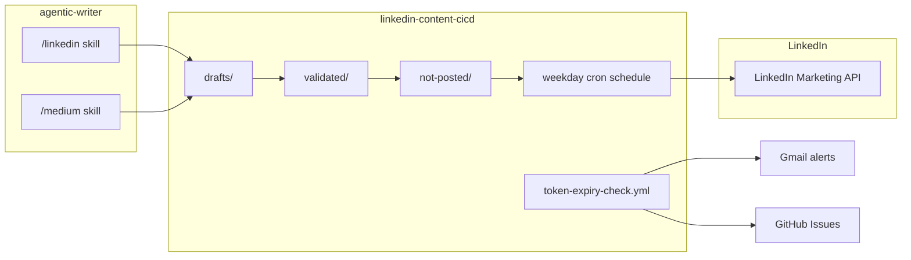

# thomas-to-bcheme.github.io

**Operationalizing AI Agents: Bridging the gap between reality and the matrix.**


## Overview

A fullstack portfolio application that demonstrates end-to-end engineering capabilities through a floating RAG-powered AI chat agent, a multi-board Excalidraw study-plan library, tiered system-design architecture diagrams, a Hugging Face ZeroGPU inference backend, and a live Job Board backed by Neon serverless Postgres. Built on a zero-cost architecture using free-tier services (Vercel, GitHub Actions, Hugging Face) with strict TypeScript and modular React component patterns.

**[Live Demo](https://thomas-to-bcheme-github-io.vercel.app/)**

---

## Open-Source Ecosystem

This portfolio is powered by standalone microservices extracted from the monorepo into dedicated open-source repositories. Each provides specialized capabilities that enrich the portfolio's AI context and content pipeline.


```mermaid
flowchart TB
    subgraph resume["resume repo"]
        R1["docs/resume.md\n(golden dataset)"]
    end

    subgraph agentic_writer["agentic-writer repo"]
        AW1["Claude Code Plugin"]
        AW2["/linkedin skill"]
        AW3["/medium skill"]
        AW1 --> AW2
        AW1 --> AW3
    end

    subgraph linkedin_cicd["linkedin-content-cicd repo"]
        LC1["GitHub Actions Cron"]
        LC2["Draft Queue\nvalidated → not-posted → posted"]
        LC3["LinkedIn Marketing API"]
        LC4["OAuth Token Monitor\n+ Email Alerts"]
        LC1 --> LC2
        LC2 --> LC3
    end

    subgraph portfolio["Portfolio (central hub)"]
        P1["Next.js App / Vercel"]
        P2["AiSystemInformation.ts\n(RAG Context)"]
        P3["Gemini AI Chat Agent"]
        P4["Local Agent Skills"]
        P5["System Design Carousel\n+ Study Plan"]
        P1 --> P2
        P2 --> P3
        P1 --> P4
        P1 --> P5
    end

    R1 -- "career data sync" --> P2
    AW2 -- "skill patterns mirrored" --> P4
    AW2 -- "generated drafts" --> LC1
    P4 -- "generated drafts" --> LC1
```

### [resume](https://github.com/thomas-to-bcheme/resume) — Resume & Cover Letter Tailor

A Claude Code skill that automatically tailors resumes and cover letters to specific job descriptions, generating ATS-optimized single-page PDFs.

| Capability | Details |
|------------|---------|
| **Resume Tailoring** | AI-powered with XYZ bullet formula, ATS compliance validation (6 categories), single-page PDF with 5-step auto-optimization |
| **Cover Letter Generation** | Narrative paragraph structure with JD keyword extraction and structural validation |
| **Golden Dataset** | Immutable master resume (`docs/resume.md`) — the single source of truth for all career data |
| **Tech** | Claude Code + Sonnet, Python 3.12+, fpdf2, Docker |

**Portfolio Integration:** The golden dataset feeds the RAG knowledge base in `src/data/AiSystemInformation.ts`, grounding the AI chat agent's responses in verified career data. When the resume is updated, the portfolio's AI context reflects current qualifications, projects, and metrics.


```mermaid
flowchart LR
    subgraph resume["Resume Repo"]
        A["docs/resume.md\n(golden dataset)"]
    end

    subgraph portfolio["Portfolio"]
        B["src/data/AiSystemInformation.ts\nRESUME_CONTEXT"]
        C["POST /api/chat\nGemini API\n(systemInstruction)"]
        D["AI chat responses\ngrounded in resume data"]
    end

    A -- "syncs to" --> B
    B -- "injected as" --> C
    C -- "generates" --> D
```

### [agentic-writer](https://github.com/thomas-to-bcheme/agentic-writer) — Content Generation Platform

A Claude Code plugin that generates platform-optimized professional content for technical audiences — LinkedIn posts and Medium articles with enforced writing quality constraints.

| Capability | Details |
|------------|---------|
| **LinkedIn Posts** | Algorithm-optimized (1,000–1,300 chars), hook optimization, community engagement CTAs |
| **Medium Articles** | SEO-optimized technical articles (1,600–2,000 words, 7-min read), auto-generated tags |
| **Writing Enforcement** | 127 banned words, active voice requirement, no emojis/hashtags/semicolons |
| **Lifecycle Management** | Draft → Review → Validate → Publish → Archive with organized folder structure |
| **Tech** | Claude Code plugin system, Claude Sonnet, YAML frontmatter + Markdown |

**Portfolio Integration:** The agentic-writer's content pipeline connects to the portfolio through the LinkedIn agent skill (`claude-marketplace/tto-agent-linkedin/`), which generates technical project updates. CI/CD publishing is handled by the [linkedin-content-cicd](https://github.com/thomas-to-bcheme/linkedin-content-cicd) repo below.


```mermaid
flowchart LR
    subgraph AW["agentic-writer repo"]
        LI["skills/linkedin/SKILL.md"]
        ME["skills/medium/SKILL.md"]
    end

    subgraph PF["portfolio"]
        MP["claude-marketplace/\ntto-agent-linkedin/"]
        CS[".claude/skills/linkedin/"]
        GD["genAI/linkedin/drafts/"]
    end

    subgraph CI["linkedin-content-cicd"]
        PUB["automated publishing"]
    end

    LI -- "pattern shared with" --> MP
    ME -- "pattern shared with" --> MP
    MP --> CS
    CS --> GD
    GD -- "triggers" --> PUB
```

**Install:** `claude plugins install github:thomas-to-bcheme/agentic-writer`

### [linkedin-content-cicd](https://github.com/thomas-to-bcheme/linkedin-content-cicd) — Content Publishing Pipeline

An automated LinkedIn content publishing pipeline powered by GitHub Actions. Schedules, queues, and publishes posts generated by the agentic-writer to LinkedIn via the Marketing API, with token lifecycle management and email alerting.

| Capability | Details |
|------------|---------|
| **Scheduled Publishing** | GitHub Actions cron workflow posts one queued item per weekday (11 PM UTC) |
| **Content Queue** | FIFO queue system with automatic recycling (`drafts/ → validated/ → not-posted/ → posted/`) |
| **Token Management** | OAuth2 token expiry monitoring (60-day rotation), email alerts via Gmail SMTP, auto-created GitHub issues |
| **Safety Controls** | Dry-run mode (post to CONNECTIONS only), manual trigger via `workflow_dispatch`, human review gates |
| **Tech** | Python 3.12+, GitHub Actions, LinkedIn Marketing API v202604, Gmail SMTP |

**Portfolio Integration:** Completes the content automation loop by connecting the agentic-writer's output to LinkedIn distribution. Posts generated by `/linkedin` and `/medium` skills flow through the queue and are published on a recurring schedule without manual intervention.


```mermaid
flowchart LR
    subgraph AW["agentic-writer"]
        LS["/linkedin skill"]
        MS["/medium skill"]
    end

    subgraph CICD["linkedin-content-cicd"]
        DR["drafts/"]
        VA["validated/"]
        NP["not-posted/"]
        CRON["weekday cron schedule"]
        TC["token-expiry-check.yml"]
    end

    subgraph LI["LinkedIn"]
        API["LinkedIn Marketing API"]
    end

    LS --> DR
    MS --> DR
    DR --> VA
    VA --> NP
    NP --> CRON
    CRON --> API

    TC --> GM["Gmail alerts"]
    TC --> GI["GitHub Issues"]
```

### Other Public Repos

Standalone projects on [github.com/thomas-to-bcheme](https://github.com/thomas-to-bcheme?tab=repositories) that aren't (yet) wired into the portfolio's data flow above:

| Repo | Description | Language |
|------|-------------|----------|
| [predict-job-salary](https://github.com/thomas-to-bcheme/predict-job-salary) | ML/DL project using NLP on job descriptions for salary prediction | Python |
| [zero-to-offer](https://github.com/thomas-to-bcheme/zero-to-offer) | Community learning resource for non-traditional, first-gen students on job preparation | — |
| [llm-driven-system-design](https://github.com/thomas-to-bcheme/llm-driven-system-design) | Collection of system designs driven by LLMs | TypeScript |
| [excalidraw-json-to-google-app-scripts](https://github.com/thomas-to-bcheme/excalidraw-json-to-google-app-scripts) | Full-stack portfolio automation powered by language models and Excalidraw | JavaScript |
| [learning-cpp](https://github.com/thomas-to-bcheme/learning-cpp) | C++ upskilling through O'Reilly resources to contribute to compiler projects | C++ |
| [computational-drug-discovery](https://github.com/thomas-to-bcheme/computational-drug-discovery) | Computational drug discovery experiments | Jupyter Notebook |
| [ml-drug-discovery](https://github.com/thomas-to-bcheme/ml-drug-discovery) | Fork of the official repo for *Machine Learning for Drug Discovery* | Jupyter Notebook |
| [visualizations](https://github.com/thomas-to-bcheme/visualizations) | Standalone data visualization experiments | — |
| [pythonProjects](https://github.com/thomas-to-bcheme/pythonProjects) | General Python practice projects | Python |
| [ECH145](https://github.com/thomas-to-bcheme/ECH145) | UC Davis coursework | Python |
| [LaTeX](https://github.com/thomas-to-bcheme/LaTeX) | Practice using LaTeX to familiarize with format, styling, and package handling | TeX |

---

## Claude Marketplace

The `claude-marketplace/` directory is a self-hosted [Claude Code plugin marketplace](https://docs.claudecode.ai/plugins) containing 15 production-ready plugins for Git automation, domain-specialized AI agents, and workflow initialization. These plugins power the development workflow of this portfolio itself.

### Plugin Catalog

#### Git Automation

| Plugin | Command | Description |
|--------|---------|-------------|
| **git-commit** | `/git-commit` | Auto-stage all changes and generate a commit message without pushing |
| **git-push** | `/git-push` | Interactive push workflow — checks status, stages/commits if needed, then pushes |
| **git-push-agentic** | `/git-push-agentic` | Fully autonomous: stages, commits, and pushes with no prompts |
| **git-README** | `/git-README` | Spawns 5 parallel agents to analyze the codebase and generate or update README.md |

#### Domain Specialists

| Plugin | Command | Specialization |
|--------|---------|----------------|
| **tto-agent-swe** | `/tto-agent-swe` | Meta-agent that routes tasks to the right specialist |
| **tto-agent-orchestrator** | `/tto-agent-orchestrator` | Code review, architectural integrity, integration verification |
| **tto-agent-frontend** | `/tto-agent-frontend` | React, Next.js, Tailwind CSS, Vercel deployment |
| **tto-agent-backend** | `/tto-agent-backend` | Database schema, business logic, Python/ML pipelines |
| **tto-agent-api** | `/tto-agent-api` | REST endpoints, middleware, request/response handling |
| **tto-agent-ai-ml** | `/tto-agent-ai-ml` | LLM integration, RAG pipelines, vector databases, ML model training |
| **tto-agent-qa** | `/tto-agent-qa` | Test strategy, automation, regression testing, quality gates |
| **tto-agent-ops** | `/tto-agent-ops` | CI/CD pipelines, Docker, GitHub Actions, infrastructure-as-code |
| **tto-agent-uiux** | `/tto-agent-uiux` | Design systems, accessibility (WCAG 2.1 AA), design tokens |
| **tto-agent-linkedin** | `/tto-agent-linkedin` | Generate professional LinkedIn posts for technical project updates |

#### Initialization

| Plugin | Command | Description |
|--------|---------|-------------|
| **tto-init** | `/tto-init` | Initialize CLAUDE.md with programming-agnostic best practices |

---

## Features

### AI & Voice
- **Floating AI Chat Agent** — Google Gemini API (`gemini-3.1-pro-preview`) with RAG context from resume and portfolio data, real-time streaming responses, markdown rendering, and up to 2 clickable follow-up-question suggestions (`src/lib/followups.ts`); delivered as a resizable floating widget (bottom-right launcher + teaser bubble via `ChatWidget`/`ChatWidgetProvider`) rather than an inline page section
- **Voice Input (STT)** — Web Speech API for hands-free interaction with auto-submit on silence detection
- **Voice Output (TTS)** — Speech Synthesis API with sentence-boundary queuing for natural streaming playback

### Press & Personal
- **Featured In** — Press-mention cards sourced from portfolio credentials data, shown between the hero and About Me sections
- **Beyond the Terminal** — "Off the Clock" personal photo section (Yosemite, BJJ competition/coaching) closing the professional narrative on a personal note

### Data Visualization
- **System Design Carousel** — Per-project tiered architecture cards (client → frontend → backend → model → data) with design-trade-off callouts, driven by `src/constants/systemDesign.ts`
- **Project Kanban Board** — Embla carousel with three swimlanes (Queue, In Development, Completed) tracking active projects across the open-source ecosystem, data-driven from `src/constants/kanban.ts`
- **Study Plan — Multi-Board Excalidraw Library** — Dedicated `/study-plan` route covering 13 topic boards (system design, backend/frontend/data engineering, ML engineering, CUDA/GPU internals, cloud ops, and general best practices); board switching, creation, and saving persist directly to the GitHub repo via the Contents API — create/save are `SAVE_SECRET`-gated, board listing is unauthenticated read-only

### Live Data Integration
- **Job Board** — `/jobs` page (Server Component, ISR every 30 min via `revalidate = 1800`) rendering open roles pulled live from a dedicated Neon serverless Postgres database (`"PORTFOLIO".roles`: `job_id`, `title`, `url`, `posted_date`, `resume_pdf_path`) through `getJobs()`; `JobCard` shows the title, a "View job" external link, posted date, and — when a posting has an attached resume — a "Download resume (PDF)" link, with a graceful "No open roles posted right now" empty state; postings are validated at runtime against a Zod `JobListingSchema`; the page's `getJobListings()` and the public `GET /api/jobs` endpoint (structured logging + correlation IDs, matching the chat API's conventions) both delegate to the same single query so the two paths can't drift apart — a showcase of consuming an external Postgres-backed microservice's data through a dedicated read-only connection string
- **Resume Downloads (Vercel Blob, private storage)** — PDFs referenced by `resume_pdf_path` live in a private Vercel Blob store, so they're only reachable through `GET /api/jobs/resume`, which streams the file server-side via `@vercel/blob`'s `get(pathname, { access: 'private' })` (never a public blob URL). Access is gated by a signed, per-job, time-limited HMAC token (`src/lib/auth/resumeToken.ts`) rather than a static shared secret — a raw secret embedded in a statically-rendered page's HTML would be visible via view-source to any visitor, defeating the point of gating files that carry PII (name/phone/email). Responses set `Cache-Control: private, no-store`.

### UX & Accessibility
- **Dark Mode** — Automatic system preference detection
- **Accessibility** — Skip links, ARIA labels, `aria-live` regions, keyboard navigation, `prefers-reduced-motion` support

---

## Tech Stack

| Category | Technology | Purpose |
|----------|------------|---------|
| Framework | Next.js 16 (App Router, Turbopack) | Server/client components, API routes, streaming |
| UI Library | React 19 | Component architecture |
| Language | TypeScript 5 (strict) | Type safety across the stack |
| Styling | Tailwind CSS v4 | Utility-first CSS with dark mode |
| Animation | Framer Motion | Page transitions, micro-interactions |
| Diagrams | Excalidraw 0.18 | Interactive technical prep canvas with GitHub save |
| Carousel | Embla Carousel | Kanban board swimlane navigation |
| Counters | react-countup | Animated metric counters |
| AI | Google Gemini API | Streaming chat with RAG context |
| Database | Neon Serverless Postgres (`@neondatabase/serverless`) | Read-only live data feed for the Job Board |
| Validation | Zod 4 | Runtime schema validation on API routes |
| Math | KaTeX | LaTeX rendering for ROI derivations |
| Icons | Lucide React | SVG icon system |
| ML Backend | Hugging Face ZeroGPU (Gradio) | GPU inference microservice (`backend/`), deployed independently via GitHub Actions to a Hugging Face Space |
| Deployment | Vercel (Hobby) | Zero-cost hosting with preview deployments |

---

## Getting Started

### Prerequisites

- **Node.js** 20+ and **npm** 9+
- **Python** 3.9+ (optional, for ML backend)
- **Google Gemini API key** ([Get one here](https://aistudio.google.com/))
- **Neon Postgres connection string** (optional — only needed to run the `/jobs` Job Board locally; see Configuration below)

### Installation

```bash
# Clone the repository
git clone https://github.com/thomas-to-bcheme/thomas-to-bcheme.github.io.git
cd thomas-to-bcheme.github.io

# Install dependencies
# postinstall automatically copies Excalidraw fonts to public/excalidraw/
npm install

# Configure environment — .env.example only covers the optional Hugging Face
# backend vars; add the required Gemini/Neon/Blob vars per Configuration below
cp .env.example .env.local

# Start development server
npm run dev
```

Open [http://localhost:3000](http://localhost:3000) to view the application.

> **Excalidraw fonts:** `npm install` runs a `postinstall` script that copies font files from `node_modules/@excalidraw/excalidraw/dist/prod/fonts` into `public/excalidraw/`. This is required for the canvas to render correctly and happens automatically.

### ML Backend (Optional)

`backend/` is a Hugging Face ZeroGPU Space (Gradio) — currently a placeholder inference
endpoint used to verify the deploy pipeline and API contract end-to-end. It deploys
independently from the rest of the monorepo via `.github/workflows/deploy-backend.yml`
on any push to `main` touching `backend/**` (uploaded via the Hub API, never a git push).

```bash
cd backend
python3 -m venv .venv && source .venv/bin/activate && pip install -r requirements.txt

./run.sh   # activates .venv, frees port 7860, starts the Gradio app locally
```

### Available Commands

| Command | Purpose |
|---------|---------|
| `npm run dev` | Start development server (Turbopack) |
| `npm run build` | Production build |
| `npm start` | Run production server |
| `npm run lint` | Run ESLint — **currently broken** on this Next.js version (see note below) |

> **Note on `npm run lint`:** Next.js 16.2.1 removed the `next lint` subcommand entirely, so this script currently exits with an "Invalid project directory" error. Until the script is updated to call ESLint directly, verify changes with:
> ```bash
> npx tsc --noEmit && npm run build
> ```
> There is no automated test suite in this repository yet (no Jest/Vitest/Playwright configured), so the command above is the current recommended pre-commit check.

---

## Project Structure

```
src/
├── app/                        # Next.js App Router
│   ├── api/
│   │   ├── chat/route.ts       # Gemini streaming endpoint (POST)
│   │   ├── jobs/route.ts       # Job postings JSON endpoint (GET, Neon-backed)
│   │   ├── jobs/resume/route.ts # Resume PDF download endpoint (GET, private Vercel Blob + signed token auth)
│   │   └── excalidraw/
│   │       ├── save/route.ts   # Board commit endpoint (POST, SAVE_SECRET auth)
│   │       ├── create/route.ts # New board scaffold endpoint (POST, SAVE_SECRET auth)
│   │       ├── list/route.ts   # Board listing endpoint (GET, unauthenticated)
│   │       └── verify/route.ts # Token verification endpoint (POST)
│   ├── jobs/page.tsx           # Job Board page (server component, ISR revalidate=1800)
│   ├── jobs/query.tsx          # getJobListings() — shared query path for page.tsx + /api/jobs
│   ├── study-plan/page.tsx     # Multi-board Excalidraw study library (full-page canvas)
│   ├── layout.tsx              # Root layout (server)
│   ├── page.tsx                # Home page (client)
│   └── error.tsx               # Error boundary
├── components/
│   ├── ui/                     # Badge, Button, SkipLink
│   ├── sections/                # HeroSection, FeaturedIn, AboutMe, BeyondTheTerminal, Connect, Footer
│   ├── features/                # AiGenerator, ChatWidget, SystemDesignCarousel, SystemDesignDiagram, KanbanBoard, JobBoard, JobCard
│   ├── layout/                  # SiteHeader, ChatWidgetProvider, BentoGrid, MotionProvider, ImpactMetric
│   ├── voice/                   # VoiceControls
│   └── excalidraw/              # ExcalidrawWrapper, TechnicalPrepDiagram (multi-board switch/create/save UI)
├── hooks/                      # useChat, useActiveSection, useSystemTheme, useSpeech*
├── constants/                  # site.ts, chat.ts, roadmap.ts, kanban.ts, systemDesign.ts
├── types/                      # chat.ts, api-errors.ts, jobs.ts, credentials.ts
├── lib/                        # chat-api.ts, utils.tsx, fractionalIndex.ts, excalidrawBoards.ts, followups.ts
│   ├── db/jobs.ts               # Neon Postgres client + getJobs() (Job Board data layer)
│   ├── auth/resumeToken.ts      # Signed, time-limited HMAC tokens for resume downloads
│   └── github/client.ts         # Shared GitHub Contents API client (getFileSha, putFile, listDirectory)
└── data/                       # AiSystemInformation.ts (RAG context), credentials.ts

backend/                        # Hugging Face ZeroGPU Space (Gradio placeholder inference)
claude-marketplace/             # Claude Code plugin marketplace (15 plugins)
public/excalidraw/              # 13 topic boards (system design, backend, frontend, data, ML, CUDA/GPU, ops, ...)
system_design_docs/             # Architecture documentation
```

---

## Configuration

### Environment Variables

| Variable | Required | Description |
|----------|----------|-------------|
| `GOOGLE_API_KEY` | Yes | Google Gemini API key for AI chat |
| `JOBS_DATABASE_URL` | Yes | Read-only Neon Postgres connection string for the Job Board (`/jobs`, `/api/jobs`). `src/lib/db/jobs.ts` throws a fatal error at module import time if unset |
| `JOBS_RESUME_SECRET` | Yes | HMAC signing key for resume download links (`src/lib/auth/resumeToken.ts`). Internal-only — generate any random value (e.g. `openssl rand -hex 32`), it doesn't need to match anything external. Throws a fatal error at module import time if unset |
| `BLOB_READ_WRITE_TOKEN` | For local dev | Read/write token for the private Vercel Blob store backing resume downloads (`/api/jobs/resume`). Only needed outside Vercel — on Vercel, with the store connected to the project, the SDK authenticates via OIDC automatically |
| `GITHUB_TOKEN` | For Excalidraw save/create | GitHub Personal Access Token with `contents` scope |
| `GITHUB_REPO_OWNER` | For Excalidraw save/create | GitHub username (repository owner) |
| `GITHUB_REPO_NAME` | For Excalidraw save/create | Repository name (e.g. `thomas-to-bcheme.github.io`) |
| `SAVE_SECRET` | For Excalidraw save/create | Token required by `/api/excalidraw/save`, `/create`, and `/verify` (board listing via `/list` is unauthenticated) |
| `HF_TOKEN_WRITE` | For backend deploy (CI only) | Write-scoped Hugging Face token used by `.github/workflows/deploy-backend.yml` to create/update the ZeroGPU Space. Never set locally |
| `HF_TOKEN_READ` | For backend calls | Read-scoped Hugging Face token for server-side calls to the deployed Space's `/infer` endpoint via `gradio_client`, attributing usage to your own HF quota. Only used once the frontend actually calls the backend |

The four Excalidraw variables are only needed if you want the study-plan boards to unlock edit mode and persist saves/creates back to GitHub. Without them, boards are still viewable in read-only mode. `JOBS_DATABASE_URL` and `JOBS_RESUME_SECRET`, by contrast, are required unconditionally — the Job Board's data layer and resume-link signing both fail fast at import time without them. `.env.example` in the project root documents the two Hugging Face variables inline — copy it as a starting point, then add the rest of the variables below.

Create (or extend) `.env.local` in the project root:

```bash
# Required — Google Gemini API key for AI chat
GOOGLE_API_KEY=your_gemini_api_key_here

# Required — read-only Neon Postgres connection string for the Job Board
JOBS_DATABASE_URL=your_neon_postgres_connection_string_here

# Required — HMAC signing key for resume download links (any random value)
JOBS_RESUME_SECRET=your_random_secret_here

# Required for local dev only — private Blob store token for resume downloads
# (on Vercel with the store connected to the project, OIDC is used instead)
BLOB_READ_WRITE_TOKEN=your_vercel_blob_read_write_token_here

# Optional — required only for the Excalidraw study-plan edit/create/save feature
GITHUB_TOKEN=your_github_pat_with_contents_scope
GITHUB_REPO_OWNER=your_github_username
GITHUB_REPO_NAME=thomas-to-bcheme.github.io
SAVE_SECRET=your_secret_token_for_save_endpoint

# Optional — required only if you're testing the Hugging Face ZeroGPU backend locally
HF_TOKEN_WRITE=your_hf_write_token   # CI only — do not set outside GitHub Actions
HF_TOKEN_READ=your_hf_read_token
```

**Local development:** `.env.local` is gitignored.

**Production:** Configure in Vercel Dashboard > Project Settings > Environment Variables.

---

## Deployment

The project deploys automatically to **Vercel** on push to `main`. Vercel auto-detects Next.js — no custom configuration file needed.

```
Framework:  Next.js (auto-detected)
Build:      next build
Output:     .next
```

**Hobby Tier Limits**: 100 deployments/24h, 10s serverless timeout, 100GB bandwidth/month.

`backend/` deploys independently to a Hugging Face ZeroGPU Space via `.github/workflows/deploy-backend.yml`, triggered on any push to `main` that touches `backend/**`. It uploads the folder's contents through the Hub API (`huggingface_hub`), never a git push, so it can't clobber the Space's own git history.

---

## Roadmap

| Phase | Status | Focus | Stakeholder |
|-------|--------|-------|-------------|
| **Phase 1**: MVP | Completed | Frontend architecture as marketing signal | Recruiters |
| **Phase 2**: Agentic Integration | Completed | Proof-of-concept AI features on serverless | Hiring Managers |
| **Phase 3**: E2E ML Infrastructure | Completed | Python ML models deployed via FastAPI + HuggingFace | Technical Leads |
| **Phase 4**: Open Source Distribution | Completed | Refactoring, documentation, educational resources | Community |
| **Phase 5**: External Data Integrations | Completed | Live Neon Postgres-backed Job Board consuming an external microservice; schema confirmed against the source table (`"PORTFOLIO".roles`) | Hiring Managers |

---

## License

MIT License. See [LICENSE](LICENSE) for details.

---

Built by [Thomas To](https://www.linkedin.com/in/thomas-to-ucdavis/) with Next.js, Vercel, and engineering rigor.
