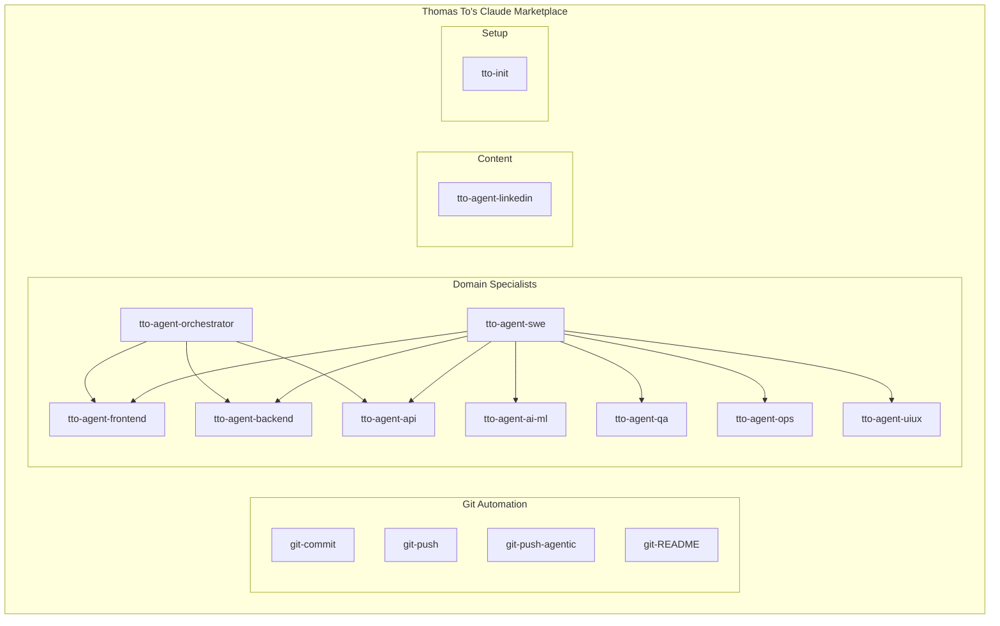
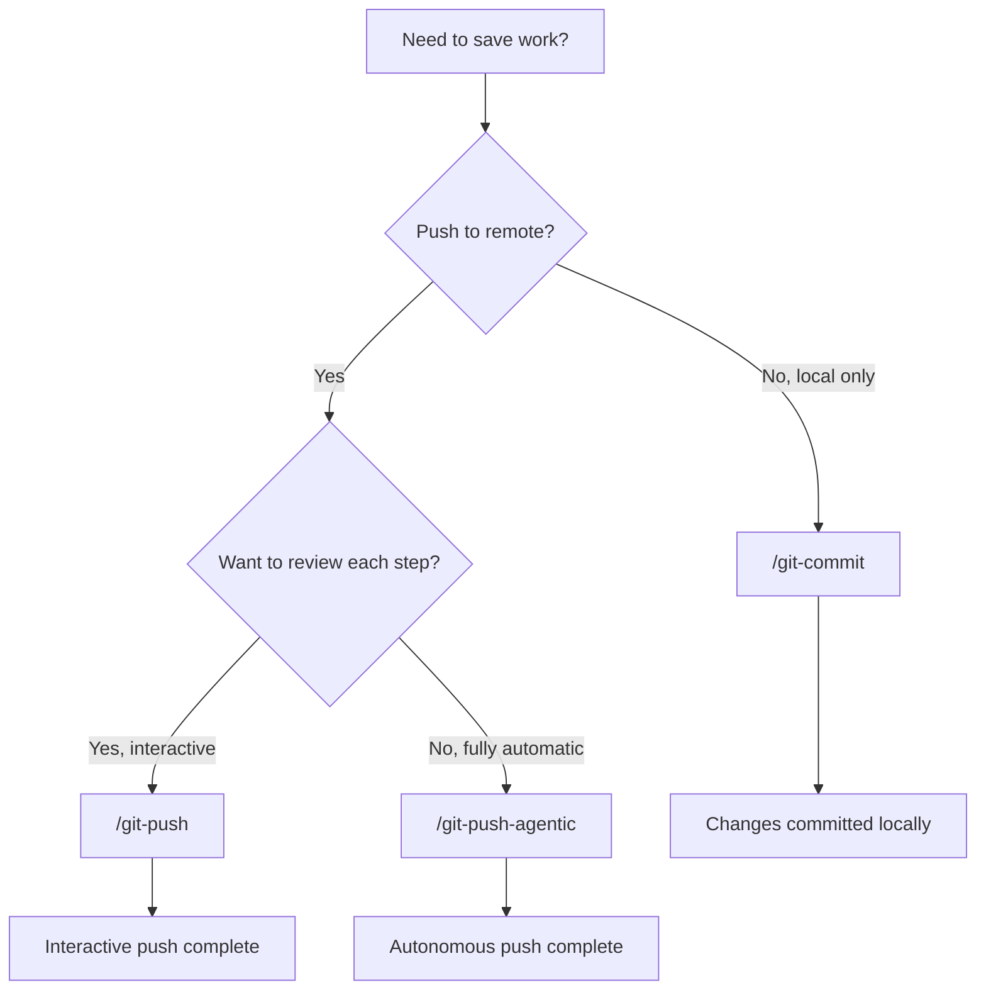
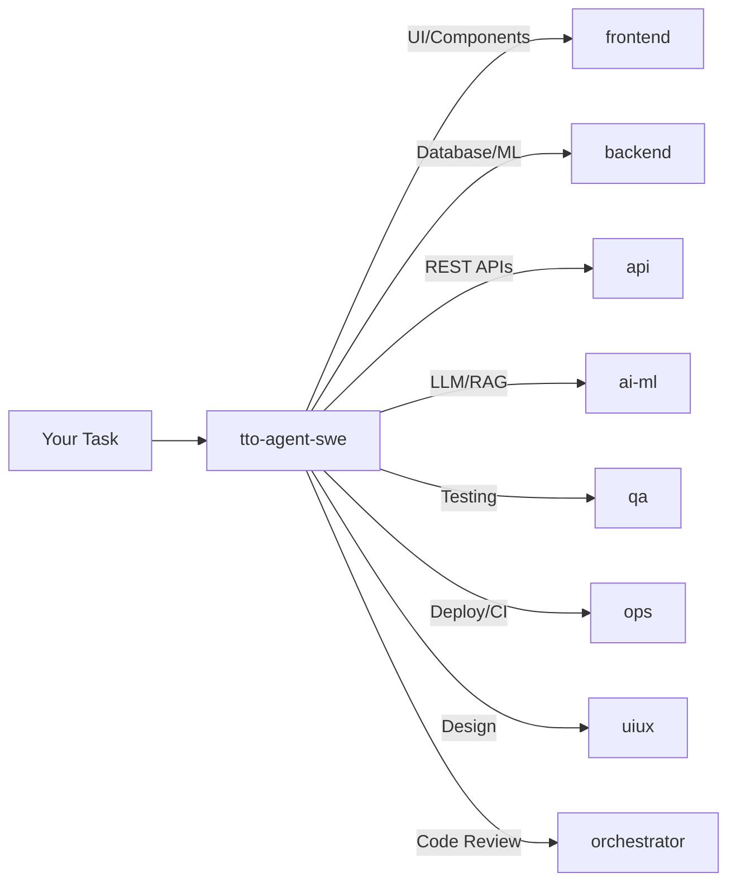

# Claude Code Plugin Marketplace

> 16 production-ready plugins for Claude Code — Git automation, domain specialists, and workflow optimization


---

## What is This?

This is a personal plugin marketplace for [Claude Code](https://claude.ai/code) containing 16 plugins that automate Git workflows, provide domain-specialized AI agents, and optimize development processes. Install individual plugins or bundles to extend Claude Code's capabilities.

**Official Documentation:** [Discover and Install Plugins](https://code.claude.com/docs/en/discover-plugins)

---

## Quick Start

### Step 1: Add the Marketplace

In Claude Code, run:

```
/plugin marketplace add thomas-to-bcheme/thomas-to-bcheme
```

### Step 2: Browse Available Plugins

```
/plugin
```

Navigate to the **Discover** tab to see all 16 plugins.

### Step 3: Install a Plugin

```
/plugin install tto-init@thomas-to-bcheme
```

That's it. The plugin is now available.

---

## Plugin Ecosystem



---

## Which Git Plugin Should I Use?



---

## Plugin Catalog

### Git Automation (4 plugins)

| Plugin | Command | Description |
|--------|---------|-------------|
| **git-commit** | `/git-commit` | Auto-stage all changes and generate a commit message. Does not push. |
| **git-push** | `/git-push` | Interactive push workflow. Asks which files to stage and for commit message. |
| **git-push-agentic** | `/git-push-agentic` | Fully autonomous: stages, commits, and pushes with no prompts. |
| **git-README** | `/git-README` | Spawns 5 agents to analyze your codebase and generate/update README.md. |

### Domain Specialists (9 plugins)

| Plugin | Command | Specialization |
|--------|---------|----------------|
| **tto-agent-swe** | `/tto-agent-swe` | Meta-agent that routes tasks to the right specialist |
| **tto-agent-orchestrator** | `/tto-agent-orchestrator` | Code review, architectural integrity, integration verification |
| **tto-agent-frontend** | `/tto-agent-frontend` | React, Next.js, Tailwind CSS, Vercel deployment |
| **tto-agent-backend** | `/tto-agent-backend` | Database schema, business logic, Python/ML pipelines |
| **tto-agent-api** | `/tto-agent-api` | REST endpoints, middleware, request/response handling |
| **tto-agent-ai-ml** | `/tto-agent-ai-ml` | LLM integration, RAG pipelines, vector databases |
| **tto-agent-qa** | `/tto-agent-qa` | Test strategy, automation, regression testing |
| **tto-agent-ops** | `/tto-agent-ops` | CI/CD pipelines, Docker, GitHub Actions, infrastructure |
| **tto-agent-uiux** | `/tto-agent-uiux` | Design systems, accessibility (WCAG 2.1 AA), design tokens |

### Content Generation (1 plugin)

| Plugin | Command | Description |
|--------|---------|-------------|
| **tto-agent-linkedin** | `/tto-agent-linkedin` | Generate professional LinkedIn posts for technical project updates |

### Initialization (1 plugin)

| Plugin | Command | Description |
|--------|---------|-------------|
| **tto-init** | `/tto-init` | Initialize CLAUDE.md with programming-agnostic best practices |

---

## Installation Walkthrough

### Prerequisites

1. **Claude Code version 1.0.33 or later**

   Check your version:
   ```bash
   claude --version
   ```

2. **Update if needed:**
   - Homebrew: `brew upgrade claude-code`
   - npm: `npm update -g @anthropic-ai/claude-code`

### Adding the Marketplace

1. Open Claude Code in your terminal
2. Run:
   ```
   /plugin marketplace add thomas-to-bcheme/thomas-to-bcheme
   ```
3. You'll see: `Marketplace added successfully`

### Browsing Plugins

1. Run `/plugin` to open the plugin manager
2. Use **Tab** to switch between tabs:
   - **Discover** — Browse available plugins
   - **Installed** — See what you have
   - **Marketplaces** — Manage marketplace sources
   - **Errors** — Debug issues

### Installing a Plugin

**Option A: Interactive**
1. Run `/plugin`
2. Go to **Discover** tab
3. Select a plugin and press **Enter**
4. Choose installation scope:
   - **User** — Available in all your projects
   - **Project** — Shared with collaborators (adds to `.claude/settings.json`)
   - **Local** — Just for you in this project

**Option B: Command Line**
```
/plugin install plugin-name@thomas-to-bcheme
```

### Verifying Installation

```
/plugin
```

Go to the **Installed** tab to confirm your plugins appear.

---

## Recommended Bundles

### Starter Bundle

Essential plugins for any project:

```
/plugin install tto-init@thomas-to-bcheme
/plugin install git-commit@thomas-to-bcheme
```

### Full Stack Developer

For web application development:

```
/plugin install tto-agent-swe@thomas-to-bcheme
/plugin install tto-agent-frontend@thomas-to-bcheme
/plugin install tto-agent-backend@thomas-to-bcheme
/plugin install tto-agent-api@thomas-to-bcheme
/plugin install tto-agent-qa@thomas-to-bcheme
/plugin install git-push@thomas-to-bcheme
```

### AI/ML Engineer

For machine learning and LLM projects:

```
/plugin install tto-agent-ai-ml@thomas-to-bcheme
/plugin install tto-agent-backend@thomas-to-bcheme
/plugin install tto-agent-qa@thomas-to-bcheme
/plugin install git-push-agentic@thomas-to-bcheme
```

### DevOps/Platform

For infrastructure and deployment:

```
/plugin install tto-agent-ops@thomas-to-bcheme
/plugin install tto-agent-api@thomas-to-bcheme
/plugin install tto-agent-orchestrator@thomas-to-bcheme
/plugin install git-push-agentic@thomas-to-bcheme
```

---

## How Agent Routing Works

The `tto-agent-swe` plugin acts as a router. When you describe a task, it analyzes the request and delegates to the appropriate specialist:



**Example:**

```
You: /tto-agent-swe Add user authentication to the app

SWE Agent analyzes:
- Task type: Feature Implementation
- Domains detected: API + Frontend + Backend
- Routing to: api (primary), frontend, backend
```

---

## Usage Examples

### Initialize a New Project

```
/tto-init
```

Output:
```
Scanning project structure...
Detected: Next.js 16, TypeScript 5, Tailwind v4
Generated CLAUDE.md with 8 sections:
  - Development Directives
  - Architecture
  - Commands
  - Testing Strategy
  - ...
```

### Commit Changes Without Pushing

```
/git-commit
```

Output:
```
Staging 3 files...
Analyzing changes...
Generated commit message:
  "Add user authentication middleware with JWT validation"
Commit created: a1b2c3d
```

### Generate a README

```
/git-README
```

Output:
```
Spawning 5 analysis agents...
  - Structure Analyzer: scanning directories
  - Feature Analyzer: reading code
  - Setup Analyzer: checking dependencies
  - CI/CD Analyzer: reviewing workflows
  - Review Coordinator: synthesizing findings

Smart merge strategy:
  - PRESERVE: 2 custom sections
  - ADD: 4 new sections
  - UPDATE: 1 section

README.md updated successfully
```

---

## Plugin Structure

Each plugin follows this structure:

```
plugin-name/
├── .claude-plugin/
│   └── plugin.json      # Metadata (name, version, keywords)
└── skills/
    └── plugin-name/
        └── SKILL.md     # Detailed workflow and instructions
```

---

## Troubleshooting

### `/plugin` command not recognized

Your Claude Code version is too old.

```bash
# Check version
claude --version

# Update (Homebrew)
brew upgrade claude-code

# Update (npm)
npm update -g @anthropic-ai/claude-code
```

### Marketplace not loading

1. Check the repository is accessible
2. Verify `.claude-plugin/marketplace.json` exists
3. Try removing and re-adding:
   ```
   /plugin marketplace remove thomas-to-bcheme
   /plugin marketplace add thomas-to-bcheme/thomas-to-bcheme
   ```

### Plugin skills not appearing

Clear the cache and reinstall:

```bash
rm -rf ~/.claude/plugins/cache
```

Then restart Claude Code and reinstall the plugin.

### Plugin errors

Run `/plugin` and check the **Errors** tab for detailed error messages.

---

## License

MIT License

**Author:** Thomas To
**Repository:** [github.com/thomas-to-bcheme](https://github.com/thomas-to-bcheme)

---

## Learn More

- [Claude Code Plugin Documentation](https://code.claude.com/docs/en/discover-plugins)
- [Create Your Own Marketplace](https://code.claude.com/docs/en/plugin-marketplaces)
- [Plugin Reference](https://code.claude.com/docs/en/plugins-reference)
