# Alma AI Engineer — Agentic System Design Interview Preparation

> Comprehensive preparation guide mapping Alma's job requirements to concrete technical knowledge, interview strategies, and immigration-domain practice problems.

---

## 1. Alma Context & Strategic Intelligence

### 1.1 What Alma Builds

Alma is an **AI-native immigration law firm** — not a traditional law firm that bolted on software. The distinction matters:

| Traditional Law Firm + Software | AI-Native (Alma) |
|--------------------------------|-------------------|
| Attorneys do work, software tracks it | AI does work, attorneys validate it |
| Software = CRM + document storage | AI = document processing + narrative generation + compliance monitoring |
| Scale by hiring more attorneys | Scale by improving AI accuracy |
| Competitive moat = attorney reputation | Competitive moat = eval systems + data flywheel |

**Core Products:**
- AI-powered document processing (passports, recommendation letters, publications, employment records)
- Petition narrative generation (O-1A extraordinary ability, EB-2 NIW national interest waiver)
- Automated form filling (I-129, I-140, I-485, LCA)
- Compliance monitoring (wage requirements, worksite changes, LCA posting)
- Real-time case tracking dashboard for clients

**Visa Types Handled:** O-1A, O-1B, H-1B, L-1, TN, EB-1A, EB-2 NIW, PERM

### 1.2 CTO Background: What It Means for You

CTO Shuo built **Uber's Michelangelo ML Platform** for 5+ years. This signals the engineering culture you should expect:

**Michelangelo Principles That Likely Shape Alma:**

| Michelangelo Concept | Immigration Application |
|---------------------|------------------------|
| **Feature Store** | Centralized embeddings for regulations, case law, client profiles |
| **Model Serving** | Low-latency inference for document extraction and form filling |
| **Experimentation Platform** | A/B testing prompt variants, model routing |
| **Online/Offline Eval** | Offline eval datasets + online attorney acceptance rate tracking |
| **Model Registry** | Versioned prompts, system prompts, and fine-tuned models |
| **Pipeline Orchestration** | Multi-agent workflow coordination with state management |

**Interview Implication:** Speak in terms of **systems**, not just models. Discuss feature stores, experiment tracking, model registries, and deployment pipelines — not just "I'd use GPT-4."

### 1.3 Human-in-the-Loop as Product Architecture

Alma's 99%+ approval rate depends on attorneys reviewing every AI output. This is not a limitation — it's the product architecture:

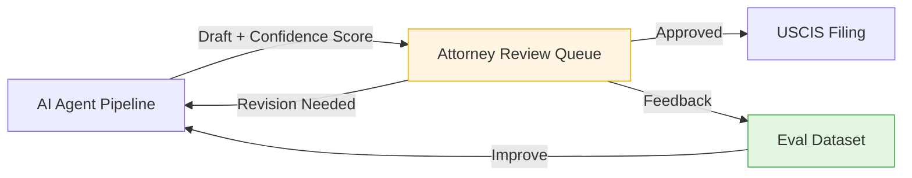

**Key Design Implications:**
- Every AI output needs a **confidence score** so attorneys can prioritize review
- **Feedback loops** from attorney edits → eval dataset → prompt improvement
- **Staged autonomy**: Start with AI drafts + full attorney review → graduate to AI + spot-check for high-confidence outputs
- **Audit trail**: Every AI action logged for USCIS compliance

### 1.4 Competitive Landscape

| Company | Approach | AI Depth |
|---------|----------|----------|
| **Alma** | AI-native, attorneys validate AI output | Deep (agents, RAG, eval) |
| **Visalaw.ai** | AI tools for existing attorneys | Medium (NLP, forms) |
| **Docketwise** | Practice management + AI features | Light (data extraction) |
| **DraftyAI** | AI drafting for immigration attorneys | Medium (generation) |
| **Filevine ImmigrationAI** | Form auto-fill from documents | Medium (extraction) |

**Alma's Differentiator:** End-to-end AI pipeline (intake → processing → drafting → review → filing) vs. point solutions.

### 1.5 Alma's Likely Internal Architecture

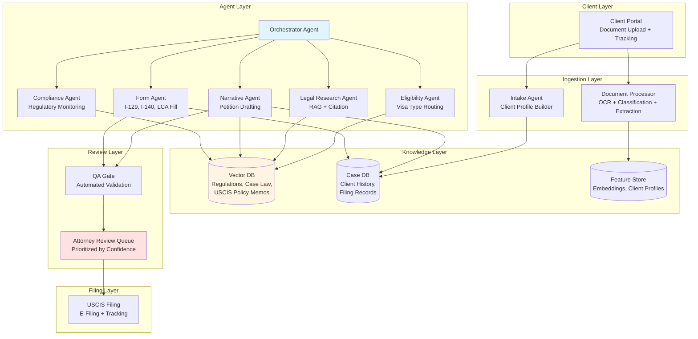

---

## 2. LLM Techniques Deep Dive

### 2.1 Prompt Engineering for Legal Domain

#### Chain-of-Thought for Legal Reasoning

Legal reasoning requires explicit step-by-step analysis. CoT prompting makes the LLM's reasoning auditable — critical for attorney review.

```python
VISA_ELIGIBILITY_PROMPT = """You are an immigration law specialist analyzing visa eligibility.

TASK: Determine the most appropriate visa category for this applicant.

APPLICANT PROFILE:
{applicant_profile}

ANALYSIS INSTRUCTIONS:
Think through this step-by-step:

Step 1: EDUCATION — What is the applicant's highest degree? From which institution?
Step 2: WORK EXPERIENCE — How many years of relevant experience? In what roles?
Step 3: EXTRAORDINARY ABILITY INDICATORS — Does the applicant have:
  - Awards or prizes for excellence?
  - Membership in associations requiring outstanding achievement?
  - Published material about them in professional/major media?
  - Evidence of judging others' work?
  - Original contributions of major significance?
  - Scholarly articles in professional journals?
  - Employment in a critical/essential capacity?
  - High salary relative to peers?
Step 4: VISA CATEGORY ANALYSIS — Based on evidence:
  - O-1A (Extraordinary Ability): Requires ≥3 of 8 criteria above
  - EB-1A (Priority Worker): Same criteria, higher bar (sustained national/international acclaim)
  - H-1B (Specialty Occupation): Requires bachelor's degree + specialty occupation
  - EB-2 NIW (National Interest Waiver): Advanced degree + national interest argument
Step 5: RECOMMENDATION — Which category is the strongest fit? Why?
Step 6: GAPS — What additional evidence would strengthen the case?

OUTPUT FORMAT:
{{
  "recommended_visa": "O-1A | EB-1A | H-1B | EB-2_NIW | ...",
  "confidence": 0.0-1.0,
  "criteria_met": ["criterion_1", "criterion_2", ...],
  "reasoning": "Step-by-step explanation...",
  "evidence_gaps": ["gap_1", "gap_2", ...],
  "alternative_visas": ["visa_type_1", ...]
}}
"""
```

#### Structured Output Schemas for Form Data Extraction

```python
from pydantic import BaseModel, Field
from typing import Optional, List
from enum import Enum

class VisaType(str, Enum):
    H1B = "H-1B"
    O1A = "O-1A"
    O1B = "O-1B"
    L1A = "L-1A"
    L1B = "L-1B"
    EB1A = "EB-1A"
    EB2_NIW = "EB-2 NIW"
    TN = "TN"

class I140PetitionData(BaseModel):
    """Structured extraction schema for I-140 Immigrant Petition."""

    # Part 1: Petitioner Information
    petitioner_name: str = Field(description="Legal name of sponsoring employer")
    petitioner_ein: str = Field(description="Employer Identification Number (9 digits)")
    petitioner_address: str = Field(description="Complete business address")
    petitioner_naics_code: Optional[str] = Field(description="NAICS industry code")

    # Part 2: Beneficiary Information
    beneficiary_full_name: str = Field(description="Full legal name of the beneficiary")
    beneficiary_dob: str = Field(description="Date of birth (YYYY-MM-DD)")
    beneficiary_country_of_birth: str = Field(description="Country of birth")
    beneficiary_country_of_citizenship: str = Field(description="Country of citizenship")
    beneficiary_a_number: Optional[str] = Field(description="Alien Registration Number if any")

    # Part 3: Classification
    classification: VisaType = Field(description="Requested visa classification")
    priority_date: Optional[str] = Field(description="Priority date if applicable")

    # Part 4: Job Information
    job_title: str = Field(description="Offered job title")
    soc_code: str = Field(description="SOC/O*NET occupation code")
    job_duties: str = Field(description="Description of job duties")
    education_required: str = Field(description="Minimum education requirement")
    years_experience: Optional[int] = Field(description="Years of experience required")
    annual_salary: float = Field(description="Offered annual salary in USD")
    prevailing_wage: float = Field(description="DOL prevailing wage for the position")
    wage_level: str = Field(description="Wage level (I, II, III, or IV)")

    # Evidence
    evidence_documents: List[str] = Field(description="List of supporting evidence documents")
```

### 2.2 Agent Patterns

#### ReAct Loop for Immigration Case Processing

```python
from dataclasses import dataclass
from typing import List, Optional, Any
from enum import Enum

class AgentAction(str, Enum):
    EXTRACT_DOCUMENT = "extract_document"
    SEARCH_REGULATIONS = "search_regulations"
    CHECK_ELIGIBILITY = "check_eligibility"
    DRAFT_NARRATIVE = "draft_narrative"
    FILL_FORM = "fill_form"
    REQUEST_ATTORNEY_REVIEW = "request_attorney_review"
    REQUEST_CLIENT_DOCUMENTS = "request_client_documents"
    TERMINATE = "terminate"

@dataclass
class AgentStep:
    thought: str
    action: AgentAction
    action_input: dict
    observation: Optional[str] = None

class ImmigrationReActAgent:
    """ReAct agent for immigration case assessment."""

    def __init__(self, llm, tools: dict, max_steps: int = 20):
        self.llm = llm
        self.tools = tools
        self.max_steps = max_steps
        self.steps: List[AgentStep] = []

    def run(self, case_input: dict) -> dict:
        context = self._build_initial_context(case_input)

        for step_num in range(self.max_steps):
            # REASON: LLM decides what to do next
            thought_and_action = self.llm.generate(
                system_prompt=REACT_SYSTEM_PROMPT,
                user_prompt=f"Case context:\n{context}\n\nPrevious steps:\n{self._format_steps()}\n\nWhat should we do next?",
                response_format=AgentStep
            )

            # ACT: Execute the chosen tool
            if thought_and_action.action == AgentAction.TERMINATE:
                return self._compile_results()

            tool = self.tools[thought_and_action.action]
            observation = tool.execute(**thought_and_action.action_input)
            thought_and_action.observation = observation

            # OBSERVE: Record result and continue loop
            self.steps.append(thought_and_action)
            context = self._update_context(context, thought_and_action)

        # Safety: max steps reached
        return self._compile_results(incomplete=True)
```

#### Visa Type Routing Decision Flow

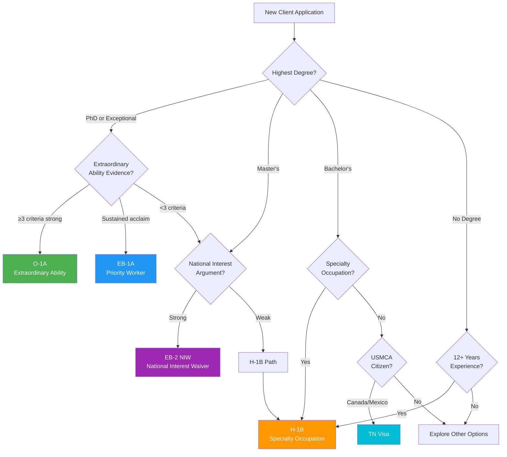

### 2.3 Experimentation & LLM Ops

#### Eval Pipeline with LLM-as-Judge

```python
from dataclasses import dataclass
from typing import List
import json

@dataclass
class EvalCase:
    case_id: str
    input_profile: dict
    generated_output: str
    expected_visa_type: str
    expected_criteria: List[str]

@dataclass
class EvalResult:
    case_id: str
    legal_accuracy: float   # 0-1: Are legal claims factually correct?
    citation_validity: float # 0-1: Do citations reference real regulations?
    completeness: float      # 0-1: Are all relevant criteria addressed?
    tone_quality: float      # 0-1: Professional legal writing quality?
    overall_score: float     # Weighted average

LLM_JUDGE_PROMPT = """You are a senior immigration attorney evaluating an AI-generated petition narrative.

EVALUATION CRITERIA:

1. LEGAL ACCURACY (weight: 40%)
   - Are all legal claims factually correct?
   - Are visa eligibility criteria correctly applied?
   - Are there any misstatements of law?

2. CITATION VALIDITY (weight: 25%)
   - Does every legal claim cite a regulation (INA §, 8 CFR §)?
   - Are cited regulations real and correctly referenced?
   - Are exhibit references consistent with the evidence list?

3. COMPLETENESS (weight: 20%)
   - For O-1A: Are at least 3 of 8 criteria substantively addressed?
   - Is each claim supported by specific evidence?
   - Are evidence gaps acknowledged?

4. PROFESSIONAL TONE (weight: 15%)
   - Is the writing style appropriate for USCIS adjudicators?
   - Is it persuasive without being argumentative?
   - Is it concise and well-structured?

GENERATED NARRATIVE:
{generated_narrative}

APPLICANT PROFILE:
{applicant_profile}

Score each criterion 0.0-1.0 and provide specific examples of issues found.

OUTPUT:
{{
  "legal_accuracy": {{"score": 0.0-1.0, "issues": [...]}},
  "citation_validity": {{"score": 0.0-1.0, "issues": [...]}},
  "completeness": {{"score": 0.0-1.0, "issues": [...]}},
  "tone_quality": {{"score": 0.0-1.0, "issues": [...]}},
  "overall_score": 0.0-1.0,
  "critical_issues": [...],
  "recommendations": [...]
}}
"""

class ImmigrationEvalPipeline:
    """Eval pipeline for immigration petition quality."""

    def __init__(self, judge_llm, eval_dataset: List[EvalCase]):
        self.judge = judge_llm
        self.dataset = eval_dataset

    def run_eval(self) -> dict:
        results = []
        for case in self.dataset:
            result = self._evaluate_single(case)
            results.append(result)

        return {
            "total_cases": len(results),
            "avg_legal_accuracy": sum(r.legal_accuracy for r in results) / len(results),
            "avg_citation_validity": sum(r.citation_validity for r in results) / len(results),
            "avg_completeness": sum(r.completeness for r in results) / len(results),
            "avg_overall": sum(r.overall_score for r in results) / len(results),
            "failing_cases": [r for r in results if r.overall_score < 0.7],
        }

    def _evaluate_single(self, case: EvalCase) -> EvalResult:
        response = self.judge.generate(
            prompt=LLM_JUDGE_PROMPT.format(
                generated_narrative=case.generated_output,
                applicant_profile=json.dumps(case.input_profile)
            ),
            temperature=0.0  # Deterministic judging
        )
        scores = json.loads(response)
        return EvalResult(
            case_id=case.case_id,
            legal_accuracy=scores["legal_accuracy"]["score"],
            citation_validity=scores["citation_validity"]["score"],
            completeness=scores["completeness"]["score"],
            tone_quality=scores["tone_quality"]["score"],
            overall_score=scores["overall_score"]
        )
```

#### Model Selection Matrix

| Use Case | Recommended Model | Rationale |
|----------|------------------|-----------|
| Document extraction (OCR → structured) | GPT-4o | Multimodal, structured output |
| Legal research (regulation lookup) | Claude Sonnet | Long context (200k), good retrieval |
| Petition narrative drafting | GPT-4 / Claude Opus | Quality-critical, creative writing |
| Form field filling | GPT-4o-mini | Cost-efficient, deterministic |
| Compliance alert triage | GPT-4o-mini | High volume, simple classification |
| Eval judge | Claude Opus / GPT-4 | Needs nuanced legal judgment |

---

## 3. LLM Tooling Deep Dive

### 3.1 RAG Architecture for Immigration Knowledge

#### Chunking Strategy for Legal Regulations

```python
from dataclasses import dataclass
from typing import List, Optional
import re

@dataclass
class LegalChunk:
    content: str
    metadata: dict  # source, section, effective_date, visa_types

class ImmigrationRegulationChunker:
    """Chunking strategy preserving legal citation boundaries."""

    def chunk_ina_section(self, raw_text: str, source: str) -> List[LegalChunk]:
        """Chunk Immigration and Nationality Act by subsection boundaries."""
        chunks = []

        # Split on section markers: § 101(a)(15)(H)(i)(b)
        section_pattern = r'(§\s*\d+\([a-z]\)(?:\(\d+\))?(?:\([A-Z]\))?(?:\([ivx]+\))?(?:\([a-z]\))?)'
        sections = re.split(section_pattern, raw_text)

        current_section = ""
        current_content = ""

        for part in sections:
            if re.match(section_pattern, part):
                # Save previous chunk
                if current_content.strip():
                    chunks.append(LegalChunk(
                        content=f"{current_section}\n{current_content.strip()}",
                        metadata={
                            "source": source,
                            "section": current_section,
                            "doc_type": "INA",
                            "effective_date": "current",
                            "visa_types": self._infer_visa_types(current_section),
                        }
                    ))
                current_section = part
                current_content = ""
            else:
                current_content += part

                # Sub-chunk if content exceeds 1500 chars (preserving sentence boundaries)
                if len(current_content) > 1500:
                    sentences = current_content.split('. ')
                    mid = len(sentences) // 2
                    chunk1 = '. '.join(sentences[:mid]) + '.'
                    chunk2 = '. '.join(sentences[mid:])

                    chunks.append(LegalChunk(
                        content=f"{current_section}\n{chunk1}",
                        metadata={
                            "source": source,
                            "section": current_section,
                            "doc_type": "INA",
                            "chunk_part": "1/2",
                            "visa_types": self._infer_visa_types(current_section),
                        }
                    ))
                    current_content = chunk2

        return chunks

    def _infer_visa_types(self, section: str) -> List[str]:
        """Map INA section references to visa types."""
        mapping = {
            "101(a)(15)(H)": ["H-1B", "H-2A", "H-2B"],
            "101(a)(15)(L)": ["L-1A", "L-1B"],
            "101(a)(15)(O)": ["O-1A", "O-1B"],
            "203(b)(1)": ["EB-1A", "EB-1B", "EB-1C"],
            "203(b)(2)": ["EB-2", "EB-2 NIW"],
        }
        for pattern, visas in mapping.items():
            if pattern in section:
                return visas
        return ["general"]
```

#### Retrieval Evaluation

```python
from typing import List, Dict
import numpy as np

def evaluate_retrieval(
    query: str,
    retrieved_docs: List[Dict],
    relevant_doc_ids: List[str],  # Ground truth
    k_values: List[int] = [1, 3, 5, 10]
) -> Dict:
    """Compute retrieval metrics for immigration legal search."""

    retrieved_ids = [doc["id"] for doc in retrieved_docs]

    metrics = {}

    # Precision@K
    for k in k_values:
        top_k = retrieved_ids[:k]
        relevant_in_k = len(set(top_k) & set(relevant_doc_ids))
        metrics[f"precision@{k}"] = relevant_in_k / k

    # Recall@K
    for k in k_values:
        top_k = retrieved_ids[:k]
        relevant_in_k = len(set(top_k) & set(relevant_doc_ids))
        metrics[f"recall@{k}"] = relevant_in_k / len(relevant_doc_ids) if relevant_doc_ids else 0

    # MRR (Mean Reciprocal Rank)
    for i, doc_id in enumerate(retrieved_ids):
        if doc_id in relevant_doc_ids:
            metrics["mrr"] = 1.0 / (i + 1)
            break
    else:
        metrics["mrr"] = 0.0

    return metrics
```

#### RAG Pipeline Architecture

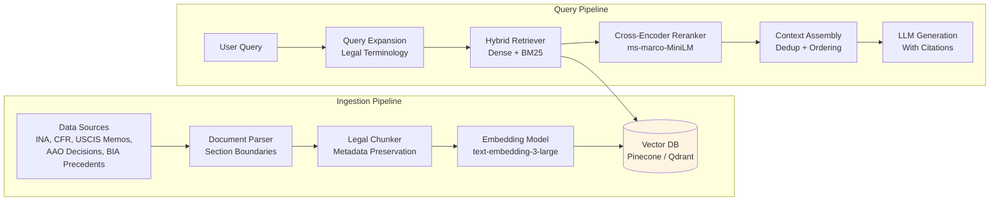

#### Vector Database Comparison

| Feature | Pinecone | Qdrant | Weaviate | Chroma |
|---------|----------|--------|----------|--------|
| **Hosting** | Managed only | Self-hosted + cloud | Self-hosted + cloud | Self-hosted |
| **Hybrid Search** | Yes (sparse+dense) | Yes | Yes (BM25+vector) | Limited |
| **Metadata Filtering** | Excellent | Excellent | Good | Basic |
| **Scale** | Billions | Millions | Millions | Thousands |
| **Cost** | $$$$ | $$ (self-host) | $$$ | Free |
| **Best For** | Production at scale | Cost-sensitive prod | GraphQL fans | Prototyping |
| **Alma Fit** | Production choice | Good budget option | Overkill | Dev/test only |

### 3.2 MCP (Model Context Protocol)

#### What MCP Is

MCP is Anthropic's open standard for connecting AI models to external data sources and tools — often called "USB-C for AI." Instead of custom integrations per tool, MCP provides a standardized client-server protocol.

**The M×N Problem → M+N Solution:**
- Without MCP: 5 AI models × 10 tools = 50 custom integrations
- With MCP: 5 AI models + 10 tools = 15 MCP implementations (5 clients + 10 servers)

#### MCP Server for USCIS Form Filling

```typescript
import { McpServer } from "@modelcontextprotocol/sdk/server/mcp.js";
import { z } from "zod";

const server = new McpServer({
  name: "uscis-forms",
  version: "1.0.0",
});

// Tool: Fill a specific field on a USCIS form
server.tool(
  "fill_form_field",
  "Fill a specific field on a USCIS immigration form (I-129, I-140, I-485, etc.)",
  {
    form_type: z.enum(["I-129", "I-140", "I-485", "I-765", "I-131"]),
    field_id: z.string().describe("USCIS field identifier (e.g., 'Part1_Line1a')"),
    value: z.string().describe("Value to fill in the field"),
    case_id: z.string().describe("Internal case identifier for audit trail"),
  },
  async ({ form_type, field_id, value, case_id }) => {
    // Validate field exists for this form type
    const formSchema = await getFormSchema(form_type);
    if (!formSchema.fields[field_id]) {
      return { content: [{ type: "text", text: `Error: Field ${field_id} not found on ${form_type}` }] };
    }

    // Validate value against field constraints
    const validation = formSchema.fields[field_id].validate(value);
    if (!validation.valid) {
      return { content: [{ type: "text", text: `Validation error: ${validation.message}` }] };
    }

    // Fill the field and log for audit
    await fillField(form_type, case_id, field_id, value);
    await auditLog(case_id, "fill_form_field", { form_type, field_id, value });

    return {
      content: [{ type: "text", text: `Successfully filled ${form_type} field ${field_id} with "${value}"` }],
    };
  }
);

// Tool: Validate a completed form
server.tool(
  "validate_form",
  "Validate all required fields are completed on a USCIS form",
  {
    form_type: z.enum(["I-129", "I-140", "I-485", "I-765", "I-131"]),
    case_id: z.string(),
  },
  async ({ form_type, case_id }) => {
    const result = await validateForm(form_type, case_id);
    return {
      content: [{
        type: "text",
        text: JSON.stringify({
          valid: result.valid,
          missing_fields: result.missingFields,
          warnings: result.warnings,
        })
      }],
    };
  }
);
```

#### MCP Architecture Diagram

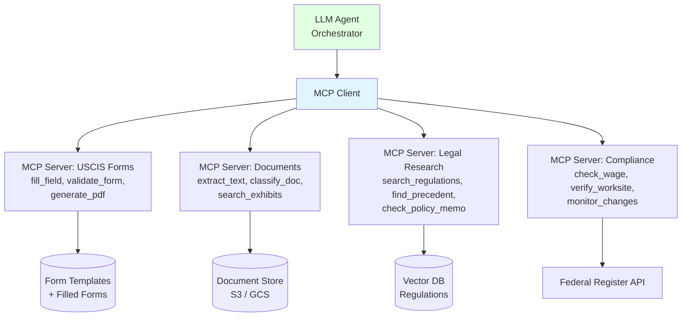

### 3.3 Eval Pipelines

#### Eval Dataset Schema

```python
from pydantic import BaseModel
from typing import List, Optional
from enum import Enum

class CaseOutcome(str, Enum):
    APPROVED = "approved"
    DENIED = "denied"
    RFE_ISSUED = "rfe_issued"
    PENDING = "pending"

class EvalDatasetEntry(BaseModel):
    """Schema for immigration case eval dataset."""
    case_id: str
    visa_type: str
    applicant_profile: dict        # Structured applicant data
    input_documents: List[str]     # Document IDs used as input
    generated_petition: str        # AI-generated petition text
    attorney_revised_petition: str # Attorney's final version
    attorney_edit_distance: float  # 0-1, how much attorney changed
    attorney_feedback: str         # Free-text feedback
    case_outcome: CaseOutcome      # USCIS decision
    rfe_issues: Optional[List[str]] # If RFE, what issues were raised
    approval_date: Optional[str]
    processing_time_days: Optional[int]
```

---

## 4. LLM Architecture & Production Best Practices

### 4.1 Agent Execution Loop

The standard agent execution loop for immigration case processing:

```
Request Intake → Context Assembly → LLM Reasoning → Action Validation
→ Sandboxed Execution → Result Processing → State Update → Loop/Terminate
```

**Immigration Example: H-1B Petition Processing**

| Step | Action | Immigration Context |
|------|--------|-------------------|
| 1. Request Intake | Parse client submission | New H-1B petition request with documents |
| 2. Context Assembly | Gather relevant data | Client profile + employer data + prevailing wage + regulations |
| 3. LLM Reasoning | Plan next action | "Need to extract passport data first, then verify employer EIN" |
| 4. Action Validation | Check action is safe | Extraction = read-only ✅, Form filing = needs attorney approval ⏸ |
| 5. Sandboxed Execution | Run the tool | OCR passport → extract structured data |
| 6. Result Processing | Parse tool output | Passport data extracted, confidence 0.92 |
| 7. State Update | Save progress | Checkpoint: "passport_extracted", move to next step |
| 8. Loop/Terminate | Decide next | More steps needed → loop back to step 2 |

### 4.2 Memory Architecture

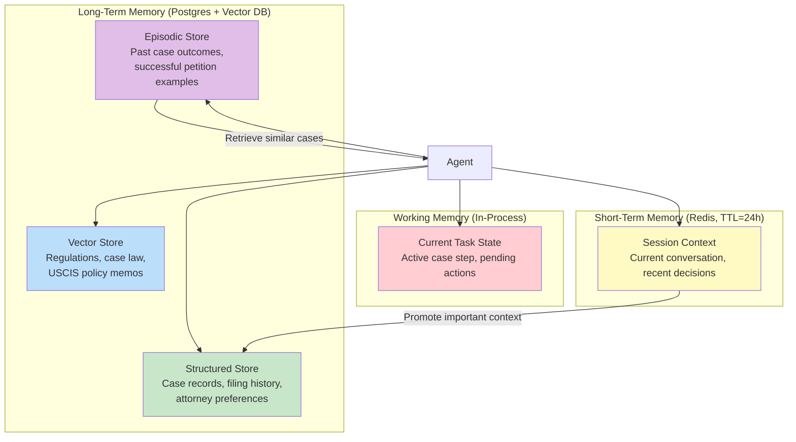

### 4.3 Tool Calling Production Patterns

```python
import asyncio
import time
from typing import Any, Callable, Optional
from dataclasses import dataclass, field
from functools import wraps

@dataclass
class CircuitBreakerState:
    failure_count: int = 0
    last_failure_time: float = 0.0
    is_open: bool = False
    threshold: int = 5
    recovery_timeout: float = 60.0  # seconds

class ProductionToolWrapper:
    """Production-ready wrapper with retry, circuit breaker, and fallback."""

    def __init__(
        self,
        primary_fn: Callable,
        fallback_fn: Optional[Callable] = None,
        max_retries: int = 3,
        timeout_seconds: float = 30.0,
    ):
        self.primary = primary_fn
        self.fallback = fallback_fn
        self.max_retries = max_retries
        self.timeout = timeout_seconds
        self.circuit = CircuitBreakerState()

    async def execute(self, **kwargs) -> dict:
        # Check circuit breaker
        if self.circuit.is_open:
            if time.time() - self.circuit.last_failure_time > self.circuit.recovery_timeout:
                self.circuit.is_open = False  # Half-open: try one request
            else:
                if self.fallback:
                    return await self._execute_fallback(**kwargs)
                return {"status": "error", "error": "Circuit breaker open"}

        # Retry loop with exponential backoff
        for attempt in range(self.max_retries):
            try:
                result = await asyncio.wait_for(
                    self.primary(**kwargs),
                    timeout=self.timeout
                )
                self.circuit.failure_count = 0  # Reset on success
                return {"status": "success", "data": result}

            except asyncio.TimeoutError:
                self._record_failure()
                if attempt < self.max_retries - 1:
                    await asyncio.sleep(2 ** attempt)  # Exponential backoff

            except Exception as e:
                self._record_failure()
                if attempt < self.max_retries - 1:
                    await asyncio.sleep(2 ** attempt)

        # All retries exhausted — try fallback
        if self.fallback:
            return await self._execute_fallback(**kwargs)
        return {"status": "error", "error": f"Failed after {self.max_retries} retries"}

    def _record_failure(self):
        self.circuit.failure_count += 1
        self.circuit.last_failure_time = time.time()
        if self.circuit.failure_count >= self.circuit.threshold:
            self.circuit.is_open = True

    async def _execute_fallback(self, **kwargs) -> dict:
        try:
            result = await self.fallback(**kwargs)
            return {"status": "fallback", "data": result}
        except Exception as e:
            return {"status": "error", "error": f"Fallback also failed: {str(e)}"}
```

### 4.4 Safety & Compliance

#### Action Classification for Legal Documents

```python
from enum import Enum

class ActionRisk(Enum):
    READ_ONLY = "read_only"                  # No approval needed
    REVERSIBLE_WRITE = "reversible_write"    # Auto-approved, can undo
    IRREVERSIBLE_WRITE = "irreversible_write"  # Requires attorney approval
    EXTERNAL_COMM = "external_communication"   # Requires explicit approval

ACTION_CLASSIFICATION = {
    # Read-only actions (auto-approved)
    "view_case_documents": ActionRisk.READ_ONLY,
    "search_regulations": ActionRisk.READ_ONLY,
    "check_case_status": ActionRisk.READ_ONLY,

    # Reversible writes (auto-approved with audit log)
    "generate_draft": ActionRisk.REVERSIBLE_WRITE,
    "add_internal_note": ActionRisk.REVERSIBLE_WRITE,
    "update_case_status": ActionRisk.REVERSIBLE_WRITE,

    # Irreversible writes (REQUIRE attorney approval)
    "submit_uscis_form": ActionRisk.IRREVERSIBLE_WRITE,
    "file_petition": ActionRisk.IRREVERSIBLE_WRITE,
    "pay_filing_fee": ActionRisk.IRREVERSIBLE_WRITE,

    # External communications (REQUIRE explicit approval)
    "email_client": ActionRisk.EXTERNAL_COMM,
    "notify_employer": ActionRisk.EXTERNAL_COMM,
    "respond_to_rfe": ActionRisk.EXTERNAL_COMM,
}
```

### 4.5 State Management for Long-Running Workflows

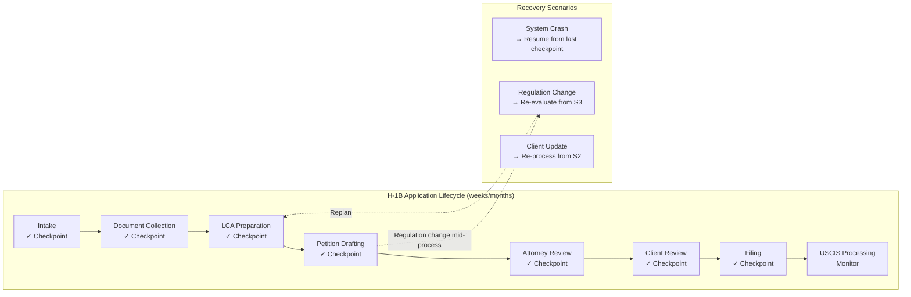

**Key Design Patterns:**
- **Checkpoint after every major step** — never lose more than one step of work
- **Idempotent operations** — replaying a step produces the same result
- **Version-stamped state** — detect stale state from concurrent modifications
- **Regulatory change hooks** — when regulations change, identify affected in-progress cases and trigger re-evaluation from the appropriate checkpoint

## 5. Agentic System Design Interview Framework

### 5.1 The 5-Phase Approach to Whiteboard Problems

System design interviews for AI Engineer positions follow a structured pattern. Master this framework to demonstrate architectural thinking, not just coding ability. Each phase has specific time allocation and deliverables.

#### Phase 1: Requirements Clarification (2-3 min)

Before drawing a single box, interrogate the problem space. The interviewer is testing your ability to scope work and identify constraints.

**Essential Questions to Ask:**

**Scope & Domain:**
- "Which visa types should this system handle? All immigrant/non-immigrant categories, or a focused subset?"
- "Are we processing initial filings only, or also RFEs (Requests for Evidence), appeals, and amendments?"
- "Should the system handle both individual applicants and corporate batch filings?"

**Scale & Performance:**
- "What's the expected throughput? Applications per day/month?"
- "What's the acceptable latency? Can document processing take 5 minutes, or must it be real-time?"
- "Do we need to support concurrent processing of multiple applications per client?"

**Success Metrics:**
- "How do we measure success? Approval rate, processing time, attorney review time, client satisfaction?"
- "What's the acceptable error rate? For legal documents, this is typically near-zero."
- "Are we optimizing for cost, speed, or quality?"

**Compliance & Safety:**
- "What are the human-in-the-loop touchpoints? Must an attorney review every output?"
- "Are there regulatory requirements for data retention or audit trails?"
- "How do we handle PII and sensitive documents (passports, financial records)?"

**Budget & Constraints:**
- "What's the LLM API budget? Are we cost-constrained or quality-constrained?"
- "Can we use external APIs (for regulatory lookups, case law search)?"
- "Are there latency requirements from dependent systems (CRM, document management)?"

**Immigration-Specific Example:**

```
Interviewer: "Design an agent system that helps draft O-1A visa petition letters."

You: "Let me clarify the scope:
1. Are we generating the complete petition letter, or specific sections like the beneficiary's extraordinary ability evidence?
2. Should the system handle both O-1A (sciences/business) and O-1B (arts/entertainment), or just O-1A?
3. What's the input format? Structured data from a form, or raw documents like CVs and publication PDFs?
4. What's the quality bar? Must the output match attorney-drafted letters, or is it a first draft for heavy revision?
5. For the evaluation criteria (sustained acclaim, major awards, etc.), should the system map evidence to USCIS criteria, or just draft narrative?
6. Must an attorney review every generated section before client delivery?"
```

**Output of Phase 1:** A written list of assumptions and constraints that both you and the interviewer agree on. This prevents scope creep during design.

#### Phase 2: High-Level Architecture (5 min)

Draw the system boundary and identify major components. Use the **agent-per-responsibility** pattern, not a monolithic agent.

**Architectural Principles:**
1. **Single Responsibility:** Each agent has one clear job (extract, research, draft, review)
2. **Clear Contracts:** Define inputs/outputs between agents
3. **Failure Isolation:** If one agent fails, others continue or gracefully degrade
4. **Observable:** Every agent emits structured logs and metrics

**Standard Components in Immigration Agentic Systems:**

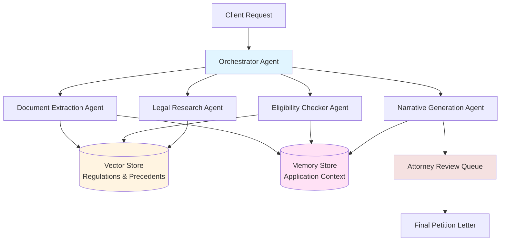

**Component Responsibilities:**

| Component | Input | Output | Failure Mode |
|-----------|-------|--------|--------------|
| **Orchestrator** | Client request JSON | Workflow execution plan | Retry with simpler plan |
| **Document Extraction** | PDFs, images, forms | Structured data (JSON) | Flag for manual review |
| **Eligibility Checker** | Applicant profile | Visa type recommendations + confidence | Return top-3 with reasoning |
| **Legal Research** | Visa type + query | Relevant regulations + citations | Return partial results |
| **Narrative Generation** | Structured evidence + research | Draft petition sections | Flag low-confidence sections |

**Key Architectural Decisions to Discuss:**

1. **Orchestration Pattern:** Sequential vs. parallel execution?
   - O-1A drafting: Document extraction → Eligibility check → (Research + Narrative in parallel)
   - H-1B LCA compliance: Document extraction → Parallel validation of wage level, job location, and employer eligibility

2. **State Management:** Where does application context live?
   - Short-term: Redis for active workflows (TTL = 24h)
   - Long-term: PostgreSQL for audit trail and attorney review

3. **RAG Strategy:** Centralized vector store vs. agent-specific indexes?
   - Centralized: All regulations in one store, agents query with filtered metadata
   - Specialized: Separate indexes for regulations, case law, internal precedents

4. **Model Selection:** Single LLM vs. specialized models per agent?
   - O-1A: GPT-4 for narrative generation (quality-critical), GPT-3.5 for document extraction (cost-sensitive)
   - EB-2 NIW: Claude for research (long context), GPT-4 for drafting (creativity)

#### Phase 3: Deep Dive on Critical Components (10 min)

Pick 2-3 components where you can show technical depth. The interviewer is testing whether you understand LLM internals, not just API calls.

**Component 1: Document Extraction Agent**

**Implementation Strategy:**

```python
from openai import OpenAI
from pydantic import BaseModel, Field
from typing import Optional
import pytesseract
from PIL import Image
import io

class PassportData(BaseModel):
    full_name: str = Field(description="Full name as shown on passport")
    passport_number: str = Field(description="Passport number")
    nationality: str = Field(description="Country of citizenship")
    date_of_birth: str = Field(description="Date of birth (YYYY-MM-DD)")
    issue_date: str = Field(description="Passport issue date (YYYY-MM-DD)")
    expiry_date: str = Field(description="Passport expiry date (YYYY-MM-DD)")

class DocumentExtractionAgent:
    def __init__(self, model: str = "gpt-4o"):
        self.client = OpenAI()
        self.model = model
        self.ocr_confidence_threshold = 0.7

    def extract_passport_data(self, image_bytes: bytes) -> tuple[PassportData, float]:
        """
        Two-stage extraction: OCR for text extraction, LLM for structured parsing.
        This hybrid approach reduces hallucination (LLM can't invent text not in OCR).
        """

        # Stage 1: OCR extraction with confidence scoring
        image = Image.open(io.BytesIO(image_bytes))
        ocr_data = pytesseract.image_to_data(image, output_type=pytesseract.Output.DICT)

        # Calculate average OCR confidence
        confidences = [int(conf) for conf in ocr_data['conf'] if int(conf) > 0]
        avg_confidence = sum(confidences) / len(confidences) if confidences else 0
        ocr_confidence = avg_confidence / 100.0

        # Extract text blocks
        ocr_text = " ".join([
            text for text, conf in zip(ocr_data['text'], ocr_data['conf'])
            if int(conf) > 60  # Filter low-confidence OCR
        ])

        # Stage 2: LLM structured extraction with grounded text
        system_prompt = """You are a passport data extraction specialist.
Extract passport information from the OCR text provided.

CRITICAL RULES:
1. Only extract information explicitly present in the OCR text
2. If a field is unclear or missing, return null for that field
3. Dates must be in YYYY-MM-DD format
4. Passport numbers must match exactly as they appear
5. Never hallucinate or infer information not in the source text"""

        response = self.client.beta.chat.completions.parse(
            model=self.model,
            messages=[
                {"role": "system", "content": system_prompt},
                {"role": "user", "content": f"OCR Text:\n{ocr_text}"}
            ],
            response_format=PassportData,
            temperature=0.0  # Deterministic extraction
        )

        extracted = response.choices[0].message.parsed
        overall_confidence = ocr_confidence * 0.95

        return extracted, overall_confidence
```

**Component 2: Legal Research Agent**

```python
from typing import List
from dataclasses import dataclass
import chromadb

@dataclass
class RetrievedDocument:
    content: str
    citation: str
    relevance_score: float

class LegalResearchAgent:
    def __init__(self):
        self.client = OpenAI()
        self.chroma_client = chromadb.PersistentClient(path="./immigration_kb")
        self.collection = self.chroma_client.get_or_create_collection(
            name="immigration_regulations"
        )

    def research(self, query: str, visa_type: str, top_k: int = 10) -> List[RetrievedDocument]:
        """
        Multi-stage retrieval: Dense retrieval → Reranking → Citation extraction
        """

        # Stage 1: Query expansion for legal domain
        expanded_query = self._expand_legal_query(query, visa_type)

        # Stage 2: Dense retrieval with metadata filtering
        results = self.collection.query(
            query_texts=[expanded_query],
            n_results=top_k * 3,  # Over-retrieve for reranking
            where={"visa_type": visa_type}
        )

        # Stage 3: Reranking with LLM-as-judge
        reranked = self._rerank_results(expanded_query, results, top_k)

        return reranked

    def _expand_legal_query(self, query: str, visa_type: str) -> str:
        """Use LLM to expand generic queries into legal terminology."""

        system_prompt = """You are a legal research specialist in U.S. immigration law.
Expand user queries into precise legal terminology for regulatory retrieval.

Include relevant statute sections (INA §) and regulatory sections (8 CFR §)."""

        response = self.client.chat.completions.create(
            model="gpt-4o-mini",
            messages=[
                {"role": "system", "content": system_prompt},
                {"role": "user", "content": f"Query: {query}\nVisa Type: {visa_type}"}
            ],
            temperature=0.0
        )

        return response.choices[0].message.content
```

#### Phase 4: Evaluation Strategy (3-5 min)

**The Evaluation Pyramid:**

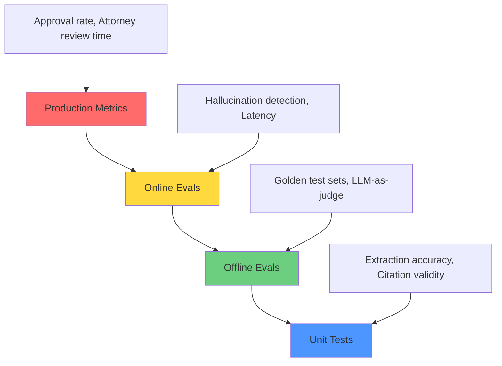

**Layer 1: Unit Tests**

```python
def test_passport_extraction_valid_document():
    agent = DocumentExtractionAgent()
    with open('test_data/sample_passport.jpg', 'rb') as f:
        image_bytes = f.read()

    extracted, confidence = agent.extract_passport_data(image_bytes)

    assert extracted.full_name == "JOHN MICHAEL DOE"
    assert extracted.passport_number == "123456789"
    assert confidence > 0.9
```

**Layer 2: Offline Evals**

```python
class O1APetitionEvaluator:
    def evaluate_petition(self, generated: str, case_id: str) -> dict:
        """
        Multi-dimensional evaluation:
        1. Citation accuracy
        2. Evidence coverage (are all 8 O-1A criteria addressed?)
        3. Factual consistency
        4. LLM-as-judge quality score
        """
        scores = {
            'citation_accuracy': self._evaluate_citations(generated),
            'evidence_coverage': self._evaluate_coverage(generated),
            'overall_quality': self._llm_judge_quality(generated)
        }
        return scores
```

#### Phase 5: Production Considerations (2-3 min)

**Key Production Considerations:**

1. **Cost Management:**
   - Token budgeting per application (max 100k tokens)
   - Model tiering (GPT-4 for generation, GPT-3.5 for extraction)
   - Caching for repeated queries

2. **Monitoring & Alerting:**
   - Token usage spikes (infinite reasoning loops?)
   - Latency degradation (API rate limits?)
   - Confidence score drops (model quality regression?)

3. **Safety & Compliance:**
   - Audit trail: Every output logged with inputs, model version, timestamp
   - Human-in-the-loop: Attorney approval required before client delivery
   - PII handling: Encryption at rest, access controls

---

### 5.2 Evaluation Rubric (What Interviewers Score)

| Criterion | Weight | Strong Signal | Weak Signal |
|-----------|--------|---------------|-------------|
| **Problem Decomposition** | 25% | Breaks into 4-6 single-purpose agents with clear contracts | Proposes single monolithic agent |
| **Architecture Design** | 25% | Draws clear data flow, discusses state management, addresses observability | No diagram, doesn't specify where state lives |
| **Technical Depth** | 20% | Shows RAG internals, discusses prompt engineering, explains model selection | Surface-level API knowledge only |
| **Error Handling** | 15% | Identifies failure modes, proposes human-in-the-loop, bounded retries | Assumes LLMs always work |
| **Evaluation Strategy** | 15% | Multi-layer eval, discusses test set construction, ties to business metrics | "We'll test it manually" |

---

### 5.3 Common Mistakes to Avoid

#### Mistake 1: Coding Before Designing
Don't open an IDE immediately. Spend 30% of time on requirements and architecture.

#### Mistake 2: The Monolithic Agent
Avoid one giant agent. Use specialized agents with clear responsibilities.

#### Mistake 3: Ignoring Failure Modes
Always discuss: "What if the LLM hallucinates a legal citation?"

**Better answer:**
"Hallucinated citations are a known issue. I'd implement three layers:
1. **Grounding:** RAG ensures LLM only cites documents we provided
2. **Validation:** Cross-reference every citation against regulatory database
3. **Human review:** Any validation failures go to attorney review"

#### Mistake 4: No Evaluation Strategy
Don't say "manual review." Propose systematic eval with golden test sets.

#### Mistake 5: Over-Engineering
Start simple. "For MVP, sequential pipeline. Once validated, optimize bottlenecks."

#### Mistake 6: No Human-in-the-Loop
For legal documents: "Every output goes to attorney review. We augment attorneys, not replace them."

---

### 5.4 Signals of a Strong Candidate

#### Signal 1: Asks About Eval Before Architecture
Shows product thinking. Success metrics determine system design.

#### Signal 2: Proposes Simple Solution First
"Start with linear pipeline. Scale horizontally once we identify bottlenecks."

#### Signal 3: Mentions Specific Failure Modes from Experience
"In a previous project, OCR quality variance caused 15% extraction failures. We fixed it by adding confidence scoring and image preprocessing."

#### Signal 4: Discusses Cost/Latency Trade-offs
"GPT-4 costs $0.15 per petition but quality justifies it. For internal summaries, GPT-3.5 saves $0.14."

#### Signal 5: References Production Monitoring
"Post-deployment, monitor: hallucination rate, token usage, attorney revision rate. Improve 10% monthly."

#### Signal 6: Shows Legal/Compliance Awareness
"USCIS regulations change. Need versioning, effective date filtering, and audit trails."

---

## 6. Agentic Debugging Deep Dive

### 6.1 Why LLM Debugging Is Fundamentally Different

| Traditional Software | LLM Agents |
|---------------------|------------|
| Deterministic | Probabilistic (temperature, sampling) |
| Clear stack trace | Silent failures (looks correct but legally wrong) |
| Binary (works/doesn't) | Probabilistic (works 9/10 times) |
| Bug in code | Bug in data, prompt, model, OR retrieval |

**The Core Challenge: Silent Failures**

```
Output: "John Doe won Best Paper award at NeurIPS 2022."
Status: ✅ Looks great!
Reality: ❌ John's paper was at ICML 2022, not NeurIPS. Hallucinated venue.
```

The output is fluent and contextually appropriate, but factually wrong. Traditional debugging won't catch this.

**The Debugging Mindset Shift:**

Old: "Find the bug" → New: "Characterize the failure distribution"

**Multi-Step Error Compounding:**

If each agent has 95% accuracy in a 5-agent pipeline:
```
0.95 × 0.95 × 0.95 × 0.95 × 0.95 = 0.774 (77.4%)
```
One in four applications has at least one error. Unacceptable for legal documents.

**Solution:** Each agent needs >99% accuracy, plus validation gates between stages.

---

### 6.2 Distributed Tracing & Observability

**Conceptual Model:**
- **Trace:** One complete agent execution (processing one H-1B application)
- **Span:** One operation within trace (LLM call, tool call, retrieval)
- **Parent-child relationships:** Spans nest to show execution tree

**Span Hierarchy Example:**

```
Trace: H1B_Application_20240101_001
├─ orchestrator.process_application (50s)
│  ├─ document_extraction.extract_passport (5s)
│  │  ├─ ocr.tesseract (3s)
│  │  └─ llm.structured_extract (2s, 1500 tokens)
│  ├─ eligibility_check.evaluate (3s)
│  │  └─ llm.reasoning (3s, 800 tokens)
│  ├─ research.query_regulations (4s)
│  │  ├─ vector_store.query (2s, 10 results)
│  │  └─ reranker.rerank (2s)
│  └─ generation.draft_petition (8s)
│     └─ llm.generate (8s, 3000 tokens)
```

**Implementation with OpenTelemetry:**

```python
from opentelemetry import trace
from opentelemetry.sdk.trace import TracerProvider
from opentelemetry.exporter.otlp.proto.grpc.trace_exporter import OTLPSpanExporter

tracer = trace.get_tracer(__name__)

class InstrumentedAgent:
    def extract_passport(self, image_bytes: bytes, application_id: str):
        with tracer.start_as_current_span(
            "document_extraction.extract_passport",
            attributes={
                "application_id": application_id,
                "document_type": "passport",
                "image_size_bytes": len(image_bytes)
            }
        ) as parent_span:

            # Child span for OCR
            with tracer.start_as_current_span("ocr.tesseract") as ocr_span:
                ocr_text, ocr_confidence = self._run_ocr(image_bytes)
                ocr_span.set_attributes({
                    "ocr.confidence": ocr_confidence,
                    "ocr.text_length": len(ocr_text)
                })

            # Child span for LLM
            with tracer.start_as_current_span("llm.structured_extract") as llm_span:
                extracted = self._llm_extract(ocr_text)
                llm_span.set_attributes({
                    "llm.model": "gpt-4o",
                    "llm.input_tokens": len(ocr_text.split()),
                    "llm.temperature": 0.0
                })

            return extracted
```

**Semantic Monitoring:**

```python
from prometheus_client import Counter, Histogram

hallucination_counter = Counter(
    'hallucination_detected_total',
    'Hallucinated facts or citations',
    ['agent_name', 'hallucination_type']
)

token_usage_histogram = Histogram(
    'llm_tokens_used',
    'Token usage per LLM call',
    ['agent_name', 'model'],
    buckets=[100, 500, 1000, 2000, 5000, 10000]
)
```

**What to Alert On:**

| Alert | Trigger | Severity |
|-------|---------|----------|
| Token budget exceeded | Single call > 20k tokens | High |
| Latency spike | P95 > 120s | Medium |
| Retrieval quality drop | Avg relevance < 0.5 for 1h | High |
| Hallucination rate increase | >5/hour | Critical |
| Error rate spike | >10% failures | Critical |

---

### 6.3 Root Cause Analysis Framework

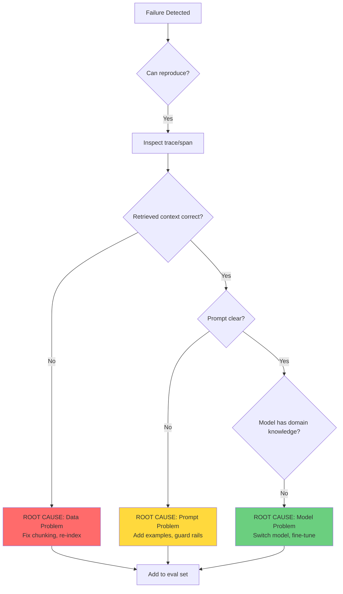

**Step 1: Is it a Data/Context Problem?**

Common causes:
- Chunk boundaries split regulations across chunks
- Poor embedding quality (low relevance scores)
- Stale data (outdated regulations)
- Context overflow truncates important info

**Fix:** Re-chunk with semantic boundaries, update embeddings, version control.

**Step 2: Is it a Prompt Problem?**

Common causes:
- Vague instructions
- Conflicting instructions
- Missing output format specification
- No edge case examples

**Fix:** Make instructions explicit, add few-shot examples, use structured output.

**Step 3: Is it a Model Problem?**

Common causes:
- Model lacks domain knowledge
- Consistent hallucinations
- Poor instruction-following

**Fix:** Switch to better model (GPT-4, Claude Opus), add context via RAG, fine-tune.

---

### 6.4 RAG-Specific Debugging

**The Two-Stage Protocol:** Always debug retrieval first, then generation.

```python
def debug_rag_failure(query: str, expected_output: str):
    # Stage 1: Retrieval evaluation
    retrieved_docs = retrieve_documents(query, top_k=10)
    retrieval_quality = evaluate_retrieval(retrieved_docs)

    if retrieval_quality['avg_relevance'] < 0.6:
        print("❌ RETRIEVAL IS THE PROBLEM")
        print("1. Check if expected documents exist in vector store")
        print("2. Try query expansion")
        print("3. Re-index with better chunking")
        return

    # Stage 2: Generation evaluation
    generated = generate_answer(query, retrieved_docs)
    generation_quality = evaluate_generation(generated, retrieved_docs)

    if generation_quality['hallucination_detected']:
        print("❌ GENERATION IS THE PROBLEM")
        print("1. Add citation requirement to prompt")
        print("2. Reduce temperature to 0.0")
        print("3. Add validation step")
```

**Common RAG Failure Modes:**

1. **Regulation section boundaries misaligned:** Re-chunk respecting legal citations
2. **Acronym mismatch:** "H-1B visa" vs "INA § 101(a)(15)(H)(i)(b)" → Use query expansion
3. **Temporal confusion:** Old and new regulation versions → Filter by effective_date
4. **Cross-reference failures:** Regulation A cites B, only A retrieved → Recursive retrieval

---

### 6.5 Debugging Walkthrough: "Wrong Visa Type Recommended"

**Scenario:** PhD with 15 publications, 523 citations. Agent recommended H-1B instead of O-1A.

**Step 1:** Reproduce with exact input

**Step 2:** Inspect trace → Query was "visa eligibility advanced degree technology" (too generic)

**Step 3:** Check retrieval → H-1B criteria retrieved first (higher similarity score than O-1A)

**Step 4:** Examine prompt → Documents presented in retrieval order, biasing toward H-1B

**Root Cause:** Generic query + retrieval ordering + conservative LLM reasoning

**Fixes:**
1. Improve query for academic profiles (add "extraordinary ability" keywords)
2. Add reranking to boost O-1A docs when publications/citations are high
3. Update prompt to evaluate multiple visa types and prefer highest tier

**Step 5:** Add to eval set as regression test

---

### 6.6 Observability Tools Comparison

| Feature | LangSmith | Langfuse | Opik | Arize Phoenix |
|---------|-----------|----------|------|---------------|
| Tracing | Yes | Yes | Yes | Yes |
| Evals | Built-in | Plugin | Built-in | Built-in |
| Open Source | No | Yes | Yes | Yes |
| Self-hosted | No | Yes | Yes | Yes |
| Cost tracking | Yes | Yes | Yes | Limited |
| Best for | LangChain | Open teams | Experiments | ML observability |

---

**Interview Preparation Summary:**

For Alma's AI Engineer role, demonstrate:
1. **System design:** Multi-agent architecture with clear failure isolation
2. **Technical depth:** RAG internals, prompt engineering, model selection
3. **Production thinking:** Monitoring, evals, human-in-the-loop
4. **Domain awareness:** Legal compliance, citation validation, PII handling
5. **Debugging mindset:** Characterize failure distributions, systematic root cause analysis


## 7. Frequently Asked Questions

### 7.1 Core Architecture

#### 1. "What defines an AI agent vs a standard LLM application?"

**Answer Framework:**
- **Standard LLM Application**: Single prompt-response interaction. User provides input → LLM generates output → done. Examples: chatbots, text summarization, translation.
- **AI Agent**: Autonomous system that perceives its environment, makes decisions, and takes actions iteratively to achieve a goal. Key characteristics:
  - **Perception**: Reads state (documents, APIs, databases)
  - **Planning**: Decomposes goals into steps
  - **Action**: Executes tools/functions based on reasoning
  - **Memory**: Maintains context across interactions
  - **Iteration**: Loops until goal achieved or constraints met

**Immigration Example:**
- **Standard LLM**: "Summarize this O-1A recommendation letter" (one-shot)
- **Agent**: "Process this H-1B application" → Agent reads documents → identifies missing fields → queries HR system for employer data → drafts LCA → requests attorney review → waits for approval → files with USCIS → monitors case status

**Strong Signal:**
Mention that agents exhibit **goal-directed behavior** and **environmental feedback loops**. Reference control theory or reinforcement learning concepts. Highlight the importance of **termination conditions** (agents must know when to stop).

```python
# Standard LLM Application
def summarize(text: str) -> str:
    return llm.generate(f"Summarize: {text}")

# AI Agent
class H1BAgent:
    def __init__(self):
        self.state = {"documents": [], "status": "pending"}
        self.tools = [read_docs, query_hr, draft_lca, file_petition]

    def run(self, goal: str):
        while not self.is_goal_achieved():
            observation = self.perceive()
            action = self.plan(observation)
            result = self.act(action)
            self.update_state(result)
        return self.state
```

---

#### 2. "Describe the main architectural patterns for building AI agents. When would you choose each?"

**Answer Framework:**
Cover these four patterns with trade-offs:

**A. ReAct (Reasoning + Acting)**
- Interleaves thought/reasoning with action
- LLM generates "Thought: [reasoning]" → "Action: [tool_call]" → "Observation: [result]" → repeat
- **When to use**: Complex tasks requiring explicit reasoning traces (e.g., multi-step visa eligibility analysis)
- **Trade-offs**: Verbose (costs more tokens), but highly interpretable

**B. Function Calling (Tool Use)**
- LLM decides which tool to invoke from a predefined set
- System parses tool calls, executes, returns results to LLM
- **When to use**: Structured environments with well-defined APIs (USCIS case status check, document retrieval)
- **Trade-offs**: Less flexible than free-form ReAct, but more reliable for production

**C. Plan-and-Execute**
- Step 1: Generate full plan upfront
- Step 2: Execute each step sequentially
- Step 3: Replan if execution fails
- **When to use**: Predictable workflows (H-1B form filling—steps are known in advance)
- **Trade-offs**: Struggles with dynamic environments; replanning adds latency

**D. Reflexion (Self-Critique Loop)**
- Agent attempts task → evaluates own output → reflects on failures → retries with improved strategy
- **When to use**: High-stakes tasks where quality matters more than speed (O-1A petition narrative drafting)
- **Trade-offs**: Multiple LLM calls increase cost; requires good self-evaluation prompts

**Immigration Example:**
For **RFE response system**, use **ReAct** because the agent must reason about ambiguous USCIS language and decide which evidence applies. For **routine compliance alerts**, use **Function Calling** because actions are deterministic (query Federal Register API → parse changes → match to client database).

**Strong Signal:**
Mention hybrid approaches. Example: "I'd use Plan-and-Execute for the overall H-1B workflow, but embed a Reflexion loop specifically for the petition letter—draft → attorney critique → revise."

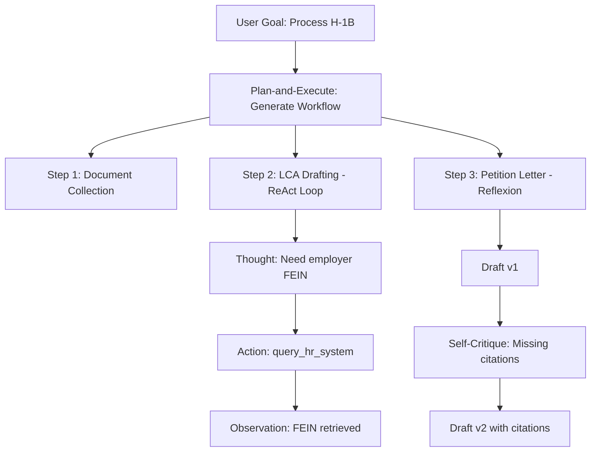

---

#### 3. "How do you handle state management in long-running agentic workflows?"

**Answer Framework:**
Address persistence, consistency, and recoverability:

**A. In-Memory State (Ephemeral)**
- Store state in process memory (Python dict, TypeScript object)
- **When to use**: Short workflows (<5 minutes), single-server execution
- **Limitation**: Lost on crash; doesn't scale horizontally

**B. Database-Backed State (Durable)**
- Persist state to Postgres, DynamoDB, or Redis after each action
- **When to use**: Long workflows (immigration cases span months), need audit trail
- **Implementation**: Save checkpoints with `workflow_id`, `step_number`, `agent_state`

**C. Event Sourcing**
- Store every action as an immutable event log
- Reconstruct current state by replaying events
- **When to use**: Regulatory compliance (USCIS may audit case history), need time-travel debugging

**D. Stateless with External Context**
- Agent queries external systems for current state each iteration
- **When to use**: When source of truth lives elsewhere (USCIS case status API)

**Immigration Example:**
For an **O-1A evidence compilation agent**, use **database-backed state** because:
- Workflow spans days (client uploads documents incrementally)
- Multiple agents collaborate (Evidence Classifier → Strength Scorer → Narrative Writer)
- Attorneys need to see progress at any time
- Rollback capability if attorney rejects a draft

**Strong Signal:**
Discuss **idempotency** and **checkpointing**. Mention frameworks like Temporal or LangGraph that provide durable execution. Address race conditions in multi-agent scenarios.

```typescript
// Database-backed state example
interface WorkflowState {
  workflow_id: string;
  current_step: string;
  agent_memory: Record<string, any>;
  completed_steps: string[];
  created_at: Date;
  updated_at: Date;
}

async function saveCheckpoint(state: WorkflowState) {
  await db.workflows.upsert({
    where: { workflow_id: state.workflow_id },
    data: state
  });
}

async function resumeWorkflow(workflow_id: string): Promise<WorkflowState> {
  const state = await db.workflows.findUnique({ where: { workflow_id } });
  if (!state) throw new Error("Workflow not found");
  return state;
}
```

**Key Design Decision:**
Separate **short-term memory** (conversation context) from **long-term memory** (case history). Short-term: in-memory. Long-term: database with vector embeddings for semantic search.

---

#### 4. "Walk me through designing a robust tool calling system."

**Answer Framework:**
Cover tool definition, execution, error handling, and observability:

**A. Tool Definition Schema**
- Name, description, parameters (type, required/optional)
- Use JSON Schema or Pydantic models
- Make descriptions clear—LLM decides based on description alone

**B. Tool Registry**
- Centralized registry mapping tool names to implementations
- Supports dynamic tool loading (add new tools without redeploying agent)

**C. Execution Engine**
- Parses LLM tool call → validates parameters → executes function → returns structured result
- Handle async tools (API calls may take seconds)

**D. Error Handling**
- Tool execution failures → return error to LLM with context
- Retry logic for transient failures (rate limits, network errors)
- Fallback tools (if primary tool fails, try alternative)

**E. Observability**
- Log every tool call with: timestamp, agent_id, tool_name, parameters, result, latency
- Trace end-to-end workflows (use OpenTelemetry or custom trace IDs)

**Immigration Example:**
For an **H-1B form filling agent**, tools include:
- `get_client_info(client_id)` → Returns name, DOB, passport
- `query_prevailing_wage(job_title, location)` → Calls DOL API
- `fill_form_field(form_id, field_name, value)` → Writes to I-129 PDF
- `validate_form(form_id)` → Checks required fields complete

**Strong Signal:**
Mention **tool versioning** (what happens when a tool's signature changes?) and **cost tracking** (some tools are expensive—API credits, compute time). Discuss **sandboxing** for untrusted tools.

```python
from pydantic import BaseModel, Field
from typing import Callable, Dict, Any

class ToolParameter(BaseModel):
    name: str
    type: str
    description: str
    required: bool = True

class Tool(BaseModel):
    name: str
    description: str
    parameters: list[ToolParameter]
    function: Callable

class ToolRegistry:
    def __init__(self):
        self.tools: Dict[str, Tool] = {}

    def register(self, tool: Tool):
        self.tools[tool.name] = tool

    async def execute(self, tool_name: str, params: Dict[str, Any]) -> Any:
        if tool_name not in self.tools:
            raise ValueError(f"Tool '{tool_name}' not found")

        tool = self.tools[tool_name]
        # Validate parameters
        for param in tool.parameters:
            if param.required and param.name not in params:
                raise ValueError(f"Missing required parameter: {param.name}")

        try:
            result = await tool.function(**params)
            return {"success": True, "result": result}
        except Exception as e:
            return {"success": False, "error": str(e)}

# Usage
registry = ToolRegistry()
registry.register(Tool(
    name="query_prevailing_wage",
    description="Retrieve prevailing wage for a job title and location from DOL API",
    parameters=[
        ToolParameter(name="job_title", type="string", description="O*NET SOC code or job title"),
        ToolParameter(name="location", type="string", description="City and state (e.g., 'San Francisco, CA')")
    ],
    function=lambda job_title, location: call_dol_api(job_title, location)
))
```

**Key Design Decision:**
**Tool call validation before execution.** LLM may hallucinate invalid parameters. Parse and validate against schema before executing to avoid downstream errors.

---

#### 5. "How would you handle tool calling failures and partial results?"

**Answer Framework:**
Address failure modes, recovery strategies, and agent awareness:

**A. Failure Modes**
- **Tool doesn't exist**: LLM hallucinates a tool name
- **Invalid parameters**: Wrong type, missing required field
- **Execution error**: API timeout, rate limit, service down
- **Partial success**: Tool returns incomplete data (e.g., missing 2 of 5 fields)

**B. Recovery Strategies**

**1. Graceful Degradation**
- Return partial result + error message to LLM
- Let LLM decide next action (retry, use alternative tool, proceed with partial data)

**2. Automatic Retry with Backoff**
- For transient errors (rate limits, network), retry with exponential backoff
- Max retries = 3, then surface error to LLM

**3. Fallback Tools**
- If primary tool fails, agent tries alternative (e.g., if USCIS API down, scrape public website)

**4. Human Escalation**
- For critical failures in high-stakes tasks (e.g., can't verify employer EIN), escalate to human

**C. Agent Awareness**
- Make failure context visible to LLM: "Tool 'query_dol' failed: Rate limit exceeded (429). Data is cached but 2 days old. Proceed with cached data or wait?"
- Include **tool reliability metadata** in prompts (e.g., "This API has 95% uptime")

**Immigration Example:**
For **RFE response system**, if the tool `search_client_documents(query="patents")` returns only 1 of 3 expected patents:
1. **Partial Result Handling**: Return what's found + note "Only 1 patent found; client claimed 3 in intake form"
2. **LLM Decision**: Agent generates "Observation: Mismatch detected. Action: query_client_via_email('Please upload missing patent documentation')"
3. **Workflow Pause**: Set state to `awaiting_client_response`, resume when documents arrive

**Strong Signal:**
Discuss **idempotency** (retry must be safe) and **circuit breakers** (if tool fails repeatedly, stop calling it). Mention cost implications—retries burn tokens/credits.

```python
import asyncio
from typing import Any, Callable

class ToolExecutor:
    def __init__(self, max_retries: int = 3):
        self.max_retries = max_retries

    async def execute_with_retry(self, tool_fn: Callable, params: dict) -> dict:
        for attempt in range(self.max_retries):
            try:
                result = await tool_fn(**params)
                if self._is_complete(result):
                    return {"status": "success", "data": result}
                else:
                    # Partial result
                    return {
                        "status": "partial",
                        "data": result,
                        "warning": "Incomplete data returned"
                    }
            except RateLimitError as e:
                if attempt < self.max_retries - 1:
                    wait_time = 2 ** attempt  # Exponential backoff
                    await asyncio.sleep(wait_time)
                else:
                    return {
                        "status": "failure",
                        "error": f"Rate limit exceeded after {self.max_retries} retries",
                        "suggestion": "Use cached data or escalate to human"
                    }
            except Exception as e:
                return {"status": "failure", "error": str(e)}

    def _is_complete(self, result: Any) -> bool:
        # Example: Check if required fields are present
        if isinstance(result, dict):
            required_fields = ["employer_name", "job_title", "wage"]
            return all(field in result for field in required_fields)
        return True
```

**Key Design Decision:**
**Surfacing failures to the LLM vs. hiding them.** Hide transient retries (network blip) but expose structural failures (API schema changed). LLM can reason about workarounds if informed.

---

### 7.2 Planning & Task Decomposition

#### 6. "Compare different planning approaches for AI agents."

**Answer Framework:**
Cover the spectrum from no planning to full hierarchical planning:

**A. Zero-Shot Reactive (No Planning)**
- Agent receives task → immediately takes action → observes result → repeats
- Example: ReAct without explicit plan generation
- **Pros**: Fast, adapts to dynamic environments
- **Cons**: Inefficient (may repeat failed actions), no global optimization

**B. Single-Step Planning (Greedy)**
- Agent generates next action only, not full sequence
- **Pros**: Lower latency, cheaper (fewer tokens)
- **Cons**: Gets stuck in local optima (can't backtrack)

**C. Full-Plan Generation (Static)**
- Agent generates complete action sequence upfront, then executes
- Example: "Step 1: Collect documents. Step 2: Fill LCA. Step 3: Draft petition..."
- **Pros**: Efficient execution, easy to parallelize steps
- **Cons**: Brittle (fails if environment changes mid-execution)

**D. Hierarchical Task Network (HTN)**
- Decompose high-level goals into subgoals recursively
- Each subgoal has its own plan
- **Pros**: Handles complex tasks, reusable subplans
- **Cons**: Requires domain knowledge to define task hierarchy

**E. Iterative Refinement (Replanning)**
- Generate plan → execute → if failure, replan
- Example: LangGraph's "plan-and-solve" with loop
- **Pros**: Robust to failures, adapts to new information
- **Cons**: Higher cost (multiple planning calls)

**Immigration Example:**
For **O-1A petition preparation**:
- **Zero-Shot Reactive**: "I'll try classifying this evidence... it failed. Now I'll try a different criterion..."—inefficient
- **Full-Plan (Better)**: "Step 1: Extract all awards. Step 2: Extract all publications. Step 3: Map to criteria. Step 4: Score strength."
- **HTN (Best)**: "Goal: Build O-1A case. Subgoal 1: Evidence extraction (subtasks: awards, publications, judging). Subgoal 2: Criterion mapping. Subgoal 3: Narrative generation."

**Strong Signal:**
Mention **plan verification** before execution. Bad plans are expensive—have a lightweight critic check feasibility. Reference STRIPS, PDDL (classical planning) or modern LLM-based planners.

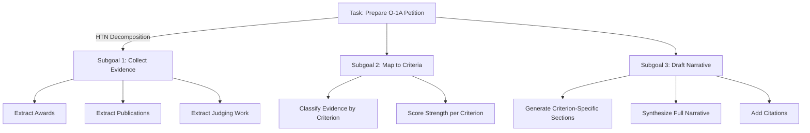

**Key Design Decision:**
Trade-off between **planning latency** and **execution efficiency**. For time-sensitive tasks (RFE response due in 7 days), use cached plan templates. For novel tasks, invest in full planning.

---

#### 7. "How do you implement effective goal decomposition?"

**Answer Framework:** Break complex objectives into sub-goals with explicit success criteria, dependency tracking, and resource allocation.

**Immigration Example:** Goal "Prepare O-1A petition" decomposes into:
1. Evidence Collection (independent per criterion, parallelizable)
2. Criterion Mapping (depends on #1, each criterion scoreable independently)
3. Narrative Drafting (depends on #2, can draft per-criterion in parallel)
4. QA Validation (depends on #3, sequential)
5. Attorney Review (depends on #4, human gate)

**Strong Signal:** Discuss recursive decomposition with measurable success criteria at each level. Mention dependency graphs for parallelization.

---

#### 8. "How do you handle dynamic replanning when circumstances change mid-workflow?"

**Answer Framework:** Monitor execution against plan assumptions. When assumptions break, trigger replanning from the latest valid checkpoint.

**Immigration Example:** During H-1B processing, USCIS announces a new prevailing wage rule. The agent must: detect the change (regulatory monitoring), identify affected steps (LCA preparation, wage validation), checkpoint current state, replan from the affected step with updated regulations.

**Strong Signal:** Reference event-driven architectures. Mention the cost of replanning (token usage) vs. cost of proceeding with stale plan (legal errors).

---

#### 9. "How do you evaluate whether a plan decomposition is good?"

**Answer Framework:** A good decomposition has: (1) each sub-task independently testable, (2) clear input/output contracts between sub-tasks, (3) minimal coupling, (4) measurable completion criteria.

**Immigration Example:** For O-1A evidence mapping — test: Does the evidence classifier correctly categorize 95%+ of documents to criteria? This can be evaluated independently before testing the full pipeline.

**Strong Signal:** Mention plan critics — a lightweight LLM check before execution to verify plan feasibility.

---

### 7.3 Multi-Agent Systems

#### 10. "Design a multi-agent system for collaborative problem-solving."

**Answer Framework:** Define agent roles with single responsibilities, establish communication protocols (message passing, shared memory, blackboard), implement coordination (task auction, consensus, hierarchy), and design conflict resolution.

**Immigration Example:** For H-1B batch processing (500 applications in lottery season):
- **Triage Agent**: Classifies applications by complexity
- **Document Agent Pool**: N parallel agents processing documents
- **Form Agent Pool**: N parallel agents filling forms
- **QA Agent**: Validates outputs against checklists
- **Orchestrator**: Manages queue, load balances, tracks progress

**Strong Signal:** Discuss backpressure mechanisms (what happens when QA agent rejects 30% of outputs — does it slow document processing to investigate?) and scaling strategies.

---

#### 11. "How do you handle communication between agents?"

**Answer Framework:** Three patterns: (A) Direct messaging (agent-to-agent), (B) Shared memory/blackboard (all agents read/write to common state), (C) Event-driven (agents publish/subscribe to events).

**Immigration Example:** For O-1A petition: Evidence Classifier publishes "evidence_classified" events → Strength Scorer subscribes and processes → publishes "strength_scored" → Narrative Writer subscribes. Loose coupling via events allows replacing any agent without changing others.

**Strong Signal:** Discuss structured message schemas (not free text between agents), message versioning, and dead letter queues for failed messages.

---

#### 12. "What coordination mechanisms prevent conflicting agent actions?"

**Answer Framework:** Mutex locks for shared resources, optimistic concurrency with version stamps, action classification (read vs write), approval chains for irreversible actions.

**Immigration Example:** Two agents both try to update the same I-140 form field. Solution: optimistic locking — each agent reads the field version, attempts update with version check. If version mismatch, re-read and retry.

**Strong Signal:** Mention the CAP theorem trade-offs in distributed agent systems. For legal documents, prefer consistency over availability.

---

#### 13. "How do you debug issues in multi-agent systems?"

**Answer Framework:** Correlation IDs linking all agent actions in a single workflow. Trace visualization showing inter-agent message flow. Replay capability to reproduce multi-agent interactions.

**Immigration Example:** Petition has wrong salary figure. Trace shows: Intake Agent extracted "$150,000" → Form Agent received "$150,000" → but DOL API returned prevailing wage "$160,000" → Form Agent used intake value instead of DOL value. Root cause: Form Agent's prompt didn't specify to prefer DOL data over client-submitted data.

**Strong Signal:** Discuss deterministic replay — recording all LLM responses so you can replay the exact execution without re-calling APIs. Mention LangSmith's trace comparison feature.

---

### 7.4 Safety & Production

#### 14. "What safety mechanisms are essential for production agentic AI systems?"

**Answer Framework:** Action classification (read/write/irreversible), resource budgets (token limits, cost caps, time limits), scope constraints, human-in-the-loop gates, audit trails, rollback capability.

**Immigration Example:** Alma's safety layers: (1) All AI outputs are drafts until attorney approval, (2) USCIS form submissions are irreversible — require double-approval (AI + attorney + senior attorney for complex cases), (3) Token budget per case prevents runaway costs, (4) Every action logged for USCIS audit compliance.

**Strong Signal:** Mention the concept of "blast radius" — if an agent goes wrong, how much damage can it do? Design to minimize blast radius.

---

#### 15. "How do you implement human-in-the-loop for high-stakes decisions?"

**Answer Framework:** Confidence-based routing (high confidence → auto-approve, low → human review), staged autonomy (start with full review, reduce as trust builds), clear escalation triggers, feedback loops.

**Immigration Example:** Confidence thresholds at Alma:
- >0.95 confidence: Auto-approve (attorney spot-checks 10%)
- 0.80-0.95: Priority attorney review
- <0.80: Full attorney review + possible client callback
- Novel visa type: Always full review regardless of confidence

**Strong Signal:** Discuss how to calibrate confidence scores (they must be well-calibrated, not just high). Mention active learning from attorney corrections.

---

#### 16. "How do you prevent and detect hallucinations in production?"

**Answer Framework:** Prevention (grounding via RAG, low temperature, structured output, citation requirements) + Detection (fact-checking against source docs, citation verification, LLM-as-judge, consistency checks).

**Immigration Example:** For petition narrative: (1) Every factual claim must cite an exhibit, (2) Cross-check cited dates/numbers against intake form data, (3) Verify regulation citations exist in the knowledge base, (4) Flag novel legal arguments for attorney review.

**Strong Signal:** Distinguish between factual hallucinations (wrong dates, invented awards) and reasoning hallucinations (incorrect legal conclusions from correct facts). Different detection strategies for each.

---

#### 17. "How do you handle versioning and rollback for AI agent deployments?"

**Answer Framework:** Version prompts independently from code. Blue-green deployments for prompt changes. Canary testing on small traffic percentage before full rollout. Automatic rollback on quality degradation.

**Immigration Example:** New prompt version for O-1A narrative generation: (1) Deploy to 10% of new cases, (2) Monitor attorney revision rate for 48 hours, (3) If revision rate increases >5%, auto-rollback, (4) If stable, gradually increase to 100%.

**Strong Signal:** Mention prompt registries (like MLflow model registry but for prompts), A/B testing infrastructure, and the importance of keeping eval datasets versioned alongside prompts.

---

### 7.5 RAG & Knowledge Management

#### 18. "How would you design a RAG system for a domain with frequently changing information?"

**Answer Framework:** Incremental indexing (not full rebuild), effective date metadata, version tracking, stale content detection, freshness scoring in retrieval.

**Immigration Example:** USCIS policy memos change regularly. Design: (1) Monitor Federal Register RSS + USCIS announcements daily, (2) When new memo detected: parse, chunk, embed, add to vector store with `effective_date`, (3) At query time, filter by `effective_date <= today`, (4) Alert cases in progress if their relevant regulations changed.

**Strong Signal:** Discuss the "knowledge freshness vs completeness" trade-off. Newer data is more relevant but may not be validated yet.

---

#### 19. "How do you evaluate RAG retrieval quality?"

**Answer Framework:** Construct golden eval datasets mapping queries to expected documents. Measure precision@k, recall@k, MRR, NDCG. Separate retrieval quality from generation quality.

**Immigration Example:** Build an eval set of 200 immigration law questions with expected regulation citations. Test: "What are the O-1A eligibility criteria?" → Expected: INA § 214(a)(1), 8 CFR § 214.2(o). Measure if these appear in top-5 retrieved chunks.

**Strong Signal:** Mention the importance of testing with adversarial queries (ambiguous terms, abbreviations, cross-references) not just easy queries.

---

#### 20. "What chunking strategies do you use and when?"

**Answer Framework:** Fixed-size (simple but breaks context), semantic (respect paragraph/section boundaries), hierarchical (parent-child chunks), document-specific (legal sections, table rows).

**Immigration Example:** For immigration regulations: chunk by legal section boundaries (INA § level), preserve cross-references in metadata, store parent section context for disambiguation. For recommendation letters: chunk by paragraph (each paragraph usually addresses one achievement).

**Strong Signal:** Discuss the chunk size trade-off: smaller chunks = better precision but less context; larger chunks = more context but noisier retrieval. Mention chunk overlap strategies.

---

#### 21. "How do you handle multi-hop reasoning over retrieved documents?"

**Answer Framework:** Iterative retrieval (retrieve → reason → retrieve again with refined query), chain-of-thought over retrieved context, knowledge graphs for structured relationships.

**Immigration Example:** Question: "Is this applicant eligible for EB-1A under the 'original contributions' criterion?" Requires: (1) Retrieve EB-1A criteria definition, (2) Retrieve 'original contributions' case law and AAO decisions, (3) Retrieve applicant's publication/patent details, (4) Synthesize across all three to form a legal argument. Each retrieval step informs the next query.

**Strong Signal:** Discuss the latency cost of multi-hop (each hop = another LLM call + retrieval). Mention pre-computing common reasoning chains for frequent question patterns.

---

### 7.6 Alma-Domain Specific

#### 22. "How would you ensure AI-generated legal documents meet attorney quality standards?"

**Answer Framework:** Multi-layer validation pipeline: schema checks → citation verification → fact-checking against source docs → LLM-based critique → attorney review. Track attorney edit distance over time as quality metric.

**Immigration Example:** For O-1A petition narrative: (1) Check all 8 criteria sections present, (2) Verify every citation exists in evidence list, (3) Cross-check numbers (publication count, citation count) against client data, (4) LLM critic checks for persuasive tone and legal accuracy, (5) Attorney reviews with tracked edits. Target: <15% of text changed by attorney.

**Strong Signal:** Discuss regression testing — maintain a golden set of approved petitions and test new prompt versions against them.

---

#### 23. "How do you handle regulatory changes that affect in-progress cases?"

**Answer Framework:** Regulatory monitoring agent + impact analysis + case-level alerting + automated replanning.

**Immigration Example:** New prevailing wage rule published in Federal Register: (1) Monitoring agent detects change, (2) Impact analyzer identifies all H-1B cases with LCA step pending, (3) Alert generator creates per-case alerts with specific action items, (4) For each affected case, trigger re-evaluation from LCA preparation checkpoint.

**Strong Signal:** Discuss the urgency classification of regulatory changes (immediate action vs. planned transition) and the attorney notification workflow.

---

#### 24. "How would you design an eval system for immigration case outcomes?"

**Answer Framework:** Multi-level metrics: (1) AI quality metrics (extraction accuracy, narrative quality), (2) Attorney efficiency metrics (review time, revision rate), (3) Business metrics (approval rate, RFE rate, processing time), (4) Client satisfaction.

**Immigration Example:**

| Level | Metric | Target | Measurement |
|-------|--------|--------|-------------|
| AI Quality | Citation accuracy | 100% | Automated verification |
| AI Quality | Form completeness | >99% | Schema validation |
| Attorney Efficiency | Revision rate | <15% edit distance | Diff between AI draft and final |
| Attorney Efficiency | Review time | <30 min per case | Time tracking |
| Business | Approval rate | >99% | USCIS outcome tracking |
| Business | RFE rate | <5% | USCIS outcome tracking |

**Strong Signal:** Discuss the data flywheel — attorney corrections improve prompts, which reduce corrections, which allow handling more cases.

---

#### 25. "How do you balance automation speed with legal accuracy requirements?"

**Answer Framework:** Legal accuracy is non-negotiable. Speed optimization comes from: (1) Parallelizing independent tasks, (2) Caching common lookups, (3) Using faster models for non-critical tasks, (4) Reducing attorney review time through better AI quality.

**Immigration Example:** For H-1B filing: Don't sacrifice accuracy for speed on the I-129 form (errors cause RFEs/denials). Instead, speed up by: parallelizing document extraction across multiple documents, caching prevailing wage lookups (valid for 90 days), using GPT-4o-mini for document classification (fast) but GPT-4 for petition narrative (quality-critical).

**Strong Signal:** Frame speed as a quality problem — better AI quality = less attorney review time = faster total processing.

---

#### 26. "How would you design a system that learns from attorney feedback over time?"

**Answer Framework:** Capture structured feedback → categorize patterns → update prompts/retrieval → measure improvement → iterate.

**Immigration Example:** (1) Track all attorney edits with categories (factual correction, citation added, tone adjustment, legal argument strengthened), (2) Monthly analysis: "Attorneys added 'as evidenced by...' phrasing in 40% of reviews" → update system prompt, (3) Quarterly: fine-tune on approved petitions, (4) Continuous: add attorney-flagged edge cases to eval dataset.

**Strong Signal:** Discuss the cold start problem (few cases initially) and how to bootstrap with synthetic eval data. Mention active learning — prioritize attorney review on cases where the model is least confident.

---

## 8. Practice Problems & Mock Scenarios

### Problem 1: "Design an agent that processes H-1B applications end-to-end"

**Interviewer Prompt:** "Alma receives ~500 H-1B applications per lottery cycle. Design an agentic system that handles the workflow from client intake to ready-for-attorney-review."

**Clarifying Questions to Ask:**
- Are we handling Cap H-1B (lottery) or Cap-Exempt (university/research)?
- What document formats? PDFs, images, structured forms?
- What's the acceptable per-application cost budget?
- Must we handle premium processing (15-day deadline)?
- What existing systems do we integrate with (CRM, document management)?

**Architecture:**

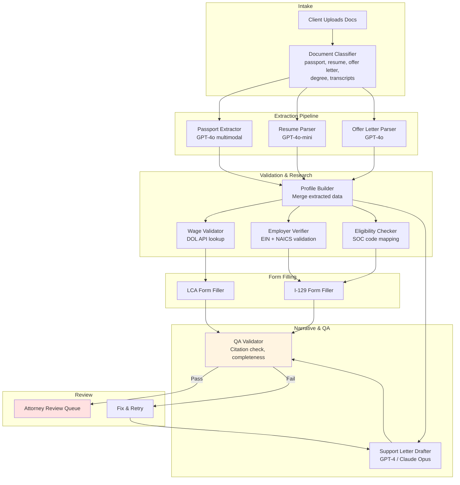

**Eval Strategy:**
- Unit: Test each extractor against 50 labeled documents
- Integration: Test 20 end-to-end cases against attorney-approved outputs
- Production: Track attorney revision rate, RFE rate, approval rate

**Production Considerations:**
- Lottery season scaling: 500 applications in 2 weeks → parallelize extraction pipeline
- Cost: ~$0.50-2.00 per application in LLM costs (GPT-4 for narrative, GPT-4o-mini for extraction)
- Priority queue: Premium processing cases get expedited

---

### Problem 2: "Design a multi-agent system for O-1A evidence compilation"

**Interviewer Prompt:** "O-1A visas require demonstrating extraordinary ability through at least 3 of 8 USCIS criteria. Design a system that analyzes a client's documents, maps evidence to criteria, scores strength, and generates a petition narrative."

**Architecture:**

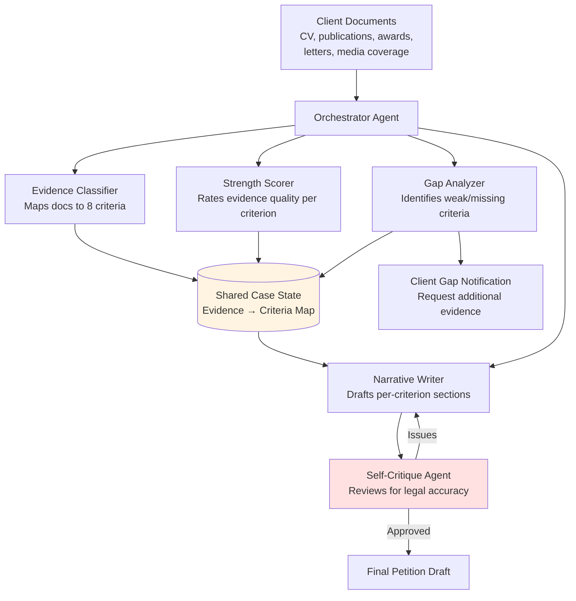

**Key Design Decisions:**
- Ambiguous evidence (maps to multiple criteria): Classify to the criterion where the client is weakest, maximizing the total criteria count
- Strength scoring: 1-5 scale with calibration against past approved cases
- Narrative strategy: Lead with strongest criteria, address weaker criteria with "further supported by" framing

**Eval:** Compare evidence-to-criteria mapping against attorney classifications on 50 historical cases. Target: >90% agreement on primary criterion assignment.

---

### Problem 3: "Design an RFE response system"

**Interviewer Prompt:** "USCIS issues Requests for Evidence when a petition is deficient. Design a system that parses RFEs, identifies issues, matches evidence, and drafts responses."

**Architecture:**

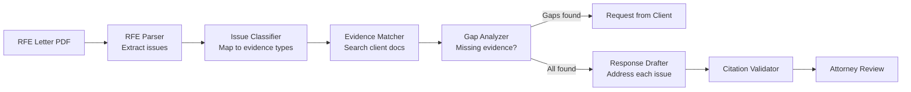

**Debugging Walkthrough: "System misidentifies RFE issue category"**

**Scenario:** RFE says "Petitioner has not established that the beneficiary's proposed employment is in a specialty occupation." System classifies this as "education requirement" instead of "specialty occupation."

**Step 1: Reproduce.** Feed the exact RFE text to the Issue Classifier in isolation.

**Step 2: Inspect trace.** The classifier's CoT reasoning shows: "The RFE mentions 'proposed employment' and 'specialty occupation.' Looking for education-related keywords... found 'established'... classifying as education requirement." The reasoning conflated "established" (legal term for "proven") with education-related terminology.

**Step 3: Check retrieval.** The RAG pulled "education requirement" regulations because "specialty occupation" co-occurs with education in many contexts. The top-3 retrieved chunks were all about degree requirements rather than the distinct "specialty occupation" analysis.

**Step 4: Root cause.** Two issues: (1) Query didn't distinguish between "specialty occupation" and "education requirement" as RFE categories, (2) The classifier prompt lacked explicit RFE category definitions.

**Step 5: Fix.**
1. Add explicit RFE category taxonomy to the classifier prompt (10 categories with definitions and examples)
2. Add reranking that distinguishes between related but distinct categories
3. Add this case to the eval dataset

**Step 6: Regression test.** Run the full RFE eval set (30 cases) to verify no regressions. The misclassified case now correctly maps to "specialty occupation."

---

### Problem 4: "Design an immigration compliance monitoring agent"

**Interviewer Prompt:** "Companies sponsoring H-1B workers must maintain ongoing compliance. Design an agent that monitors regulatory changes, identifies affected clients, and generates compliance alerts."

**Architecture:**

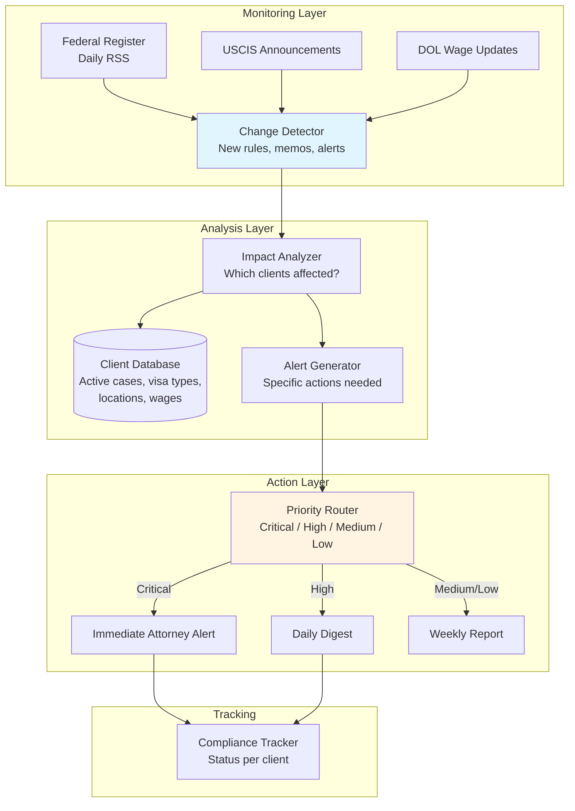

**Knowledge Freshness Strategy:**
- Federal Register: Check daily (new rules published on weekdays)
- USCIS Policy Memos: Check every 6 hours
- DOL Prevailing Wage: Check quarterly
- State-specific rules: Check weekly

**Eval:** Track alert accuracy by having attorneys rate each alert as "actionable" or "false positive." Target: >90% actionable rate, <48h latency for critical changes.

---

## 9. Recommendations & Study Plan

### 9.1 Key Papers & Resources

| Resource | Why It Matters |
|----------|---------------|
| [ReAct (Yao et al., 2022)](https://arxiv.org/abs/2210.03629) | Core agent pattern Alma likely uses |
| [Toolformer (Schick et al., 2023)](https://arxiv.org/abs/2302.04761) | LLMs teaching themselves tool use |
| [Reflexion (Shinn et al., 2023)](https://arxiv.org/abs/2303.11366) | Self-critique loops for quality improvement |
| [Chain-of-Thought (Wei et al., 2022)](https://arxiv.org/abs/2201.11903) | Foundation for legal reasoning prompts |
| [Anthropic MCP Specification](https://modelcontextprotocol.io/) | Required knowledge per job description |
| [LangGraph Documentation](https://langchain-ai.github.io/langgraph/) | Multi-agent orchestration framework |
| [Uber Michelangelo Blog Posts](https://www.uber.com/blog/michelangelo-machine-learning-platform/) | CTO's background — know this system |
| [USCIS Policy Manual](https://www.uscis.gov/policy-manual) | Immigration domain knowledge |
| [Practices for Governing Agentic AI (OpenAI)](https://openai.com/index/practices-for-governing-agentic-ai-systems/) | Safety frameworks for production agents |
| [State of Agent Engineering (LangChain)](https://www.langchain.com/state-of-agent-engineering) | Industry benchmarks and trends |

### 9.2 Skills to Demonstrate

- **Experimental mindset**: "I would try X, measure Y, iterate based on results"
- **Shipping mentality**: "Here's how I'd get this to production in a focused sprint"
- **Eval-first thinking**: "Before building, let me define what success looks like"
- **Cost awareness**: "This prompt costs $0.03/call x 500 applications = $15/cycle for extraction alone"
- **Failure mode awareness**: "What happens when OCR fails? When the API is rate-limited? When the regulation changes?"
- **Domain sensitivity**: "Legal accuracy is non-negotiable — every claim needs a citation"
- **Systems thinking**: "This is a platform problem, not just a model problem" (mirrors CTO's Michelangelo background)

### 9.3 Red Flags to Avoid

- Textbook/Wikipedia answers without practical experience
- Designing a single monolithic agent instead of specialized agents
- No evaluation strategy ("we'll test it manually")
- Ignoring cost and latency trade-offs
- Over-engineering for hypothetical future requirements
- Not considering human-in-the-loop for high-stakes legal decisions
- Saying "just use GPT-4" without discussing model selection trade-offs
- Not asking clarifying questions before designing
- Ignoring data privacy (passports, financial records = PII)

### 9.4 Day-Before-Interview Checklist

- [ ] Review Alma's recent blog posts and case studies at tryalma.com
- [ ] Practice one whiteboard problem end-to-end (timed 25 minutes)
- [ ] Review your own past projects for relevant stories (production AI, eval, debugging)
- [ ] Prepare 3-4 clarifying questions for any system design prompt
- [ ] Review MCP documentation (Alma lists it as a specific requirement)
- [ ] Prepare a cost estimation framework (tokens x price x volume)
- [ ] Review common failure modes and the Data → Prompt → Model debugging framework
- [ ] Have an opinion on open-source vs proprietary models with trade-offs
- [ ] Review Uber Michelangelo architecture (relevant to CTO's background)
- [ ] Prepare to discuss: "What's the hardest AI debugging problem you've solved?"

### 9.5 Sources & References

- [The Agentic System Design Interview (PromptLayer)](https://blog.promptlayer.com/the-agentic-system-design-interview-how-to-evaluate-ai-engineers/)
- [10 Essential Agentic AI Interview Questions (KDnuggets)](https://www.kdnuggets.com/10-essential-agentic-ai-interview-questions-for-ai-engineers)
- [Top 30 Agentic AI Interview Questions (DataCamp)](https://www.datacamp.com/blog/agentic-ai-interview-questions)
- [Alma Immigration](https://www.tryalma.com/)
- [AI Agents: The Definitive Guide (Comet)](https://www.comet.com/site/blog/ai-agents/)
- [How to Debug LLM Agents (Medium)](https://medium.com/@kamaljp/how-to-debug-llm-agents-understanding-3-pillars-of-agents-a6459b7f106d)
- [Best Practices for Debugging Multi-Agent LLM Systems (Newline)](https://www.newline.co/@zaoyang/best-practices-for-debugging-multi-agent-llm-systems--5c2c85f6)
- [State of Agent Engineering (LangChain)](https://www.langchain.com/state-of-agent-engineering)
- [MCP and RAG: A Powerful Partnership (Medium)](https://medium.com/the-ai-forum/mcp-and-rag-a-powerful-partnership-for-advanced-ai-applications-858c074fc5db)
- [AI for Immigration Lawyers (Docketwise)](https://www.docketwise.com/blog/ai-for-immigration-lawyers/)
